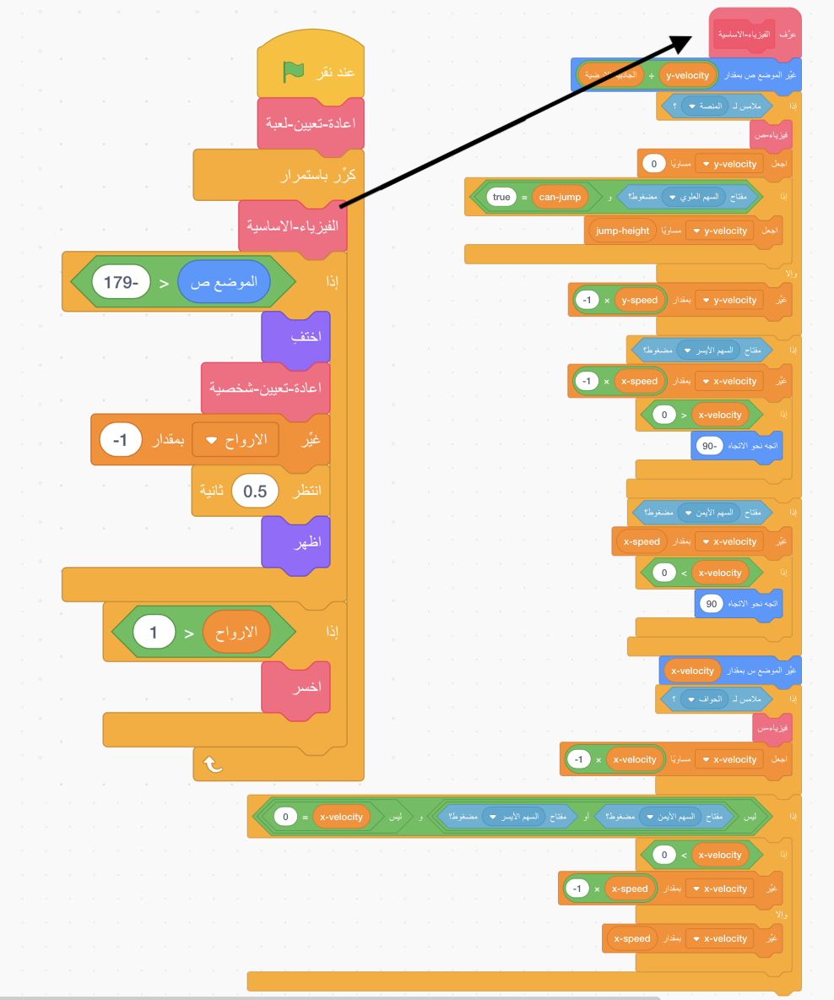

## ضبط الأمور

نظرًا لأنك تتعلم كيفية الترميز في Scratch وليس كيفية إنشاء محرك للفيزياء (الكود الذي يجعل الأشياء في لعبة كمبيوتر تتصرف مثل الكائنات في العالم الحقيقي ، على سبيل المثال ، لا تتساقط خلال الأرضيات) ، فسوف تبدأ بـ مشروع قمت بإنشائه يحتوي بالفعل على أساسيات الحركة والقفز واكتشاف الأنظمة الأساسية المضمنة.

يجب إلقاء نظرة سريعة على المشروع ، بما في ذلك التفاصيل الموجودة في هذه البطاقة ، لأنك ستجري بعض التغييرات عليه لاحقًا ، لكنك لست بحاجة إلى فهم كل ما يتم فعله!

### الحصول على المشروع

--- task ---

أول ما عليك القيام به هو الحصول على نسخة من كود Scratch من [scratch.mit.edu/projects/443133709](https://scratch.mit.edu/projects/443133709){:target="_blank"}.

لاستخدام المشروع في وضع عدم الاتصال بالانترنيت، قم بتحميل البرنامج بالضغط على **See Inside**، ثم انتقل إلى قائمة **ملف** وانقر **تحميل لجهاز الكمبيوتر الخاص بي**. ثم يمكنك فتح الملف الذي تم تنزيله في Scratch على جهاز الكمبيوتر الخاص بك.

يمكنك أيضًا استخدامه مباشرةً في Scratch في المستعرض الخاص بك فقط بالنقر فوق **راجع الداخل** ثم **ريمكس**.

--- /task ---

### ألقِ نظرة على الكود

يحتوي محرك الفيزياء الخاص باللعبة على مجموعة متنوعة من القطع ، بعضها يعمل بالفعل وبعضها لا يعمل بعد. يمكنك اختبار ذلك عن طريق تشغيل اللعبة ومحاولة اللعب.

سترى أنه يمكنك فقد الأرواح ، لكن لا شيء يحدث عندما تنفد ارواحك. أيضًا ، تحتوي اللعبة على مستوى واحد ، ونوع واحد من الأشياء لجمعها ، ولا يوجد أعداء. أنت بصدد إصلاح كل ذلك ، ثم تفعل أكثر قليلاً!

--- task ---

ألق نظرة على كيفية وضع الكود معًا.

--- /task ---

ويستخدم الكثير من **لبناتي**، والتي تعتبر رائعة لتقسيم الشفرة إلى أجزاء بحيث يمكنك إدارتها بشكل أفضل. كتل **لبناتي** عبارة عن كتلة تقوم بتكوينها من الكثير من القطع الأخرى، ويمكنك إعطاء بعض التعليمات لها. سترى كيف يعمل في خطوة قادمة!

### كتل "لبناتي" مفيدة حقاً

في الكود البرمجي أعلاه فإن اللبنة الرئيسية `باستمرار`{:class="block3control"} تستدعي لبنة `الفيزياء-الاساسية`{:class="block3myblocks"} من كتل **لبناتي** والتي تقوم بمجموعة كبيرة من الاشياء! إن ابقاء القوائم مفصولة بهذا الشكل يجعل من السهل قراءة اللبنة الرئيسية وفهم ما يحدث في اللعبة، دون الحاجة إلى القلق حول **كيف** تحدث.

--- task ---

انظر الآن في لبنة `اعادة-تعيين-لعبة`{:class="block3myblocks"} و `إعادة-تعيين-شخصية`{:class="block3myblocks"} في كتل **لبناتي**.

--- /task ---

إنهم يقومون بأشياء طبيعية إلى حد ما ، مثل إعداد المتغيرات والتأكد من أن الشخصية تدور بشكل صحيح

- إن كتلة `إعادة-تعيين-لعبة`{:class="block3myblocks"} **تستدعي الكتلة** `إعادة-تعيين-شخصية`{:class="block3myblocks"} ، وهذا يوضح لك أنه يمكنك استخدام كتلة **لبناتي** داخل كتلة **لبناتي** اخرى
- كتلة `إعادة-تعيين-شخصية`{:class="block3myblocks"} في كتل**لبناتي** يستخدم في مكانين مختلفين في اللبنة الرئيسية. هذا يعني أنه يمكنك تغيير مكانين في حلقة اللعبة الرئيسية عن طريق تغيير الكود داخل قائمة **لبناتي** ، مما يوفر لك الكثير من العمل ويساعدك على تجنب الأخطاء.