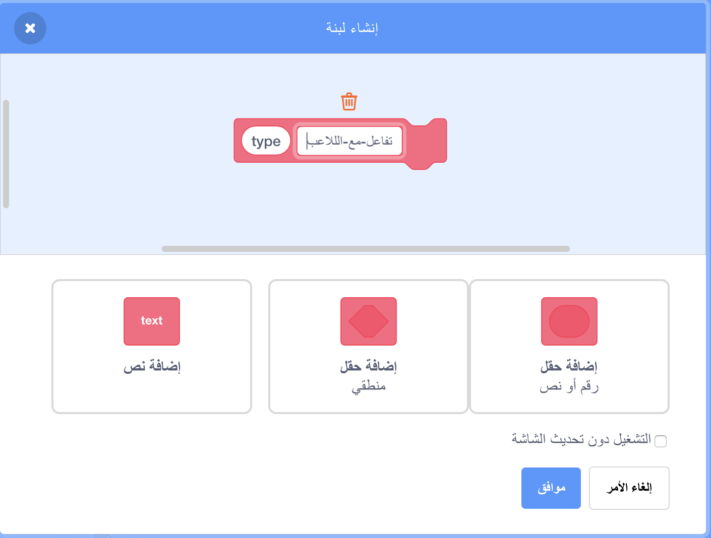

## امدادات الطاقة

في الوقت الحالي ، لديك نوع واحد فقط من الألعاب القابلة للجمع: وهو نجمة تعطيك نقطة واحدة عند الحصول عليها. في هذه البطاقة ، ستنشئ نوعًا جديدًا من الاشياء القابلة للجمع، وستقوم بذلك بطريقة تجعل إضافة أنواع أخرى من المقتنيات أمرًا سهلاً. ثم يمكنك اختراع امدادات طاقة ومكافآت وبذلك تجعل اللعبة فعلاً خاصة بك!

لقد قمت بالفعل بتضمين بعض القطع للقيام بذلك باستخدام المتغير `collectable-type<` {:class="block3variables"} والمتغير `pick-costume`{:class="block3myblocks"} في كتل **لبناتي**. سوف تحتاج إلى تحسينها بالرغم من ذلك.

دعونا نلقي نظرة على كيفية عمل المقتنيات الآن

في البرامج النصية للكائن **تجميع** ، ابحث عن الكود `عندما أبدأ كنسخة clone`{: class = "block3events"}. الكتل التي يجب إلقاء نظرة عليها هي الكتل التي تعطيك نقاطًا لجمع النجم

```blocks3
    اذا <touching [Player Character v]?> 
        غيّر [points v] بمقدار (collectable-value ::variables)
        احذف هذه النسخة
```

وهذا الذي يختار شكل للنسخة:

```blocks3
    pick-costume (collectable-type ::variables) :: custom
```

## \--- collapse \---

## title: كيف يعمل اختيار الشكل؟

تعمل الكتلة `pick-costume`{:class="block3myblocks"} تمامًا مثل الكتلة `اخسر`{: class = "block3myblocks"} ، لكنها تحتوي على شيء إضافي: وهو متغير **مدخلات** يسمى `type` {:class="block3myblocks"}.

```blocks3
    حدد pick-costume (type)
    if <(type :: variables) = [1]> ثم
        بدّل الزي إلى [star1 v]
    end
```

عندما تعمل الكتلة `pick-costume`{: class = "block3myblocks"} ، فإن ما تقوم به هو:

1. يبحث في متغير الإدخال `type`{: class = "block3myblocks"}
2. إذا كانت قيمة `type`{: class = "block3myblocks"} تساوي `1`، فستتحول إلى زي `star1`

ألق نظرة على جزء البرنامج النصي الذي يستخدم الكتلة:

```blocks3
    عندما أبدأ كاختيار
    clone (نوع قابل للتجميع :: المتغيرات) :: custom
    show
    كرر حتى <(موضع y) < [-170]>
        تغيير y بواسطة (collectable-speed :: variables)
        if <touching [Player Character v]?>
            تغيير [النقاط v] بواسطة (collectable-value :: variables)
            احذف هذا الاستنساخ
```

يمكنك أن ترى أن المتغير `collectable-type`{: class = "block3variables"} **يمرر** الى الكتلة `pick-costume`{: class = "block3myblocks"}. داخل الكودر البرمجي لـ `pick-costume`{:class="block3myblocks"} فان مدخلات `collectable-type`{:class="block3variables"} تستعمل بعد ذلك كمدخل للمتغير (`type`{:class="block3myblocks"}).

هذا يعني أن قيمة `collectable-type`{: class = "block3variables"} هي التي تحدد الشكل الذي تحصل عليه نسخة الكائن.

\--- /collapse \---

### أضف شكلا إلى امدادات الطاقة الجديدة

بطبيعة الحال ، فإن الكائن **تجميع** لها شكل واحد فقط، حيث يوجد نوع واحد فقط من القطع القابلة للتجميع. أنت على وشك تغيير ذلك.

\--- task \---

Add a new costume to the **Collectable** sprite for your new power-up. I like the lightning bolt, but pick whatever you like.

\--- /task \---

\--- task \---

Next, tell the `pick-costume`{:class="block3myblocks"} **My blocks** block to set the new costume whenever it gets the new value for `type`{:class="block3myblocks"}, like this \(using whatever costume name you picked\):

```blocks3
    حدد pick-costume (type)
    if <(type :: variable) = [1]> ثم
        بدل زي إلى [star1 v]
    end
+ if <(type :: variable) = [2]> ثم
+ بدل البرق الخامس]
+ نهاية
```

\--- /task \---

### إنشاء الكتل البرمجية لامدادات الطاقة

Now you need to decide what the new collectable will do! We’ll start with something simple: giving the player a new life. In the next step, you’ll make it do something cooler.

\--- task \---

Go into the **My blocks** section and click **Make a Block**. Name the new block `react-to-player`{:class="block3myblocks"} and add a **number input** named `type`{:class="block3myblocks"}.



Click **OK**.

\--- /task \---

\--- task \---

Make the `react-to-player`{:class="block3myblocks"} **My blocks** block either increase the points or increase the player’s lives, depending on the value of `type`{:class="block3myblocks"}.

```blocks3
+ حدد رد الفعل على اللاعب (النوع)
+ إذا <(النوع :: متغير) = [1]> ثم
+ تغيير [النقاط v] بواسطة (collectable-value :: variables)
+ end
+ if <(type: : متغير) = [2]> ثم
+ تغيير [حياة الخامس] بحلول نهاية [1]
+
```

\--- /task \---

\--- task \---

Update the `when I start as a clone`{:class="block3events"} code to replace the block that adds a point with a **call** to `react-to-player`{:class="block3myblocks"}, **passing** `collectable-type`{:class="block3variables"} to it.

```blocks3
+ if <touching [Player Character v] ?> +
+ رد فعل على اللاعب (من النوع القابل للتحصيل :: المتغيرات) :: custom
+ احذف هذا clone
+ end
```

\--- /task \---

By using this new `react-to-player`{:class="block3myblocks"} **My blocks** block, stars still add a point, but the new power-up you've created adds a life.

### باستخدام `collectable-type`{:class="block3variables"} لجعل مقتنيات مختلفة تظهر بشكل عشوائي

Right now, you might be wondering how you'll tell each collectable the game makes what type it should be.

You do this by setting the value of `collectable-type`{:class="block3variables"}. This variable is just a number. As you've seen, it's used to tell the `pick-costume`{:class="block3myblocks"} and `react-to-player`{:class="block3myblocks"} blocks what costume, rules, etc. to use for the collectable.

## \--- collapse \---

## title: العمل مع المتغيرات في النسخة

For each clone of the **Collectable** sprite, you can set a different value for `collectable-type`{:class="block3variables"}.

Think of it like creating a new copy of the **Collectable** sprite with the help of the value that is stored in `collectable-type`{:class="block3variables"} at the time the **Collectable** clone gets created.

You might be wondering whether changing the value of `collectable-type`{:class="block3variables"} will turn all the collectables on the Stage into the same type. That doesn't happen, because one of the things that makes clones special is that they cannot change the values of any variables they start with. Sprite clones effectively have **constant** values. That means that when you change the value of `collectable-type`{:class="block3variables"}, this doesn't affect the **Collectable** sprite clones that are already in the game.

\--- /collapse \---

You're going to set the `collectable-type`{:class="block3variables"} to either `1` or `2` for each new clone that you make. To keep the game interesting, pick between the numbers at random to make a random collectable every time.

\--- task \---

Find the `repeat until`{:class="block3control"} loop inside the green flag code for the **Collectable** sprite, and add the `if...else`{:class="block3control"} code shown below.

```blocks3
    كرر حتى <not <(create-collectables ::variables) = [true]>>
+ إذا <[50] = (اختر عشوائي (1) إلى (50))> ثم
+ اضبط [تحصيل من النوع الخامس] إلى [2]
+ آخر
+ مجموعة [قابل للتحصيل من النوع الخامس] إلى [1]
+ انتظر نهاية
        (تحصيل تردد :: المتغيرات) ثانية
        انتقل إلى س: (اختر عشوائي (-240) إلى (240)) ذ: (179)
        إنشاء استنساخ من [نفسي الخامس]
```

\--- /task \---

This code gives a 1-in-50 chance of setting the `collectable-type`{:class="block3variables"} to `2`. After all, you don't want to give the player the chance to collect an extra life too often, otherwise the game would be too easy.

Now you have a new type of collectable that sometimes shows up instead of the star, and that gives you an extra life instead of a point when you collect it.