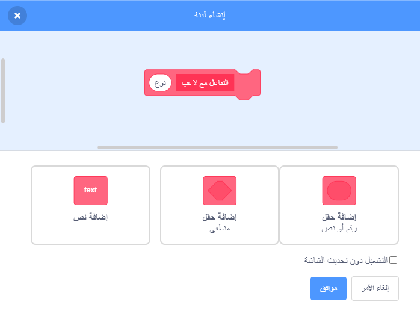

## امدادات الطاقة

في الوقت الحالي ، لديك نوع واحد فقط من الألعاب القابلة للجمع: وهو نجمة تعطيك نقطة واحدة عند الحصول عليها. في هذه البطاقة ، ستنشئ نوعًا جديدًا من الاشياء القابلة للجمع، وستقوم بذلك بطريقة تجعل إضافة أنواع أخرى من المقتنيات أمرًا سهلاً. ثم يمكنك اختراع امدادات طاقة ومكافآت وبذلك تجعل اللعبة فعلاً خاصة بك!

لقد قمت بالفعل بتضمين بعض القطع للقيام بذلك باستخدام المتغير `نوع التجميعات`{:class="block3variables"} والمتغير `اختيار المظهر`{:class="block3myblocks"} في كتل **لبناتي**. سوف تحتاج إلى تحسينها بالرغم من ذلك.

دعونا نلقي نظرة على كيفية عمل المقتنيات الآن

في البرامج النصية للكائن **تجميع** ، ابحث عن الكود `عندما أبدأ كنسخة clone`{:class="block3events"}. الكتل التي يجب إلقاء نظرة عليها هي الكتل التي تعطيك نقاطًا لجمع النجم

```blocks3
    اذا <touching [Player Character v]?> 
        غيّر [points v] بمقدار (collectable-value ::variables)
        احذف هذه النسخة
```

وهذا الذي يختار شكل للنسخة:

```blocks3
    pick-costume (collectable-type ::variables) :: custom
```

--- collapse ---
---
title: كيف يعمل اختيار الشكل؟
---

تعمل الكتلة `اختيار المظهر`{:class="block3myblocks"} تمامًا مثل الكتلة `اخسر`{:class="block3myblocks"} ، لكنها تحتوي على شيء إضافي: وهو متغير **مدخلات** يسمى `نوع`{:class="block3myblocks"}.

```blocks3
    حدد pick-costume (type)
    if <(type :: variables) = [1]> ثم
        بدّل الزي إلى [star1 v]
    end
```

عندما تعمل الكتلة `اختيار المظهر`{:class="block3myblocks"} ، فإن ما تقوم به هو:

1. يبحث في متغير الإدخال `نوع`{:class="block3myblocks"}
2. إذا كانت قيمة `نوع`{:class="block3myblocks"} تساوي `1`، فستتحول إلى زي `star1`

ألق نظرة على جزء البرنامج النصي الذي يستخدم الكتلة:

```blocks3
    عندما أبدأ كاختيار
    clone (نوع قابل للتجميع :: المتغيرات) :: custom
    show
    كرر حتى <(موضع y) < [-170]>
        تغيير y بواسطة (collectable-speed :: variables)
        if <touching [Player Character v]?>
            تغيير [النقاط v] بواسطة (collectable-value :: variables)
            احذف هذا الاستنساخ
```

يمكنك أن ترى أن المتغير `نوع التجميعات`{:class="block3variables"} **يمرر** الى الكتلة `اختيار المظهر`{:class="block3myblocks"}. داخل الكودر البرمجي لـ `اختيار المظهر`{:class="block3myblocks"} فان مدخلات `نوع التجميعات`{:class="block3variables"} تستعمل بعد ذلك كمدخل للمتغير (`نوع`{:class="block3myblocks"}).

هذا يعني أن قيمة `نوع التجميعات`{:class="block3variables"} هي التي تحدد الشكل الذي تحصل عليه نسخة الكائن.

--- /collapse ---

### أضف شكلا إلى امدادات الطاقة الجديدة

بطبيعة الحال ، فإن الكائن **تجميع** لها شكل واحد فقط، حيث يوجد نوع واحد فقط من القطع القابلة للتجميع. أنت على وشك تغيير ذلك.

--- task ---

أضف شكلاً جديدًا إلى الكائن **تجميع** لامدادات الطاقة الجديدة الخاصة بك. أنا أحب صاعقة البرق ، ولكن اختر ما تريد.

--- /task ---

--- task ---

بعد ذلك، قل لكتلة `اختيار المظهر`{:class="block3myblocks"} من كتل **لبناتي** لضبط شكل جديد كلما حصل على قيمة جديدة للمتغير `نوع`{:class="block3myblocks"}، مثل هذا (باستخدام اي اسم للشكل الذي اخترته):

```blocks3
    حدد pick-costume (type)
    if <(type :: variable) = [1]> ثم
        بدل زي إلى [star1 v]
    end
+ if <(type :: variable) = [2]> ثم
+ بدل البرق الخامس]
+ نهاية
```

--- /task ---

### إنشاء الكتل البرمجية لامدادات الطاقة

الآن عليك أن تقرر ما الذي ستقوم به المجموعة الجديدة! سنبدأ بشيء بسيط: إعطاء اللاعب حياة جديدة. في الخطوة التالية ، ستجعلها تفعل شيئًا أكثر روعة.

--- task ---

اذهب إلى القسم **لبناتي** وانقر فوق **إنشاء لبنة**. سمِّ الكتلة الجديدة `التفاعل مع لاعب`{:class="block3myblocks"} وإضف **عدد المدخلات** بالاسم `نوع`{:class="block3myblocks"}.



انقر فوق **موافق**.

--- /task ---

--- task ---

اجعل `التفاعل مع لاعب`{:class="block3myblocks"} في كتلة **لبناتي** إما يعمل على زيادة النقاط أو زيادة حياة اللاعب، اعتمادًا على قيمة المتغير `نوع`{:class="block3myblocks"}.

```blocks3
+ حدد رد الفعل على اللاعب (النوع)
+ إذا <(النوع :: متغير) = [1]> ثم
+ تغيير [النقاط v] بواسطة (collectable-value :: variables)
+ end
+ if <(type: : متغير) = [2]> ثم
+ تغيير [حياة الخامس] بحلول نهاية [1]
+
```

--- /task ---

--- task ---

قم بتحديث التعليمات البرمجية في `عندما أبدأ كنسخة`{:class="block3events"} لاستبدال الكتلة التي تضيف نقطة من خلال **الاستدعاء** الى `التفاعل مع لاعب`{:class="block3myblocks"}، **ومرر** `نوع التجميعات`{:class="block3variables"} له.

```blocks3
+ if <touching [Player Character v] ?> +
+ رد فعل على اللاعب (من النوع القابل للتحصيل :: المتغيرات) :: custom
+ احذف هذا clone
+ end
```

--- /task ---

من خلال استخدام `التفاعل مع لاعب`{:class="block3myblocks"} في كتلة **لبناتي** ، لا تزال النجوم تضيف نقطة، لكن القوة الجديدة التي أنشأتها تضيف حياة.

### باستخدام `نوع التجميعات`{:class="block3variables"} لجعل مقتنيات مختلفة تظهر بشكل عشوائي

في الوقت الحالي ، قد تتساءل كيف ستخبر كل لعبة تحصيلها بأنواعها.

يمكنك القيام بذلك عن طريق تعيين قيمة لـ `نوع التجميعات`{:class="block3variables"}. هذا المتغير مجرد رقم. كما رأيت ، يتم استخدامه لإخبار كتل `اختيار المظهر`{:class="block3myblocks"} و`التفاعل مع لاعب`{:class="block3myblocks"} أي زي ، قواعد وغيرها. لاستخدامها للتحصيل.

--- collapse ---
---
title: العمل مع المتغيرات في النسخة
---

لكل نسخة من كائنات **تجميع**، يمكنك تعيين قيمة مختلفة من `نوع التجميعات`{:class="block3variables"}.

فكر في الأمر مثل إنشاء نسخة جديدة من الكائن **تجميع** بمساعدة القيمة المخزنة في `نوع التجميعات`{:class="block3variables"} في الوقت الذي يتم فيه إنشاء نسخة من الكائن **تجميع**.

قد تتساءل عما إذا كان تغيير قيمة `نوع التجميعات`{:class="block3variables"} سيحول جميع المقتنيات على المسرح إلى نفس النوع. لا يحدث هذا ، لأن أحد الأشياء التي تجعل المستنسخ مميز هو أنه لا يستطيع تغيير قيم أي متغيرات تبدأ بها. تحتوي نسخ الكائنات على **قيم ثابتة**. هذا يعني أنه عند تغيير قيمة `نوع التجميعات`{:class="block3variables"} ، فإن هذا لا يؤثر على نسخ الكائن **تجميع** الموجودة بالفعل في اللعبة.

--- /collapse ---

ستقوم بتعيين `نوع التجميعات`{:class="block3variables"} على إما `1` أو `2` لكل عملية نسخ جديدة تقوم بها. للحفاظ على اللعبة مثيرة للاهتمام ، اختر بين الأرقام بشكل عشوائي لجعل تحصيل عشوائي في كل مرة.

--- task ---

ابحث عن حلقة `تكرار حتى`{:class="block3control"} داخل رمز العلم الأخضر للعنصر **تجميع** ، وأضف `إذا... else`{:class="block3control"} الكود الموضح أدناه.

```blocks3
    كرر حتى <not <(create-collectables ::variables) = [true]>>
+ إذا <[50] = (اختر عشوائي (1) إلى (50))> ثم
+ اضبط [تحصيل من النوع الخامس] إلى [2]
+ آخر
+ مجموعة [قابل للتحصيل من النوع الخامس] إلى [1]
+ انتظر نهاية
        (تحصيل تردد :: المتغيرات) ثانية
        انتقل إلى س: (اختر عشوائي (-240) إلى (240)) ذ: (179)
        إنشاء استنساخ من [نفسي الخامس]
```

--- /task ---

يمنح هذا الرمز فرصة 1 الى 50 لتعيين `نوع التجميعات`{:class="block3variables"} إلى `2`. بعد كل شيء ، لا ترغب في منح اللاعب فرصة جمع حياة إضافية كثيرًا ، وإلا ستكون اللعبة سهلة للغاية.

الآن لديك نوع جديد من المجموعات القابلة للتحصيل التي تظهر أحيانًا بدلاً من النجمة ، وهذا يمنحك حياة إضافية بدلاً من نقطة عند جمعها.