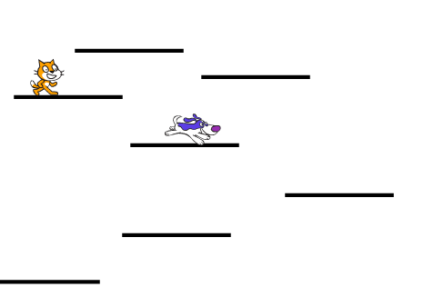

## إضافة بعض المنافسة

اللعبة الخاصة بك تعمل والآن يمكنك جمع النقاط ، والحصول على طاقات خاصة من الطاقات العليا, والخسارة. نحن نصل إلى مكان ما! ربما سيكون من الممتع إضافة بعض المنافسة رغم ذلك - ماذا عن تضمين شخصية تتحرك قليلاً ، لكن ليس من المفترض أن تلمسها؟ سيكون هذا مشابهًا للأعداء في ألعاب المنصات التقليدية مثل Super Mario التي نستلهمها هنا.

\--- task \---

First, pick a sprite to add as your enemy. Because our player character is a cat, I chose a dog. There are lots of other sprites you could add though. I also renamed the sprite **Enemy**, just to make things clearer for me.

Resize the sprite to the right size, and place it somewhere appropriate to start. Here’s what mine looks like:



\--- /task \---

\--- task \---

Write the easiest code first: set up its block for reacting to the `game over`{:class="events"} message to make the enemy disappear when the player loses the game.

```blocks3
+ عندما أتلقى [game over v]
+ إخفاء
```

\--- /task \---

\--- task \---

Now you need to write the code for what the enemy does. Use my code here, but consider adding extra bits! (What if they can teleport around to different platforms? What if there’s a power-up that makes them move faster, or slower?)

```blocks3
+  عند الضغط على العلم الأخضر
+  اعرض
+  اضبط [خطوات-نقل-العدو v] الى [5]
+ اضبط نمط الدوران [يسار-يمين v]
+ اذهب الى x: (-25) y: (-9)        
+ للابد
       move (enemy-move-steps) steps
        if <not <touching [Platforms v] ?>> then
            set [enemy-move-steps v] to ((enemy-move-steps) * (-1))
        end
     end
```

**Note**: if you just drag the `go to`{:class="block3motion"} block into the sprite panel and don’t change the `x` and `y` values, they’ll be the values for the current location of the **Enemy** sprite!

The code in the `if...then`{:class="block3control"} block will make the sprite turn around when they get to the end of the platform!

\--- /task \---

The next thing you’ll need is for the player to lose a life when their **Player Character** sprite touches the **Enemy** sprite. Also, you need to make sure the sprites **stop** touching really quickly, since otherwise the code that checks for touching will keep running and the player will keep losing lives.

\--- task \---

Here's how I did it, but you can try to improve on this code! I modified the **Player Character** sprite’s main block. Add the new code before the `if`{:class="block3control"} block that checks if you're out of lives.

```blocks3
    عند الضغط على العلم الاخضر
reset-game :: custom
    forever
        main-physics :: custom
        if <(y position) < [-179]> then
            hide
            reset-character :: custom
            change [lives v] by (-1)
            wait (0.05) secs
            show
        end
+ اذا <touching [Enemy v] ?> ثم
hide
            go to x: (-187) y: (42)
            change [lives v] by (-1)
            wait (0.5) secs
            show
+    النهاية
if <(lives) < [1]> then
            lose :: custom
        end
    end
```

\--- /task \---

The new code hides the **Player Character** sprite, moves it back to its starting position, reduces the `lives`{:class="block3variables"} variable by `1`, and after half a second makes the sprite re-appear.