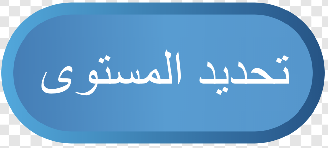

## المستوى ٢

مع هذه الخطوة ، ستقوم بإضافة مستوى جديد إلى اللعبة يمكن للاعب الوصول إليها بمجرد الضغط على الزر. في وقت لاحق ، يمكنك تغيير الكود الخاص بك لجعله يحتاج إلى عدد معين من النقاط ، أو أي شيء آخر ، للوصول إلى هناك.

### الانتقال إلى المستوى التالي

--- task ---

أولاً ، قم بإنشاء كائن جديد مثل زر عن طريق إضافة واحد من المكتبة أو رسم كائن خاص بك. لقد فعلت شيئًا من الاثنين وخرجت بهذا:



--- /task ---

--- task ---

الآن ، التعليمات البرمجية لهذا الزر ذكية: تم تصميمها بحيث في كل مرة تقوم بالنقر فوق الزر، سينقلك إلى المستوى التالي ، بغض النظر عن عدد المستويات الموجودة.

أضف هذه البرامج النصية إلى كائن **الزر** الخاص بك. سوف تحتاج إلى إنشاء بعض المتغيرات بينما تفعل ذلك.

```blocks3
+    when green flag clicked
+    set اعلى مستوى v] to [2]
+    set [أدنى مستوى v] to [1]
+    set [المستوى الحالي v] to [1]
```

```blocks3
+    when this sprite clicked
+    change [المستوى الحالي v] by (1)
+    if <(المستوى الحالي) > (اعلى مستوى ::variables)> then
        set [المستوى الحالي v] to (أدنى مستوى ::variables)
    end
+    broadcast [تنظيف التجميعات v]
+    broadcast (join [المستوى -](المستوى الحالي))
```

--- /task ---

هل تستطيع أن ترى كيف سيستخدم البرنامج المتغيرات التي قمت بإنشائها؟

+ `المستوى الأقصى`{:class="block3variables"} يخزن أعلى مستوى
+ `المستوى الادنى`{:class="block3variables"} يخزن أقل مستوى
+ `المستوى الحالي`{:class="block3variables"} يخزن المستوى الذي يكون عليه اللاعب الآن

كل هذه الأشياء تحتاج إلى ضبطها بواسطة المبرمج (أنت!)، لذلك إذا أضفت مستوى ثالثًا، فلا تنسَ تغيير قيمة ا`المستوى الأقصى`{:class="block3variables"}! وبالطبع فان `المستوى الادنى`{:class="block3variables"} لن تحتاج إلى تغييره أبداً.

تستخدم عمليات البث لإخبار الكائنات الأخرى اي مستوى مطلوب عرضه، ومسح المقتنيات عند بدء مستوى جديد.

### اجعل الكائنات تتفاعل

#### كائنات الـ**مقتنيات**

أنت الآن بحاجة إلى الحصول على كائنات اخرى للرد على هذا البث! ابدأ بأسهلها: مسح جميع المقتنيات.

--- task ---

أضف الكود التالي إلى البرامج النصية للكائن **المقتنيات** لإخبار جميع النسخ لـ`تختفي`{:class="block3looks"} عندما يتلقون بث المسح:

```blocks3
+    when I receive [تنظيف التجميعات v]
+    hide
```

--- /task ---

نظرًا أن أحد الأشياء الأولى التي يقوم بها أي استنساخ جديد هو إظهار نفسه ، فلا داعي للقلق بشأن إظهار المقتنيات!

#### كائنات الـ**منصات**

الآن لتبديل كائنات الـ**منصات**. يمكنك تصميم مستواك الجديد في وقت لاحق إذا أردت ، ولكن الآن دعونا نستخدم المستوى الذي قمت بتضمينه بالفعل - سترى السبب في الخطوة التالية!

--- task ---

أضف هذه التعليمات البرمجية إلى كائن **اللاعب**:

```blocks3
+    when I receive [المستوى-1 v]
+    switch costume to [Level 1 v]
+    show
```

```blocks3
+    when I receive [المستوى-2 v]
+    switch costume to [Level 2 v]
+    show
```

--- /task ---

يتلقى رسائل `انضم`{:class="block3operators"} للـ `مستوى-`{:class="block3variables"} و `المستوى الحالي`{:class="block3variables"} التي ارسلها كائن **الزر**، ويستجيب عن طريق تغيير شكل **المنصات**.

#### كائن **العدو**

--- task ---

في النصوص البرمجية للكائن **العدو**، فقط تأكد من اختفاء الكائن عندما يدخل اللاعب المستوى 2 ، مثل هذا:

```blocks3
+    when I receive [المستوى-1 v]
+    show
```

```blocks3
+    when I receive [المستوى-2 v]
+    hide
```

--- /task ---

إذا كنت تفضل ذلك ، يمكنك نقل العدو إلى منصة أخرى بدلاً من ذلك. في هذه الحالة ، يمكنك استخدام `انتقل إلى`{:class="block3motion"} block بدلاً من `العرض`{:class="block3looks"} و `إخفاء`{:class="block3looks"} الكتل.

### اجعل **شخصية اللاعب** تظهر في المكان المناسب

كلما بدأ مستوى جديد، كائن **شخصية اللاعب** يحتاج إلى الذهاب إلى المكان المناسب لهذا المستوى. لتحقيق ذلك، تحتاج إلى تغيير من أين يحصل الكائن على إحداثياته عندما يظهر لأول مرة على المسرح. في الوقت الحالي ، فان قيم المحورين `س` و `ص` مثبتة في التعليمات البرمجية.

--- task ---

ابدأ بإنشاء متغيرات لإحداثيات البداية: `بداية-س`{:class="block3variables"} و `بداية-ص`{:class="block3variables"}. ثم قم بتوصيلها في كتلة `انتقل إلى`{:class="block3motion"} في كتل `إعادة تعيين الشخصية`{:class="block3myblocks"} الموجودة في كتل **لبناتي** بدلا من القيم الثابتة لـ `س` و `ص`:

```blocks3
    define إعادة تعيين شخصية
    set [يستطيع القفز v] to [true]
    set [x-velocity v] to [0]
    set [y-velocity v] to [-0]
+    go to x: (بداية-س) y: (بداية-ص)
```

--- /task ---

--- task ---

ثم لكل بث يعلن بداية المستوى ، اضبط قيم المحاور `بداية-س`{:class="block3variables"} و `بداية-ص`{:class="block3variables"} الصحيحة في الاستجابة، وإضافة **استدعاء** إلى `إعادة تعيين الشخصية`{:class="block3myblocks"}:

```blocks3
+    when I receive [المستوى -1 v]
+    set [بداية-س v] to [-183]
+    set [بداية-ص v] to [42]
+    إعادة تعيين شخصية :: custom
```

```blocks3
+    when I receive [المستوى -2 v]
+    set [بداية-س v] to [-218]
+    set [بداية-ص v] to [-143]
+    إعادة تعيين شخصية :: custom
```

--- /task ---

### بدءا من المستوى 1

تحتاج أيضًا إلى التأكد من أنه في كل مرة يبدأ فيها شخص ما اللعبة ، يكون المستوى الأول الذي يلعبه هو المستوى 1.

--- task ---

انتقل إلى النص البرمجي الخاص بـ`اعادة اللعبة`{:class="block3myblocks"} وإزالة الاستدعاء `إعادة تعيين الشخصية`{:class="block3myblocks"} منه. بدلا عنها، قم ببث `المستوى الادنى`{:class="block3variables"}. سيقوم الكود الذي أضفته بالفعل مع هذه البطاقة بإعداد إحداثيات البداية الصحيحة لكائن **شخصية اللاعب**، وأيضا استدعاء `إعادة تعيين الشخصية`{:class="block3myblocks"}.

```blocks3
    define إعادة اللعبه
    set rotation style [left-right v]
    set [ارتفاع القفز v] to [15]
    set [الجاذبية v] to [2]
    set [x-speed v] to [1]
    set [y-speed v] to [1]
    set [الأرواح v] to [3]
    set [نقاط v] to [0]
+    broadcast (join [المستوى -](أدنى مستوى ::variables))
```

--- /task ---

--- collapse ---
---
title: إعادة تعيين شخصية اللاعب مقابل إعادة تعيين اللعبة
---

لاحظ أن الكتلة الأولى في النص الرئيسي لكائن**شخصية اللاعب** للعلم الأخضر هو استدعاء لـ `إعادة تعيين اللعبة`{:class="block3myblocks"} كتل **لبناتي**.

تقوم هذه الكتلة بإعداد جميع المتغيرات الخاصة بلعبة جديدة ثم تقوم باستدعاء `إعادة تعيين الشخصية`{:class="block3myblocks"} في كتل **لبناتي**، والذي يضع الشخصية مرة أخرى في وضع البداية الصحيح.

وجود الكود البرمجي لـ `إعادة تعيين الشخصية`{:class="block3myblocks"} في كتلة خاصة به منفصلة عن `إعادة ضبط اللعبة`{:class="block3myblocks"} يسمح لك بإعادة تعيين الشخصية إلى مواضع مختلفة **بدون** الحاجة إلى إعادة تعيين اللعبة بأكملها.

--- /collapse ---