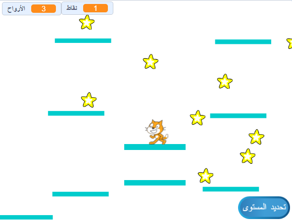

## منصات متحركة

السبب في أنني طلبت منك استخدام نسختي من المستوى 2 هو الفجوة التي قد تكون لاحظتها في منتصف التصميم. ستقوم بإنشاء منصة تتحرك من خلال هذه الفجوة والتي يمكن للاعب القفز عليها وركوبها!



أولاً ، ستحتاج كائن للمنصة.

--- task ---

أضف كائناً جديدًا ، وقم بتسميته **منصة متحركة** ، واستخدام أدوات تخصيص المظاهر في علامة التبويب "المظاهر" لجعلها تبدو مثل المنصات الأخرى (استخدم وضع المتجه).

--- /task ---

الآن ، دعونا نضيف بعض الكود إلى الكائن.

ابدأ بالأساسيات: لجعل مجموعة لا تنتهي من المنصات تتحرك على الشاشة ، ستحتاج إلى استنساخ المنصة على فترات منتظمة. لقد اخترت `4` ثواني كفترة لي. تحتاج أيضًا إلى التأكد من وجود مفتاح تشغيل / إيقاف لإنشاء المنصات ، بحيث لا تظهر في المستوى 1. أنا أستخدم متغيرًا جديدًا يسمى `إنشاء-منصات`{:class="block3variables"}.

--- task ---

أضف رمزًا لإنشاء نسخ للكائن الأساسي الخاص بك.

إليك كيف تبدو لي حتى الآن:

```blocks3
+    when green flag clicked
+    hide
+    forever
        wait (4) secs
        if <(إنشاء-منصات ::variables) = [true]> then
            create clone of [myself v]
        end
    end
```

--- /task ---

--- task ---

ثم أضف التعليمات البرمجية للنسخة:

```blocks3
+    when I start as a clone
+    show
+    forever
        if <(y position) < [180]> then
            change y by (1)
            wait (0.02) secs
        else
            delete this clone
        end
    end
```

--- /task ---

هذا الرمز يجعل نسخة **المنصة المتحركة** تتحرك لأعلى الشاشة، ببطء كافٍ يتيح للاعب القفز وإيقاف القفز، ثم يختفي.

--- task ---

الآن اجعل المنصات تختفي / تعاود الظهور على أساس عمليات البث التي تغير المستويات (بحيث تكون موجودة فقط في المستوى الذي تتوفر فيه مساحة لهم) ، وفي رسالة `انتهت اللعبة`{:class="block3events"}.

```blocks3
+    when I receive [المستوى-1 v]
+    set [إنشاء-منصات v] to [false]
+    hide

+    when I receive [المستوى-2 v]
+    set [إنشاء-منصات v] to [true]

+    when I receive [انتهت اللعبة v]
+    hide
+    set [إنشاء-منصات v] to [false]
```

--- /task ---

الآن ، إذا حاولت تشغيل اللعبة فعليًا ، **شخصية اللاعب** يقع من خلال المنصة! أي فكرة لماذا؟

ذلك لأن كود الفيزياء لا يعرف عن المنصة. إنه في الواقع حل سريع:

--- task ---

في النصوص البرمجية لكائن**شخصية اللاعب**، استبدل كل كتلة بها `لمس "المنصات"`{:class="block3sensing"} بالعملية `أو`{:class="block3operators"} التي تبحث عن **اما** `لمس "المنصات"`{:class="block3sensing"} **أو** `لمس "منصة متحركة"`{:class="block3sensing"}.

انتقل بين التعليمات البرمجية لكائن **شخصية اللاعب** وفي كل مكان ترى هذه الكتلة:

```blocks3
    <touching [المنصات v] ?>
```

استبدالها مع هذا:

```blocks3
    <<touching [المنصات v] ?> or <touching [منصة متحركة v] ?>>
```

--- /task ---