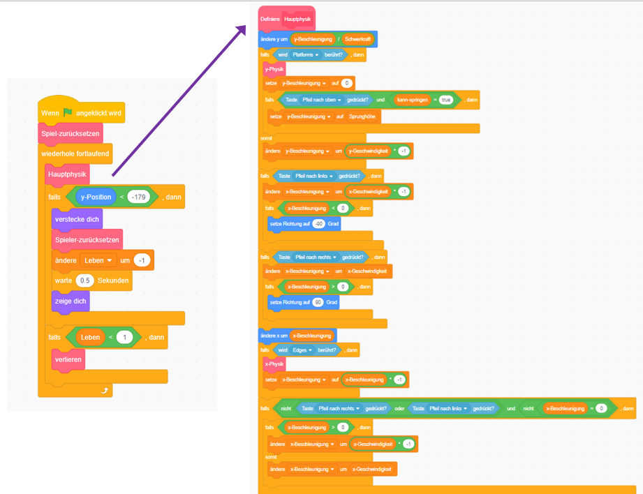

## Vorbereitungen

Du lernst, wie man in Scratch programmiert, und nicht wie man eine Physik-Engine erstellt (Code, der bewirkt, dass sich Dinge in einem Computerspiel wie realistische Objekte verhalten, z. B. fallen sie nicht durch Böden). Deswegen beginnst du mit einem Projekt, das ich erstellt habe und das bereits die Grundlagen für das Verschieben, Springen und Erkennen von Plattformen enthält.

Du solltest dir das Projekt einschließlich der Details auf dieser Karte kurz ansehen, da du später einige Änderungen daran vornehmen wirst, aber du musst nicht alles verstehen, was es tut!

### Das Projekt bekommen

\--- task \---

The first thing you’ll need to do is to get a copy of the Scratch code from [here](https://scratch.mit.edu/projects/454114430){:target="_blank"}.

Um das Projekt offline zu verwenden, lade es herunter, indem du auf **Schau hinein** klickst und dann weiter auf **Datei** und **Auf deinem Computer speichern**. Dann kannst du die heruntergeladene Datei in Scratch auf deinem Computer öffnen.

Du kannst es auch direkt in Scratch in deinem Browser verwenden, indem du auf **Schau hinein** und dann auf **Remix** klickst.

\--- /task \---

### Schaue dir den Code an

Die Physik-Engine des Spiels enthält eine Vielzahl von Teilen, von denen einige bereits funktionieren und andere noch nicht. Du kannst dies testen, indem du das Spiel ausführst und versuchst, es zu spielen.

Du wirst sehen, dass du Leben verlieren kannst, aber nichts passiert, wenn die Leben ausgehen. Außerdem hat das Spiel nur eine Ebene, eine Art von Dingen zu sammeln und keine Gegner. Du wirst all das reparieren und dann noch ein bisschen mehr tun!

\--- task \---

Sie dir an, wie der Code zusammengesetzt wird.

\--- /task \---

Es verwendet viele **Mein Blöcke**-Blöcke, die sich hervorragend dazu eignen, deinen Code in Teile zu zerlegen, damit du ihn besser verwalten kannst. Ein **Meine Blöcke**-Block ist ein Block, den du aus vielen anderen Blöcken zusammenstellen und dem du einige Anweisungen geben kannst. Du wirst in einem nächsten Schritt sehen, wie es funktioniert!

### "Meine Blöcke"-Blöcke sind wirklich nützlich

Im obigen Code ruft das Hauptspiel in der `wiederhole fortlaufend`{:class="block3control"}-Schleife den `Hauptphysik`{:class="block3myblocks"}-**Meine Blöcke**-Block auf, um eine ganze Menge Sachen zu machen! Die Blöcke getrennt zu halten, macht es leicht, die Hauptschleife zu lesen und verstehen, was im Spiel passiert, ohne sich Gedanken zu machen **wie** es passiert.

\--- task \---

Nun schau dir die `Spiel-zurücksetzen`{:class="block3myblocks"} und `Spieler-zurücksetzen`{:class="block3myblocks"}-**Meine Blöcke**-Blöcke an.

\--- /task \---

Sie machen ziemlich normale Dinge, zum Beispiel richten Sie Variablen ein und stellen sicher, dass sich der Charakter richtig dreht

- `Spiel-zurücksetzen`{:class="block3myblocks"} **ruft** `Spieler-zurücksetzen`{:class="block3myblocks"} auf und zeigt, dass du einen **Meine Blöcke**-Block innerhalb eines weiteren **Meine Blöcke**-Blocks verwenden kannst
- Der `Spieler-zurücksetzen`{:class="block3myblocks"} **Meine Blöcke**-Block wird an zwei verschiedenen Stellen in der Hauptschleife verwendet. Dies bedeutet, dass du zwei Stellen in deiner Hauptspielschleife ändern kannst, indem du nur den Code innerhalb des **Meine Blöcke**-Blocks änderst. Dies erspart dir viel Arbeit und hilft, Fehler zu vermeiden.