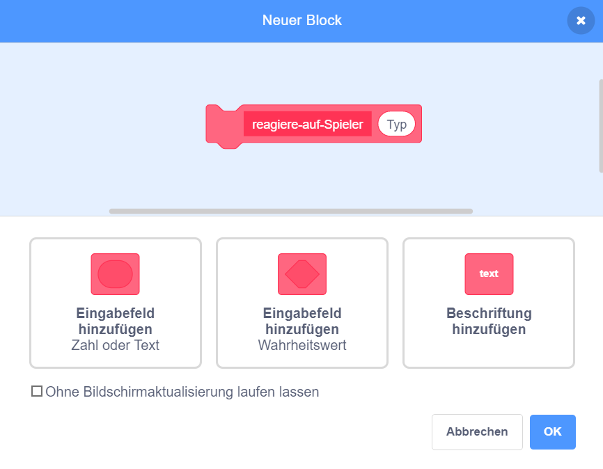

## Power-Up

Im Moment hast du nur eine Art Sammelobjekt: einen Stern, der dir einen Punkt bringt, wenn du ihn auffängst. Auf dieser Karte erstellst du eine neue Art von Sammelobjekt, und tust dies auf eine Weise, die das Hinzufügen anderer Arten von Sammelobjekten vereinfacht. Danach kannst du deine eigenen Power-Ups und Boni erfinden und das Spiel wirklich zu deinem eigenen machen!

Ich habe bereits einige Teile dazu mit der Variable `sammelobjekt-typ`{:class="block3variables"} und dem `wähle-Kostüm`{:class="block3myblocks"} **Meine Blöcke**-Block hinzugefügt. Du musst sie jedoch verbessern.

Schauen wir uns an, wie das Sammelobjekt jetzt funktioniert.

Suche in den Skripten für die Figur **Sammelobjekt** den `wenn ich als Klon entstehe`{:class="block3events"}-Code. Die Blöcke, die du betrachten solltest, sind diejenigen die dir Punkte geben, wenn du einen Stern sammelst:

```blocks3
    falls <wird [Spieler Character v]berührt?>, dann
    ändere [Punkte v] um (Sammelobjekt-wert::variables)
    lösche diesen Klon
```

und diesen hier, der ein Kostüm für den Klon auswählt:

```blocks3
    wähle-Kostüm (Sammelobjekt-typ ::variables) :: custom
```

## \--- collapse \---

## title: Wie funktioniert das Auswählen eines Kostüms?

Der `wähle-Kostüm`{:class="block3myblocks"}-Block funktioniert ein bisschen wie der `verlieren`{:class="block3myblocks"}-Block, aber er kann etwas Besonderes: Er benötigt eine **Eingabe-**Variable mit der Bezeichnung `Typ`{:class="block3myblocks"}.

```blocks3
    Definiere wähle-Kostüm (typ) 
    falls <(typ ::variables) = [1]> dann
        wechsle zu Kostüm [Stern1 v]
    Ende
```

Wenn der Block `wähle-Kostüm`{:class="block3myblocks"} ausgeführt wird, macht er Folgendes:

1. Es betrachtet die Eingangsvariable `Typ`{:class="block3myblocks"}
2. Wenn der Wert von `Typ`{:class="block3myblocks"} gleich `1`ist, wechselt er zum `Stern1` - Kostüm

Schau dir den Teil des Skripts an, der den Block verwendet:

```blocks3
    Wenn ich als Klon entstehe
  wähle-Kostüm (Sammelobjekt-Typ ::variables) :: custom
  zeige dich
  wiederhole bis <(y-Position) <[-170]> 
     ändere y um (Sammelobjekt-Geschwindigkeit ::variables)
     falls <wird [Spieler Character v] berührt?> , dann 
          ändere [Punkte v] um (Sammelobjekt-Wert ::variables)
          lösche diesen Klon
  Ende
Ende
```

Du siehst, dass die `Sammelobjekt-Typ`{:class="block3variables"} - Variable an den `wähle-Kostüm`{:class="block3myblocks"}-Block **weitergereicht** wird. Im Code für `wähle-Kostüm`{:class="block3myblocks"}, wird `Sammelobjekt-Typ`{:class="block3variables"} dann als Eingabevariable (`Typ`{:class="block3myblocks"}) verwendet.

Das bedeutet, dass der Wert von `Sammelobjekt-Typ`{:class="block3variables"} entscheidet, welches Kostüm der Klon der Figur erhält.

\--- /collapse \---

### Füge ein Kostüm für das neue Power-Up hinzu

Natürlich hat die **Sammelobjekt** - Figur momentan nur ein Kostüm, da es nur eine Art von Sammelobjekten gibt. Du wirst das jetzt ändern.

\--- task \---

Add a new costume to the **Collectable** sprite for your new power-up. I like the lightning bolt, but pick whatever you like.

\--- /task \---

\--- task \---

Next, tell the `pick-costume`{:class="block3myblocks"} **My blocks** block to set the new costume whenever it gets the new value for `type`{:class="block3myblocks"}, like this \(using whatever costume name you picked\):

```blocks3
    Definiere wähle-Kostüm (typ)
    falls <(typ ::variable) = [1]>, dann
        wechsle zu Kostüm [Stern v] 
    Ende
+    falls <(typ ::variable) = [2]>, dann
+         wechsle zu Kostüm [Blitz v]
+    Ende
```

\--- /task \---

### Erstelle den Power-Up-Code

Now you need to decide what the new collectable will do! We’ll start with something simple: giving the player a new life. In the next step, you’ll make it do something cooler.

\--- task \---

Go into the **My blocks** section and click **Make a Block**. Name the new block `react-to-player`{:class="block3myblocks"} and add a **number input** named `type`{:class="block3myblocks"}.



Click **OK**.

\--- /task \---

\--- task \---

Make the `react-to-player`{:class="block3myblocks"} **My blocks** block either increase the points or increase the player’s lives, depending on the value of `type`{:class="block3myblocks"}.

```blocks3
+ Definiere reagiere-auf-Spieler (typ)
+ falls <(typ ::variable) = [1]>, dann
+    ändere [Punkte v] um (Sammelobjekt-Wert ::variables)
+ Ende
+ falls <(typ ::variable) = [2]>, dann
+     ändere [Leben v] um [1]
+ Ende
```

\--- /task \---

\--- task \---

Update the `when I start as a clone`{:class="block3events"} code to replace the block that adds a point with a **call** to `react-to-player`{:class="block3myblocks"}, **passing** `collectable-type`{:class="block3variables"} to it.

```blocks3
+ falls <wird [Spieler Character v] berührt?>, dann
+       reagiere-auf-Spieler (Sammelobjekt-Typ ::variables) :: custom
+       lösche diesen Klon
+    Ende
```

\--- /task \---

By using this new `react-to-player`{:class="block3myblocks"} **My blocks** block, stars still add a point, but the new power-up you've created adds a life.

### Verwende `Sammelobjekt-Typ`{:class="block3variables"}, um verschiedene Sammelobjekte zufällig erscheinen zu lassen

Right now, you might be wondering how you'll tell each collectable the game makes what type it should be.

You do this by setting the value of `collectable-type`{:class="block3variables"}. This variable is just a number. As you've seen, it's used to tell the `pick-costume`{:class="block3myblocks"} and `react-to-player`{:class="block3myblocks"} blocks what costume, rules, etc. to use for the collectable.

## \--- collapse \---

## title: Mit Variablen in einem Klon arbeiten

For each clone of the **Collectable** sprite, you can set a different value for `collectable-type`{:class="block3variables"}.

Think of it like creating a new copy of the **Collectable** sprite with the help of the value that is stored in `collectable-type`{:class="block3variables"} at the time the **Collectable** clone gets created.

You might be wondering whether changing the value of `collectable-type`{:class="block3variables"} will turn all the collectables on the Stage into the same type. That doesn't happen, because one of the things that makes clones special is that they cannot change the values of any variables they start with. Sprite clones effectively have **constant** values. That means that when you change the value of `collectable-type`{:class="block3variables"}, this doesn't affect the **Collectable** sprite clones that are already in the game.

\--- /collapse \---

You're going to set the `collectable-type`{:class="block3variables"} to either `1` or `2` for each new clone that you make. To keep the game interesting, pick between the numbers at random to make a random collectable every time.

\--- task \---

Find the `repeat until`{:class="block3control"} loop inside the green flag code for the **Collectable** sprite, and add the `if...else`{:class="block3control"} code shown below.

```blocks3
    wiederhole bis <nicht <(erzeuge-Sammelobjekte ::variables) = [wahr]>>
+    falls <[50] = (Zufallszahl von (1) bis (50))>, dann
+    setze [Sammelobjekt-Typ v] auf [2], sonst
+    setze [Sammelobjekt-Typ v] auf [1]
   Warte (Sammelobjekt-Häufigkeit ::variables) Sekunden
        gehe zu x: (Zufallszahl von (-240) bis (240)) y: (179)
        Erzeuge Klon von [mir selbst]
ende
```

\--- /task \---

This code gives a 1-in-50 chance of setting the `collectable-type`{:class="block3variables"} to `2`. After all, you don't want to give the player the chance to collect an extra life too often, otherwise the game would be too easy.

Now you have a new type of collectable that sometimes shows up instead of the star, and that gives you an extra life instead of a point when you collect it.