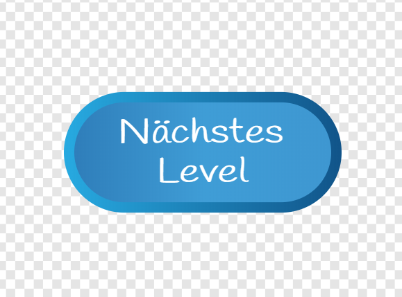

## Level 2

Mit diesem Schritt fügst du dem Spiel ein neues Level hinzu, das der Spieler durch Drücken einer Taste erreichen kann. Später kannst du deinen Code so ändern, dass er eine bestimmte Anzahl von Punkten oder etwas anderes benötigt, um dorthin zu gelangen.

### Auf das nächste Level gelangen

\--- task \---

First, create a new sprite as a button by either adding one from the library or drawing your own. I did a bit of both and came up with this:



\--- /task \---

\--- task \---

Now, the code for this button is clever: it’s designed so that every time you click it it will take you to the next level, no matter how many levels there are.

Add these scripts to your **Button** sprite. You will need to create some variables as you do so.

```blocks3
+ Wenn die grüne Flagge angeklickt
+ setze [max-Level v] auf [2]
+ setze [min-Level v] auf [1]
+ setze [aktuelles-Level v] auf [1]
```

```blocks3
+ Wenn diese Figur angeklickt wird
+ ändere [aktuelles-Level v] um (1)
+ falls <(aktuelles-Level) > (max-Level :: variables)>  dann 
  setze [aktuelles-Level v] auf (min-Level :: variables)
ende
+ sende [Sammelobjekte-aufräumen v] an alle
+ sende (betrete [Level-] (aktuelles-Level)) an alle
```

\--- /task \---

Can you see how the program will use the variables you created?

+ `max-Level`{:class="block3variables"} speichert den höchsten Level
+ `min-Level`{:class="block3variables"} speichert den untersten Level
+ `aktuelles-Level`{:class = "block3variables"} speichert das Level, auf dem sich der Spieler gerade befindet

These all need to be set by the programmer \(you!\), so if you add a third level, don’t forget to change the value of `max-level`{:class="block3variables"}! `min-level`{:class="block3variables"} will never need to change, of course.

The broadcasts are used to tell the other sprites which level to display, and to clear up the collectables when a new level starts.

### Lass die Figuren reagieren

#### Die **Sammelobjekt** - Figur

Now you need to get the other sprites to respond to these broadcasts! Start with the easiest one: clearing all the collectables.

\--- task \---

Add the following code to the **Collectable** sprite scripts to tell all its clones to `hide`{:class="block3vlooks"} when they receive the cleanup broadcast:

```blocks3
+    wenn ich [Sammelobjekte-aufräumen v] empfange   
+    verstecke dich
```

\--- /task \---

Since one of the first things any new clone does is show itself, you don't have to worry about unhiding collectables!

#### Die **Plattormen** - Figur

Now to switch the **Platforms** sprite. You can design your own new level later if you like, but for now let’s use the one I’ve already included — you’ll see why on the next step!

\--- task \---

Add this code to the **Platforms** sprite:

```blocks3
+ Wenn ich [Level-1 v] empfange
+ wechsle zu Kostüm [Level 1 v]
+ zeige dich
```

```blocks3
+ Wenn ich [Level-2 v] empfange
+ wechsle zu Kostüm [Level 2 v]
+ zeige dich
```

\--- /task \---

It receives the `joined`{:class="block3operators"} messages of `level-`{:class="block3variables"} and `current-level`{:class="block3variables"} that the **Button** sprite sends out, and responds by changing the **Platforms** costume.

#### Die **Feind** - Figur

\--- task \---

In the **Enemy** sprite scripts, just make sure the sprite disappears when the player enters level 2, like this:

```blocks3
+ wenn ich [Level-1 v] empfange
+ zeige dich
```

```blocks3
+ wenn ich [Level-2 v] empfange
+ verstecke dich
```

\--- /task \---

If you prefer, you can make the enemy move to another platform instead. In that case, you would use a `go to`{:class="block3motion"} block instead of the `show`{:class="block3looks"} and `hide`{:class="block3looks"} blocks.

### Lass den **Spielercharakter** an der richtigen Stelle erscheinen

Whenever a new level starts, the **Player Character** sprite needs to go to the right place for that level. To make this happen, you need to change where the sprite gets its coordinates from when it first appears on the Stage. At the moment, there are fixed `x` and `y` values in its code.

\--- task \---

Begin by creating variables for the starting coordinates: `start-x`{:class="block3variables"} and `start-y`{:class="block3variables"}. Then plug them into the `go to`{:class="block3motion"} block in the `reset-character`{:class="block3myblocks"} **My blocks** block instead of the fixed `x` and `y` values:

```blocks3
    Definiere Spieler-zurücksetzen
    setze [kann-springen v] auf [wahr]
    setze [x-Beschleunigung v] auf [0]
    setze [y-Beschleunigung v] auf [-0]
+    gehe zu  x: (start-x) y: (start-y)
```

\--- /task \---

\--- task \---

Then for each broadcast announcing the start of a level, set the right `start-x`{:class="block3variables"} and `start-y`{:class="block3variables"} coordinates in response, and add a **call** to `reset-character`{:class="block3myblocks"}:

```blocks3
+ wenn ich [Level-1 v] empfange
+ setze [start-x v] auf [-183]
+ setze [start-y v] auf [42]
+ Spieler-zurücksetzen :: custom
```

```blocks3
+ wenn ich [Level-2 v] empfange
+ setze [start-x v] auf [-218]
+ setze [start-y v] auf [-143]
+ Spieler-zurücksetzen :: custom
```

\--- /task \---

### Beginne mit Level 1

You also need to make sure that every time someone starts the game, the first level they play is level 1.

\--- task \---

Go to the `reset-game`{:class="block3myblocks"} script and remove the call to `reset-character`{:class="block3myblocks"} from it. In its place, broadcast the `min-level`{:class="block3variables"}. The code you've already added with this card will then set up the correct starting coordinates for the **Player Character** sprite, and also call `reset-character`{:class="block3myblocks"}.

```blocks3
    Definiere Spiel-zurücksetzen
    setze Drehtyp auf [links-rechts v]
    setze [Sprunghöhe v] auf [15]
    setze [Schwerkraft v] auf [2]
    setze [x-Geschwindigkeit v] auf [1]
    setze [Y-Geschwindigkeit v] auf [1]
    setze [Leben v] auf [3]
    setze [Punkte v] auf [0]
+ Sende (betrete [Level-](min-Level ::variables)) an alle
```

\--- /task \---

## \--- collapse \---

## title: Zurücksetzen des Spielercharakters im Vergleich zum Zurücksetzen des Spiels

Notice that the first block in the **Player Character** sprite's main green flag script is a call to the `reset-game`{:class="block3myblocks"} **My blocks** block.

This block sets up all the variables for a new game and then calls the `reset-character`{:class="block3myblocks"} **My blocks** block, which places the character back in its correct starting position.

Having the `reset-character`{:class="block3myblocks"} code in its own block separate from `reset-game`{:class="block3myblocks"} allows you to reset the character to different positions **without** having to reset the whole game.

\--- /collapse \---