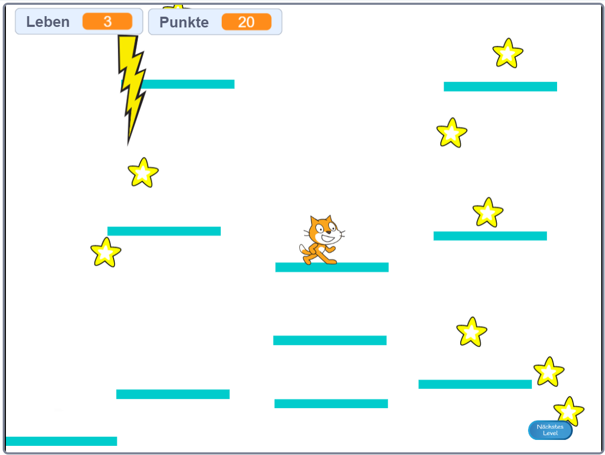

## Plattformen verschieben

Der Grund, warum ich dich gebeten habe, meine Version von Level 2 zu verwenden, ist die Lücke, die du möglicherweise in der Mitte des Layouts bemerkt hast. Du wirst eine Plattform schaffen, die sich durch diese Lücke bewegt und auf die der Spieler springen und fahren kann!



Zunächst benötigst du die Figur für die Plattform.

\--- task \--- Füge eine neue Figur hinzu, nenne sie **mobile-plattform**und benutze die Kostümanpassungs-Tools auf der Registerkarte Kostüme, damit sie wie die anderen Plattformen aussieht \(Vektormodus verwenden\). \--- /task \---

Nun fügen wir der Figur etwas Code hinzu.

Beginne mit den Grundlagen: Um eine unendliche Anzahl von Plattformen, die sich auf dem Bildschirm nach oben bewegen, zu machen, musst du die Plattform in regelmäßigen Abständen klonen. Ich habe `4` Sekunden als Intervall ausgewählt. Du musst auch sicherstellen, dass es einen Ein/Aus-Schalter für die Herstellung der Plattformen gibt, damit sie nicht in Level 1 angezeigt werden. Ich verwende eine neue Variable mit dem Namen `erstelle-Plattform`{:class="block3variables"}.

\--- task \--- Füge Code hinzu, um Klone der Plattformfigur zu erstellen.

So sieht meiner bisher aus:

```blocks3
+ Wenn die grüne Flagge angeklickt 
+ verstecke dich
+ wiederhole fortlaufend
        warte (4) Sekunden
        falls <(erstelle-plattform ::variables) = [wahr]>, dann
            erzeuge Klon von [mir selbst v]
        Ende
    Ende
```

\--- /task \---

\--- task \--- Dann füge den Code des Klons hinzu:

```blocks3
+ Wenn ich als Klon entstehe
+ zeige dich
+ wiederhole fortlaufend
        falls <(y - Position) < [180]>, dann
            ändere y um (1)
            warte (0,02) Sekunden
        sonst
            lösche diesen Klon
        Ende
    Ende
```

\--- /task \---

Dieser Code bewirkt, dass der **mobile-Plattform** - Klon sich langsam genug an den oberen Rand des Bildschirms bewegt, sodass der Spieler ein- und aussteigen kann und dann verschwindet.

\--- task \--- Nun lasse die Plattformen verschwinden/erscheinen, basierend auf den Nachrichten, die die Level ändern (dass sie also nur auf dem Level erscheinen auf dem Platz für sie ist), und die `Game Over`{:class="block3events"} Nachricht.

```blocks3
+ wenn ich [Level-1 v] empfange
+ setze [erstelle-Plattform v] auf [falsch]
+ verstecke dich

+ wenn ich [Level-2 v] empfange
+ setze [erstelle-Plattform v] auf [wahr]

+ wenn ich [Game Over v] empfange 
+ verstecke dich
+ setze [erstelle-Plattform  v] auf [falsch]
```

\--- /task \---

Wenn du nun versuchst, das Spiel tatsächlich zu spielen, fällt der **Spieler-Charakter** durch die Plattform! Irgendeine Idee warum?

Der Grund dafür ist, dass der Physikcode die Plattform nicht kennt. Es ist eigentlich eine schnelle Lösung:

\--- task \--- Ersetze in den Figur-Skripten des **Spielercharakters** alle `berühre "Plattform"`{:platforms"="block3sensing"}-Blöcke durch einen Operator `oder`{:class="block3operators"}, der prüft ob **entweder** `Berühre "Plattform"`{:class="block3sensing"} **ODER** `Berühre "mobile-Plattform"`{:class="block3sensing"} wahr ist.

Durchsuche den Code für die Figur **Spielercharakter** und überall, wo du diesen Block siehst:

```blocks3
    <wird [Platform v] berührt?>
```

ersetze ihn durch diesen:

```blocks3
    <<wird [Platform v] berührt?> oder <wird [mobile-Platform v] berührt?>>
```

\--- /task \---