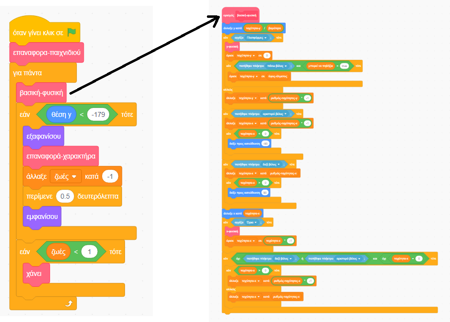

## Ρύθμιση των πραγμάτων

Επειδή μαθαίνεις το Scratch και όχι πώς να φτιάξεις μια μηχανή φυσικής (κώδικας που κάνει τα πράγματα να συμπεριφέρονται τουλάχιστον όπως στον πραγματικό κόσμο - π.χ. να μην γίνεται πτώση μέσα από το πάτωμα), θα ξεκινήσεις με ένα έτοιμο έργο που έχει ενσωματωμένα τα βασικά στοιχεία για την κίνηση, το άλμα και τον εντοπισμό των πλατφορμών.

Θα πρέπει να ρίξεις μια γρήγορη ματιά στο έργο, συμπεριλαμβανομένων των λεπτομερειών σε αυτήν την καρτέλα, επειδή θα κάνεις κάποιες αλλαγές αργότερα, αλλά δεν χρειάζεται να καταλάβεις όλα όσα κάνει!

### Πάρε το έργο

--- task ---

Το πρώτο πράγμα που πρέπει να κάνεις είναι να κάνεις ένα αντίγραφο του κώδικα Scratch από το [scratch.mit.edu/projects/436301479](https://scratch.mit.edu/projects/436301479){:target="_ blank"}.

Για να χρησιμοποιήσεις το έργο εκτός σύνδεσης, μπορείς να το κατεβάσεις κάνοντας κλικ στο **Δείτε μέσα** και μετά από το μενού **Αρχείο** και **Αποθήκευση στον υπολογιστή σου**. Στη συνέχεια μπορείς να ανοίξεις το αρχείο στο πρόγραμμα Scratch που έχεις στον υπολογιστή σου.

Μπορείς επίσης να το χρησιμοποιήσεις απευθείας στο Scratch στο πρόγραμμα περιήγησης κάνοντας απλώς κλικ στο **Δείτε μέσα** και στη συνέχεια στο κουμπί **Ανάμειξη**.

--- /task ---

### Ρίξε μια ματιά στον κώδικα

Η μηχανή φυσικής του παιχνιδιού έχει πολλά τμήματα κώδικα, μερικά από τα οποία λειτουργούν ήδη, ενώ άλλα δε λειτουργούν ακόμη. Μπορείς να το δοκιμάσεις εκτελώντας το παιχνίδι και προσπαθώντας να το παίξεις.

Θα δεις ότι μπορείς να χάνεις ζωές, αλλά τίποτα δε συμβαίνει όταν σου τελειώσουν όλες. Επίσης, το παιχνίδι έχει μόνο ένα επίπεδο, ένα είδος αντικειμένου που μπορείς να συλλέξεις και καθόλου εχθρούς. Θα διορθώσεις όλα αυτά και, στη συνέχεια, θα κάνεις ακόμη περισσότερα!

--- task ---

Ρίξε μια ματιά στον τρόπο που ο κώδικας καλεί άλλο κώδικα.

--- /task ---

Χρησιμοποιεί πολλά μπλοκ από το μενού **Οι Εντολές μου**, τα οποία βοηθούν για να χωρίζεις τον κώδικα σε τμήματα, ώστε να μπορείς να τον διαχειριστείς καλύτερα. Ένα μπλοκ στις **Εντολές μου** είναι ένα μπλοκ που απαρτίζεται από πολλά άλλα μπλοκ και μπορεί να εκτελέσει κάποιες οδηγίες. Θα δεις πώς λειτουργεί αυτό σε επόμενο βήμα!

### Τα μπλοκ στις «Εντολές μου» είναι πραγματικά χρήσιμα

Στον παραπάνω κώδικα του παιχνιδιού, ο κύριος βρόχος `για πάντα`{:class="block3control"} καλεί το μπλοκ `βασική-φυσική`{:class="block3myblocks"} από τις **Εντολές μου** για να κάνει πολλά πράγματα! Ο διαχωρισμός των μπλοκ με αυτόν τον τρόπο σε βοηθάει να διαβάζεις πιο εύκολα τον κύριο βρόχου και να κατανοείς τι συμβαίνει στο παιχνίδι, χωρίς να ανησυχείς για το **πώς** συμβαίνει.

--- task ---

Τώρα δες τα μπλοκ `επαναφορά-παιχνιδιού`{:class="block3myblocks"} και `επαναφορά-χαρακτήρα`{:class="block3myblocks"} από το μενού **Οι Εντολές μου**.

--- /task ---

Κάνουν διάφορα πραγματάκια, όπως η ρύθμιση των μεταβλητών και η σωστή περιστροφή του χαρακτήρα

- Η εντολή `επαναφορά-παιχνιδιού`{:class="block3myblocks"} **καλεί** την `επαναφορά-χαρακτήρα`{:class="block3myblocks"}, που σημαίνει ότι μπορείς να χρησιμοποιείς ένα μπλοκ από τις **Εντολές μου** μέσα σε ένα άλλο μπλοκ από τις **Εντολές μου**
- Το μπλοκ `επαναφορά-χαρακτήρα`{:class="block3myblocks"} από το μενού **Οι εντολές μου** χρησιμοποιείται σε δύο διαφορετικά σημεία στον κύριο βρόχο. Αυτό σημαίνει ότι μπορείς να αλλάξεις δύο τμήματα στον κύριο βρόχο του παιχνιδιού, αλλάζοντας τον κώδικα μέσα στο μπλοκ από τις **Εντολές μου** μόνο μια φορά, πράγμα που σου εξοικονομεί πολλή δουλειά και σε βοηθάει να αποφεύγεις σφάλματα.