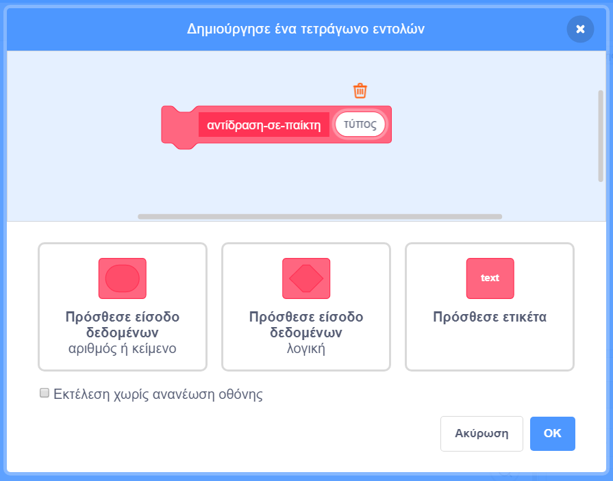

## Power-ups

Προς το παρόν έχεις μόνο έναν τύπο για τα βραβεία σου: ένα αστέρι που όταν το πάρεις κερδίζει ένα πόντο. Σε αυτήν την καρτέλα, θα δημιουργήσεις έναν νέο τύπο βραβείων και θα το κάνεις με τρόπο που θα διευκολύνει την προσθήκη κι άλλων τύπων αργότερα. Στη συνέχεια, μπορείς να εμπνευστείς τα δικά σου power-ups και μπόνους και να κάνεις πραγματικά το δικό σου παιχνίδι!

Έχω ήδη συμπεριλάβει κώδικα για να το κάνεις αυτό με τη μεταβλητή `τύπος-βραβείου`{:class="block3variables"} και το μπλοκ`επιλογή-ενδυμασά`{: class="block3myblocks"} από τις **Εντολές μου**. Ωστόσο, θα πρέπει να τον βελτιώσεις.

Ας ρίξουμε μια ματιά στο πώς λειτουργεί το βραβείο αυτή τη στιγμή.

Στον κώδικα για το αντικείμενο **Βραβείο**, βρες την εντολή `όταν ξεκινήσω ως κλώνος`{:class="block3events"}. Τα μπλοκ που θέλω να δεις είναι αυτά που σου δίνουν πόντους για τη συλλογή ενός αστεριού:

```blocks3
    if <touching [Player Character v]?> then
        change [points v] by (collectable-value ::variables)
        delete this clone
```

και αυτό που επιλέγει μια ενδυμασία για τον κλώνο:

```blocks3
    pick-costume (collectable-type ::variables) :: custom
```

## \--- collapse \---

## title: Πώς λειτουργεί η επιλογή ενδυμασίας;

Το μπλοκ `επιλογή-ενδυμασία`{:class="block3myblocks"} λειτουργεί περίπου σαν το μπλοκ `χάνει`{:class="block3myblocks"}, αλλά έχει κάτι επιπλέον: παίρνει μια**παράμετρο** που ονομάζεται `τύπος`{:class="block3myblocks"}.

```blocks3
    define pick-costume (type)
    if <(type ::variables) = [1]> then
        switch costume to [star1 v]
    end
```

Όποτε εκτελείται το μπλοκ `επιλογή-ενδυμασία`{:class="block3myblocks"}, αυτό που κάνει είναι:

1. Εξετάζει την παράμετρο εισόδου `τύπος`{:class="block3myblocks"}
2. Εάν η τιμή της `τύπος`{:class="block3myblocks"} είναι `1`, τότε αλλάζει στην ενδυμασία `star1`

Ρίξε μια ματιά στο μέρος του κώδικα που χρησιμοποιεί το μπλοκ:

```blocks3
    when I start as a clone
    pick-costume (collectable-type ::variables) :: custom
    show
    repeat until <(y position) < [-170]>
        change y by (collectable-speed ::variables)
        if <touching [Player Character v]?> then
            change [points v] by (collectable-value ::variables)
            delete this clone
```

Μπορείς να δεις ότι η μεταβλητή `τύπος-βραβείου`{:class="block3variables"} **περνάει** στο μπλοκ `επιλογή-ενδυμασία`{:class="block3myblocks"}. Μέσα στον κώδικα του `επιλογή-ενδυμασία`{:class="block3myblocks"}, ο `τύπος-βραβείου`{:class="block3variables"} χρησιμοποιείται στη συνέχεια ως παράμετρος εισόδου (`τύπος`{:class="block3myblocks"}).

Αυτό σημαίνει ότι η τιμή του `τύπος-βραβείου`{:class="block3variables"} αποφασίζει ποια ενδυμασία θα έχει ο κλώνος του αντικειμένου.

\--- /collapse \---

### Πρόσθεσε μια ενδυμασία για το νέο είδος βραβείου

Φυσικά, τώρα το αντικείμενο**Βραβείο** έχει μόνο μια ενδυμασία, αφού υπάρχει μόνο ένας τύπος βραβείου. Αυτό θα το αλλάξεις.

\--- task \---

Πρόσθεσε μια νέα ενδυμασία στο αντικείμενο **Βραβείο** για το νέο σου power-up. Μου αρέσει ο κεραυνός, αλλά εσύ επίλεξε ό,τι θέλεις.

\--- /task \---

\--- task \---

Στη συνέχεια, πες στο μπλοκ `επιλογή-ενδυμασία`{:class="block3myblocks"} από τις **Εντολές μου** να ορίζει τη νέα ενδυμασία όποτε λαμβάνει τη νέα τιμή για την παράμετρο `τύπος`{:class="block3myblocks"}, όπως αυτό \(χρησιμοποιώντας οποιοδήποτε όνομα ενδυμασίας έχεις εσύ επιλέξει\):

```blocks3
    define pick-costume (type)
    if <(type ::variable) = [1]> then
        switch costume to [star1 v]
    end
+    if <(type ::variable) = [2]> then
+        switch costume to [lightning v]
+    end
```

\--- /task \---

### Υλοποίησε τον κώδικα του βραβείου

Τώρα πρέπει να αποφασίσεις τι θα κάνει το νέο είδος βραβείου! Θα ξεκινήσουμε με κάτι απλό: δίνοντας στον παίκτη μια νέα ζωή. Στο επόμενο βήμα θα κάνεις κάτι πιο εντυπωσιακό.

\--- task \---

Κάνε κλικ στην καρτέλα **Οι Εντολές μου**, και μετά επίλεξε τη **Δημιουργία Εντολής**. Ονόμασε το νέο μπλοκ `αντίδραση-σε-παίκτη`{:class="block3myblocks"} και πρόσθεσε μια **είσοδο δεδομένων** που ονομάζεται `τύπος`{:class="block3myblocks"}.



Πάτησε **ΟΚ**.

\--- /task \---

\--- task \---

Κάνε το μπλοκ `αντίδραση-σε-παίκτη`{:class="block3myblocks"} από τις **Εντολές μου** είτε να αυξάνει τους πόντους, είτε να αυξάνει τις ζωές του παίκτη, ανάλογα με την τιμή της παραμέτρου `τύπος`{:class="block3myblocks"}.

```blocks3
+    define react-to-player (type)
+    if <(type ::variable) = [1]> then
+        change [points v] by (collectable-value ::variables)
+    end
+    if <(type ::variable) = [2]> then
+        change [lives v] by [1]
+    end
```

\--- /task \---

\--- task \---

Ενημέρωσε τον κώδικα του `όταν ξεκινήσω ως κλώνος`{:class="block3events"} αντικαθιστώντας το μπλοκ που προσθέτει ένα πόντο, με μια **κλήση** της εντολής `αντίδραση-σε-παίκτη`{:class="block3myblocks"} και **περνώντας** ως παράμετρο εισόδου τον `τύπο-βραβείου`{:class="block3variables"}.

```blocks3
+    if <touching [Player Character v] ?> then
+        react-to-player (collectable-type ::variables) :: custom
+        delete this clone
+    end
```

\--- /task \---

Χρησιμοποιώντας αυτό το νέο μπλοκ `αντίδραση-σε-παίκτη`{:class="block3myblocks"} από τις **Εντολές μου**, τα αστέρια εξακολουθούν να προσθέτουν ένα πόντο, αλλά το νέο βραβείο που δημιούργησες προσθέτει μια ζωή.

### Χρησιμοποιώντας τον `τύπο-βραβείου`{:class="block3variables"} για να εμφανίζονται διαφορετικά βραβεία με τυχαίο τρόπο

Αυτήν τη στιγμή, ίσως αναρωτιέσαι πώς θα πεις σε κάθε βραβείο τι είδους θα έπρεπε να είναι.

Αυτό το κάνεις ορίζοντας την τιμή του `τύπος-βραβείου`{:class="block3variables"}. Αυτή η μεταβλητή είναι απλώς ένας αριθμός. Όπως έχεις δει, χρησιμοποιείται για να πει στις εντολές `επιλογή-ενδυμασία`{:class="block3myblocks"} και `αντίδραση-σε-παίκτη`{:class = "block3myblocks"} τι ενδυμασία, κανόνες κ.λπ. θα χρησιμοποιήσει για το βραβείο.

## \--- collapse \---

## title: Χρησιμοποιώντας μεταβλητές σε κλώνους

Για κάθε κλώνο του αντικειμένου **Βραβείο**, μπορείς να ορίσεις μια διαφορετική τιμή για το `τύπος-βραβείου`{:class="block3variables"}.

Σκέψου το σαν να δημιουργείς ένα νέο αντίγραφο του αντικειμένου **Βραβείο** με τη βοήθεια της τιμής που είναι αποθηκευμένη στο `τύπος-βραβείου`{:class="block3variables"} τη στιγμή που δημιουργείται ο κλώνος από το **Βραβείο**.

Ίσως αναρωτιέσαι ότι εάν αλλάξεις την τιμή του `τύπος-βραβείου`{:class="block3variables"}, αυτό θα μετατρέψει όλα τα βραβεία στη σκηνή στον ίδιο τύπο. Αυτό δεν συμβαίνει, επειδή ένα από τα πράγματα που κάνουν τους κλώνους ξεχωριστούς είναι ότι δεν μπορούν να αλλάξουν τις τιμές των μεταβλητών με τις οποίες ξεκινούν. Οι κλώνοι των αντικειμένων έχουν ουσιαστικά **σταθερές** τιμές, που στον προγραμματισμό λέγονται constant. Αυτό σημαίνει ότι όταν αλλάζεις την τιμή του `τύπος-βραβείου`{:class="block3variables"}, αυτό δεν επηρεάζει τους κλώνους του αντικειμένου **Βραβείο** που βρίσκονται ήδη στο παιχνίδι.

\--- /collapse \---

Πρόκειται να ορίσεις τον `τύπο-βραβείου`{:class="block3variables"} σε `1` ή `2` για κάθε νέο κλώνο που δημιουργείς. Για να διατηρήσεις το παιχνίδι ενδιαφέρον, επίλεξε τυχαία μεταξύ των αριθμών ώστε να έχεις ένα τυχαίο βραβείο κάθε φορά.

\--- task \---

Βρες το βρόχο `επανάλαβε ώσπου`{:class="block3control"} μέσα στον κώδικα της πράσινης σημαίας για το αντικείμενο **Βραβείο** και πρόσθεσε τον κώδικά `εάν...αλλιώς`{:class="block3control"} που φαίνεται παρακάτω.

```blocks3
    repeat until <not <(create-collectables ::variables) = [true]>>
+        if <[50] = (pick random (1) to (50))> then
+            set [collectable-type v] to [2]
+        else
+            set [collectable-type v] to [1]
+        end
        wait (collectable-frequency ::variables) secs
        go to x: (pick random (-240) to (240)) y: (179)
        create clone of [myself v]
```

\--- /task \---

Αυτός ο κώδικας δίνει πιθανότητα 1 προς 50 να οριστεί ο `τύπος-βραβείου`{:class="block3variables"} σε `2`. Άλλωστε, δε θέλεις να δώσεις στον παίκτη την ευκαιρία να συλλέγει μια επιπλέον ζωή πολύ συχνά, διαφορετικά το παιχνίδι θα ήταν πολύ εύκολο.

Τώρα έχεις ένα νέο τύπο βραβείου που εμφανίζεται μερικές φορές αντί το αστέρι και που σου δίνει μια επιπλέον ζωή αντί για ένα πόντο όταν το παίρνεις.