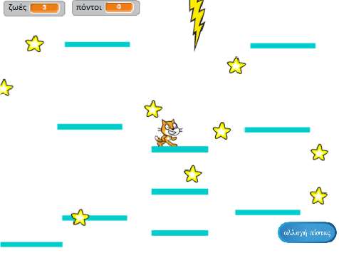

## Κινούμενες πλατφόρμες

Ο λόγος που σου ζήτησα να χρησιμοποιήσεις τη δική μου έκδοση για το επίπεδο 2 είναι το κενό που ίσως έχεις παρατηρήσει στη μέση της πλατφόρμας. Πρόκειται να δημιουργήσεις μια πλατφόρμα που κινείται μέσα από αυτό το κενό, όπου ο παίκτης μπορεί να πηδήξει και να πατήσει!



Πρώτα, θα χρειαστείς το αντικείμενο για την πλατφόρμα.

--- task ---

Πρόσθεσε ένα νέο αντικείμενο με όνομα **Κινούμενη-πλατφόρμα** και χρησιμοποιώντας τα εργαλεία στην καρτέλα Ενδυμασίες κάνε το να μοιάζει με τις άλλες πλατφόρμες \(χρησιμοποίησε τη λειτουργία διανύσματος - vector\).

--- /task ---

Τώρα, ας προσθέσουμε κώδικα στο αντικείμενο.

Ξεκίνα με τα βασικά: για να δημιουργήσεις ένα ατελείωτο σύνολο πλατφορμών που ανεβαίνει στην οθόνη, θα πρέπει να κλωνοποιείς την πλατφόρμα σε τακτά χρονικά διαστήματα. Διάλεξα `4` δευτερόλεπτα ως το διάστημά μου. Πρέπει επίσης να βεβαιωθείς ότι υπάρχει ένας διακόπτης on / off για την κατασκευή των πλατφορμών, έτσι ώστε να μην εμφανίζονται στο επίπεδο 1. Δημιούργησε μία νέα μεταβλητή που θα την ονομάσεις `δημιουργία-πλατφορμών`{:class="block3variables"}.

--- task ---

Πρόσθεσε κώδικα για να δημιουργήσεις κλώνους της πλατφόρμας σου.

Δες πώς φαίνεται η δική μου μέχρι στιγμής:

```blocks3
+    when green flag clicked
+    hide
+    forever
        wait (4) secs
        if <(δημιουργία-πλατφορμών ::variables) = [true]> then
            create clone of [myself v]
        end
    end
```

--- /task ---

--- task ---

Στη συνέχεια, πρόσθεσε τον κώδικα του κλώνου:

```blocks3
+    when I start as a clone
+    show
+    forever
        if <(y position) < [180]> then
            change y by (1)
            wait (0.02) secs
        else
            delete this clone
        end
    end
```

--- /task ---

Αυτός ο κώδικας κάνει τον κλώνο από την **Κινούμενη-πλατφόρμα** να μετακινείται μέχρι το πάνω μέρος της σκηνής, αρκετά αργά για να προλαβαίνει ο παίκτης να πηδά και μετά να εξαφανίζεται.

--- task ---

Τώρα κάνε τις πλατφόρμες να εξαφανίζονται/επανεμφανίζονται με βάση τα μηνύματα που αλλάζουν επίπεδα (οπότε να εμφανίζονται μόνο στο επίπεδο που έχει τον κενό χώρο για αυτές) και το μήνυμα `τέλος παιχνιδιού`{:class="block3events"}.

```blocks3
+    when I receive [επίπεδο-1 v]
+    set [δημιουργία-πλατφορμών v] to [false]
+    hide

+    when I receive [επίπεδο-2 v]
+    set [δημιουργία-πλατφορμών v] to [true]

+    when I receive [Τέλος Παιχνιδιού v]
+    hide
+    set [δημιουργία-πλατφορμών v] to [false]
```

--- /task ---

Τώρα, αν προσπαθήσεις να παίξεις το παιχνίδι, ο **Παίκτης** πέφτει μέσα από την πλατφόρμα! Έχεις καμιά ιδέα γιατί συμβαίνει αυτό;

Είναι επειδή ο κώδικας φυσικής δεν γνωρίζει για την πλατφόρμα. Χρειάζεται μια πολύ εύκολη διόρθωση:

--- task ---

Στις εντολές του αντικειμένου **Παίκτης**, αντικατάστησε κάθε μπλοκ `αγγίζει "Πλατφόρμες"`{:class="block3sensing"} με ένα τελεστή `ή`{:class="block3operators"} που ελέγχει **είτε** αν `αγγίζει "Πλατφόρμες"`{:class="block3sensing"}**ή** αν `αγγίζει "Κινούμενη-πλατφόρμα"`{:class="block3sensing"}.

Πήγαινε μέσα στον κώδικα για το αντικείμενο **Παίκτης**, και οπουδήποτε βρεις αυτό το μπλοκ:

```blocks3
    <touching [Πλατφόρμες v] ?>
```

αντικατέστησε το με αυτό:

```blocks3
    <<touching [Πλατφόρμες v] ?> or <touching [Κινούμενη-Πλατφόρμα v] ?>>
```

--- /task ---