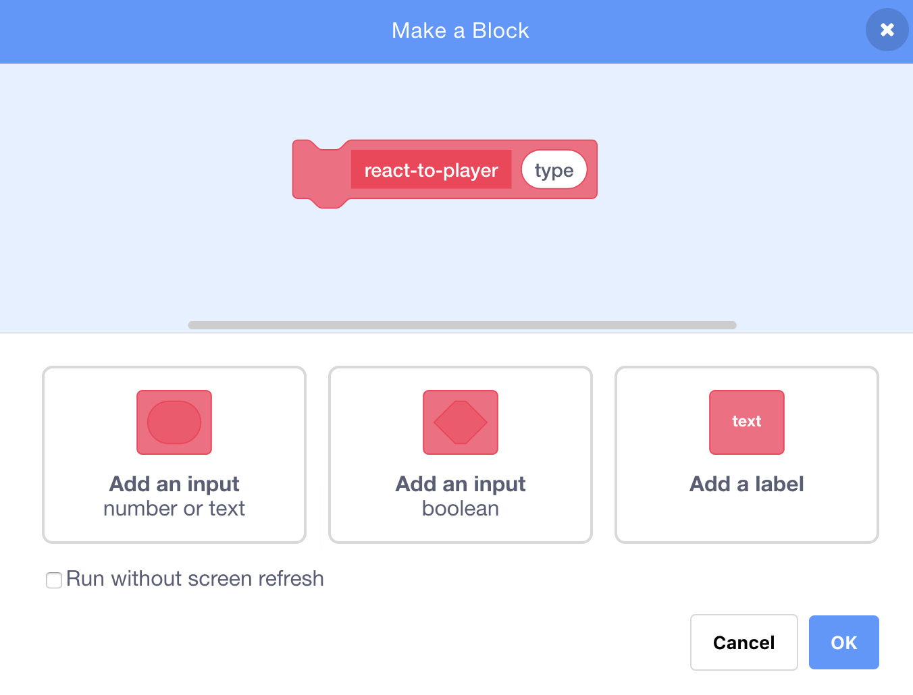

## Power-ups

At the moment you have just one type of collectable: a star that gains you one point when you grab it. On this card, you’re going to create a new type of collectable, and you'll do it in a way that will make adding other types of collectables easy. Then you can invent your own power-ups and bonuses and really make the game your own!

I’ve already included some pieces to do this with the `collectable-type`{:class="block3variables"} variable and the `pick-costume`{:class="block3myblocks"} **My blocks** block. You’re going to need to improve on them though. 

Let's have a look at how the collectable works right now.

+ In the scripts for the **Collectable** sprite, find the `when I start as a clone`{:class="block3events"} code. The blocks you should look at are the ones that give you points for collecting a star:

```blocks3
    if <touching [Player Character v]?> then
        change [points v] by (collectable-value ::variables)
        delete this clone
```

 and this one that selects a costume for the clone:

```blocks3
    pick-costume (collectable-type ::variables) :: custom
```

--- collapse ---
---
title: How does picking a costume work?
---

The `pick-costume`{:class="block3myblocks"} block works a bit like the `lose`{:class="block3myblocks"} block, but it has something extra: it takes an **input** variable called `type`{:class="block3myblocks"}.

```blocks3
    define pick-costume (type)
    if <(type ::variables) = [1]> then
        switch costume to [star1 v]
    end
```
    
When the `pick-costume`{:class="block3myblocks"} block runs, what it does is this:

1. It looks at the `type`{:class="block3myblocks"} input variable
1. If the value of `type`{:class="block3myblocks"} is equal to `1`, it switches to the `star1` costume

Take a look at the part of the script that uses the block:

```blocks3
    when I start as a clone
    pick-costume (collectable-type ::variables) :: custom
    show
    repeat until <(y position) < [-170]>
        change y by (collectable-speed ::variables)
        if <touching [Player Character v]?> then
            change [points v] by (collectable-value ::variables)
            delete this clone
```

You can see that the `collectable-type`{:class="block3variables"} variable gets **passed** to the `pick-costume`{:class="block3myblocks"} block. Inside the code for `pick-costume`{:class="block3myblocks"}, `collectable-type`{:class="block3variables"} is then used as the input variable (`type`{:class="block3myblocks"}).

This means that the value of `collectable-type`{:class="block3variables"} decides which costume the sprite clone gets.

--- /collapse ---

### Add a costume for the new power-up

Of course, right now the **Collectable** sprite only has one costume, since there's only one type of collectable. You're about to change that!

+ Add a new costume to the **Collectable** sprite for your new power-up. I like the lightning bolt, but pick whatever you like.

+ Next you need to tell the `pick-costume`{:class="block3myblocks"} **My blocks** block to set the new costume whenever it gets the new value for `type`{:class="block3myblocks"}, like this \(using whatever costume name you picked\): 

```blocks3
    define pick-costume (type)
    if <(type ::variable) = [1]> then
        switch costume to [star1 v]
    end
    if <(type ::variable) = [2]> then
        switch costume to [lightning v]
    end
```

### Create the power-up code

Now you need to decide what the new collectable will do! We’ll start with something simple: giving the player a new life. On the next card, you’ll make it do something cooler. 

+ Go into the **My blocks** section and click **Make a Block**. Name the new block `react-to-player`{:class="block3myblocks"} and add a **number input** named `type`{:class="block3myblocks"}.



+ Click **OK**. 

+ Make the `react-to-player`{:class="block3myblocks"} **My blocks** block either increase the points or increase the player’s lives, depending on the value of `type`{:class="block3myblocks"}.  

```blocks3
    define react-to-player (type)
    if <(type ::variable) = [1]> then
        change [points v] by (collectable-value ::variables)
    end
    if <(type ::variable) = [2]> then
        change [lives v] by [1]
    end
```

+ Update the `when I start as a clone`{:class="block3events"} code to replace the block that adds a point with a **call** to `react-to-player`{:class="block3myblocks"}, **passing** `collectable-type`{:class="block3variables"} to it.
```blocks3
    if <touching [Player Character v] ?> then
        react-to-player (collectable-type ::variables) :: custom
        delete this clone
    end
```

By using this new `react-to-player`{:class="block3myblocks"} **My blocks** block, stars still add a point, but the new power-up you've created adds a life. 

### Using `collectable-type`{:class="block3variables"} to make different collectables appear at random

Right now, you might be wondering how you'll tell each collectable the game makes what type it should be.

You do this by setting the value of `collectable-type`{:class="block3variables"}. This variable is just a number. As you've seen, it's used to tell the `pick-costume`{:class="block3myblocks"} and `react-to-player`{:class="block3myblocks"} blocks what costume, rules, etc., to use for the collectable. 

--- collapse ---
---
title: Working with variables in a clone
---

For each clone of the **Collectable** sprite, you can set a different value for `collectable-type`{:class="block3variables"}. 

Think of it like creating a new copy of the **Collectable** sprite with the help of the value that is stored in `collectable-type`{:class="block3variables"} at the time the **Collectable** clone gets created. 

You might be wondering whether changing the value of `collectable-type`{:class="block3variables"} will turn all the collectables on the Stage into the same type. But that doesn't happen, because one of the things that makes clones special is that they cannot change the values of any variables they start with. Sprite clones effectively have **constant** values. That means that when you change the value of `collectable-type`{:class="block3variables"}, this doesn't affect the **Collectable** sprite clones that are already in the game.

--- /collapse ---

You're going to set the `collectable-type`{:class="block3variables"} to either `1` or `2` for each new clone that you make. To keep the game interesting, let's pick between the numbers at random to make a random collectable every time. 

+ Find the `repeat until`{:class="block3control"} loop inside the green flag code for the **Collectable** sprite, and add the `if...else`{:class="block3control"} code shown below.

```blocks3
    repeat until <not <(create-collectables ::variables) = [true]>>
        if <[50] = (pick random (1) to (50))> then
            set [collectable-type v] to [2]
        else
            set [collectable-type v] to [1]
        end
        wait (collectable-frequency ::variables) secs
        go to x: (pick random (-240) to (240)) y: (179)
        create clone of [myself v]
```

This code gives a 1-in-50 chance of setting the `collectable-type`{:class="block3variables"} to `2`. After all, you don't want to give the player the chance to collect an extra life too often, otherwise the game would be too easy!

Great! Now you have a new type of collectable that sometimes shows up instead of the star, and that gives you an extra life instead of a point when you collect it.
