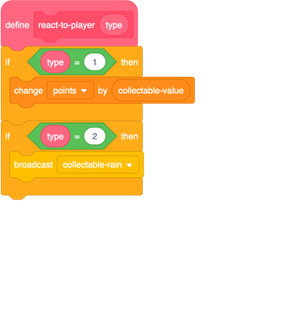
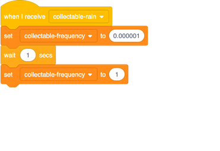
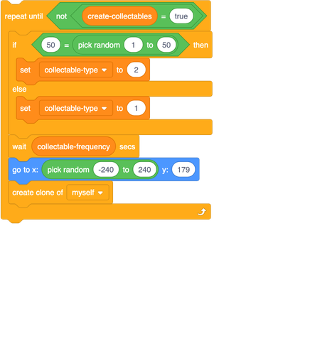

## Super power-ups!

Now that you have a new power-up collectable working, it’s time to make it do something really cool! Let's make it 'rain' power-ups for a few seconds, instead of just giving out an extra life.
 
For this, you're going to use another `broadcast`{:class="block3events"} message.

+ First, change the `react-to-player`{:class="block3myblocks"} block to broadcast a message when the player character touches a type `2` collectable. Call the message `collectable-rain`{:class="block3events"}.

 
Now you need to create a new piece of code inside the **Collectable** sprite scripts that will start whenever the `collectable-rain`{:class="block3events"} message is broadcast.

+ Add this code for the **Collectable** sprite to make it listen out for the `collectable-rain`{:class="block3events"} broadcast.

--- collapse ---
---
title: What does the new code do?
---

This piece of code waits to receive a broadcast, and responds by setting the `collectable-frequency`{:class="block3variables"} variable to a very small number, then waiting for one second, and then changing the variable back to `1`.

Let's look at how the `collectable-frequency`{:class="block3variables"} variable is used to find out why this makes it rain collectables.

In the main game loop, the part of the code that makes **Collectable** sprite clones gets told by the `collectable-frequency`{:class="block3variables"} variable how long to wait between making one clone and the next:

You can see that the `wait`{:class="block3control"} block here pauses the code for the length of time set by `collectable-frequency`{:class="block3variables"}. 

If the value of `collectable-frequency`{:class="block3variables"} is `0.000001`, the `wait`{:class="block3control"} block only pauses for **one millionth** of a second, meaning that the `repeat until`{:class="block3control"} loop will run many more times than normal. As a result, the code is going to create **a lot** more power-ups than it normally would, until `collectable-frequency`{:class="block3variables"} is changed back `1`.

Can you think of any problems that might cause? There’ll be a lot more power-ups…what if you kept catching them?

--- /collapse ---

### Challenge: get creative!
 
+ Based on this card and the previous one, you can now make as many different power-up collectables as you want! What about one that gives out 20 times the usual number of points, or adds three lives, or makes it so the player can’t run out of lives for a period of time? Come up with some cool power-ups and see if you can make them!
