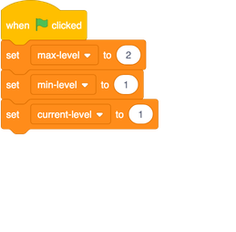
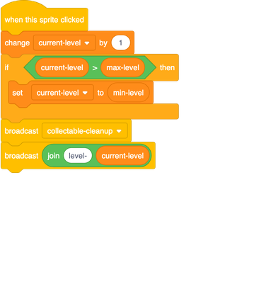
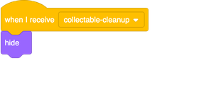
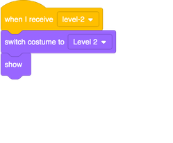
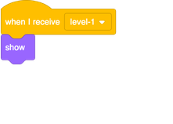
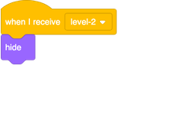
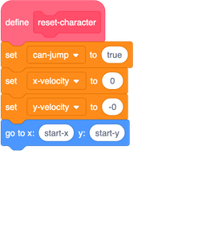
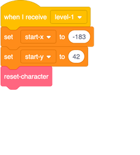
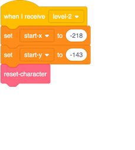
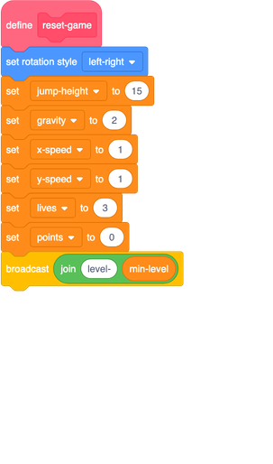

## Level 2

With this card, you're going to add a new level to the game that the player can get to by just pressing a button. Later, you can change your code to make it so they need a certain number of points, or something else, to get there.

### Moving to the next level

+ First, create a new sprite as a button by either adding one from the library or drawing your own. I did a bit of both and came up with this: 

Now, the code for this button is kinda clever: it’s designed so that every time you click it, it will take you to the next level, however many levels there are.

+ Add these scripts to your **Button** sprite: 

 
+ `max-level`{:class="block3variables"} stores the highest level
+ `min-level`{:class="block3variables"} stores the lowest level
+ `current-level`{:class="block3variables"} stores the level the player is on right now

+ These all need to be set by the programmer \(you!\), so if you add a third level, don’t forget to change the value of `max-level`{:class="block3variables"}! (`min-level`{:class="block3variables"} will never need to change, of course.)

The code uses broadcasts to tell the other sprites which level to display, and to clear up the collectables when a new level starts.

### Make the sprites react

#### The **Collectable** sprite

Now you need to get the other sprites to respond to these broadcasts! Start with the easiest one: clearing all the collectables.  

+ Add the following code to the **Collectable** sprite scripts to tell all its clones to `hide`{:class="block3vlooks"} when they receive the cleanup broadcast: 

Since one of the first things any new clone does is show itself, this new code means you don’t have to worry about turning this behaviour off for them!

#### The **Platforms** sprite

Now to switch the **Platforms** sprite. You can design your own new level later if you like, but for now let’s use the one I’ve already included — you’ll see why on the next card! 

+ Add this code to the **Platforms** sprite:

It receives the `joined`{:class="block3operators"} messages of `level-`{:class="block3variables"} and `current-level`{:class="block3variables"} that the **Button** sprite sends out, and responds by changing the **Platforms** costume. 

#### The **Enemy** sprite

+ In the **Enemy** sprite scripts, you just need to make sure the sprite disappears when the player enters level 2, like this: 

If you prefer, you can make the enemy move to another platform instead. In that case, you would use a `go to`{:class="block3motion"} block instead of the `show`{:class="block3looks"} and `hide`{:class="block3looks"} blocks.

### Make the **Player Character** appear in the right place

Whenever a new level starts, the **Player Character** sprite needs to go to the right place for that level. To make this happen, you need to change where the sprite gets its coordinates from when it first appears on the Stage. At the moment, there are fixed `x` and `y` values in its code.

+ Begin by creating variables for the starting coordinates: `start-x`{:class="block3variables"} and `start-y`{:class="block3variables"}. Then plug them into the `go to`{:class="block3motion"} block in the `reset-character`{:class="block3myblocks"} **My blocks** block instead of the fixed `x` and `y` values:

+ Then for each broadcast announcing the start of a level, set the right `start-x`{:class="block3variables"} and `start-y`{:class="block3variables"} coordinates in response, and add a **call** to `reset-character`{:class="block3myblocks"}:

### Starting at Level 1

You also need to make sure that every time someone starts the game, the first level they play is level 1.

+ Go to the `reset-game`{:class="block3myblocks"} script and remove the call to `reset-character`{:class="block3myblocks"} from it. In its place, broadcast the `min-level`{:class="block3variables"}. The code you've already added with this card will then set up the correct starting coordinates for the **Player Character** sprite, and also call `reset-character`{:class="block3myblocks"}.

--- collapse ---
---
title: Resetting the Player Character versus resetting the game
---

Notice that the first block in the **Player Character** sprite's main green flag script is a call to the `reset-game`{:class="block3myblocks"} **My blocks** block. 

This block sets up all the variables for a new game and then calls the `reset-character`{:class="block3myblocks"} **My blocks** block, which places the character back in its correct starting position.

Having the `reset-character`{:class="block3myblocks"} code in its own block separate from `reset-game`{:class="block3myblocks"} allows you to reset the character to different positions **without** having to reset the whole game.

--- /collapse ---
