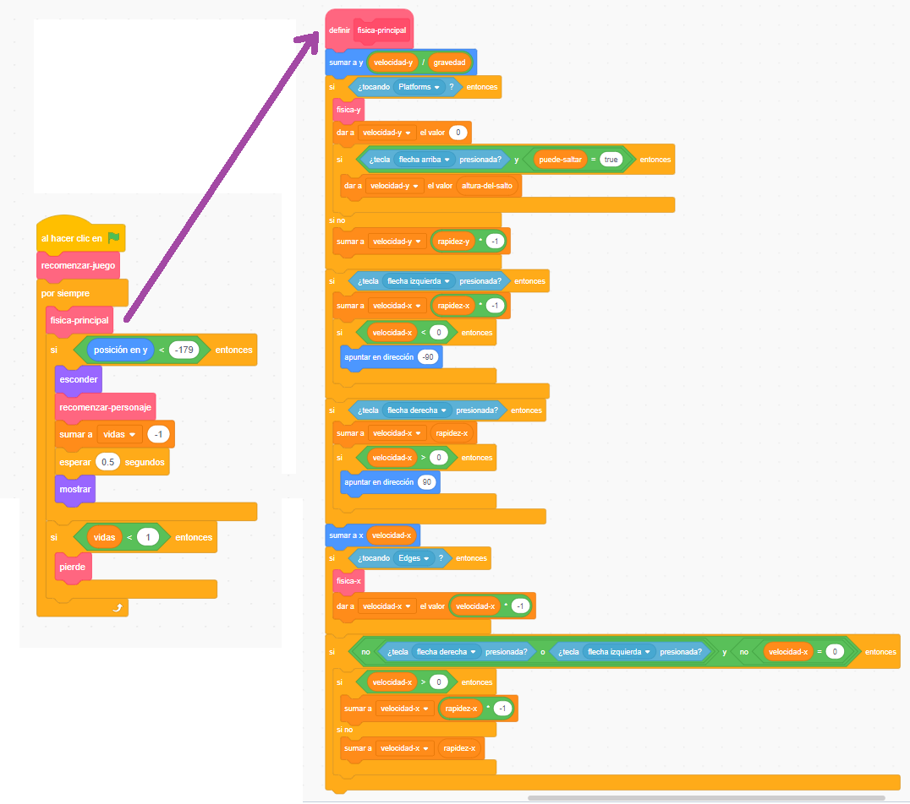

## Preparando todo

Como estás aprendiendo a programar en Scratch y no a construir un motor de física (el código que hace que las cosas en un juego de computadora se comporten como objetos del mundo real, por ejemplo, no se caen a través de los pisos), comenzarás con un proyecto que he creado que ya tiene integrado lo básico para moverse, saltar y detectar plataformas.

Debes echarle un vistazo rápido al proyecto, incluidos los detalles en esta tarjeta, ya que harás algunos cambios más adelante, ¡pero no necesitas entender todo lo que hace!

### Obtener el proyecto

\--- task \---

Lo primero que debes hacer es obtener una copia del código Scratch desde [aquí](https://scratch.mit.edu/projects/454114430){:target="_ blank"}.

Para usar el proyecto sin conexión a Internet, descárgalo haciendo clic en **Ver dentro**, luego ve al menú **Archivo** y haz clic en **Guardar en tu ordenador**. Luego puedes abrir el archivo descargado en Scratch en tu ordenador.

También puedes usarlo directamente en Scratch en tu navegador haciendo clic en **Ver dentro** y luego **Reinventar**.

\--- /task \---

### Echa un vistazo al código

El motor de física del juego tiene una variedad de piezas, algunas de las cuales ya funcionan y otras aún no. Puedes probar esto ejecutando el juego e intentando jugarlo.

Verás que puedes perder vidas, pero nada pasa cuando se te terminan. Además, el juego solo tiene un nivel, un solo tipo de cosas para recolectar y no tiene enemigos. Vas a arreglar todo eso, ¡y un poco más!

\--- task \---

Echa un vistazo a la forma en que el código está hecho.

\--- /task \---

Utiliza muchos bloques de **Mis bloques** que son ideales para dividir tu código en pedazos para que puedas gestionarlo mejor. Un bloque **Mis bloques** es un bloque que fabricas a partir de un montón de otros bloques, y al que puedes ponerle algunas instrucciones. ¡Verás cómo funciona en un próximo paso!

### Los bloques 'Mis bloques' son realmente útiles

¡En el código de arriba, el bucle `por siempre`{:class="block3control"} del juego principal llama al bloque `fisica-principal`{:class="block3myblocks"} **Mis bloques** para hacer un montón de cosas! Mantener así separados los bloques hace que sea fácil leer el bucle principal y entender lo que sucede en el juego, sin preocuparse por **cómo** sucede.

\--- task \---

Ahora mira a los bloques `recomenzar-juego`{:class="block3myblocks"} y `recomenzar-personaje`{:class="block3myblocks"} **Mis bloques**.

\--- /task \---

Hacen cosas bastante normales, como configurar variables y asegurarse de que el personaje gira correctamente

- `recomenzar-juego`{: class = "block3myblocks"} **llama a** `recomenzar-personaje`{: class = "block3myblocks"}, lo que muestra que puedes usar un bloque **Mis bloques** adentro de otro bloque **Mis bloques**
- El bloque `recomenzar-personaje`{:class="block3myblocks"} **Mis bloques** se usa en dos lugares diferentes en el bucle principal. Esto significa que puedes cambiar dos lugares en tu bucle principal de juego cambiando solo el código dentro del bloque **Mis bloques**, lo que te ahorra mucho trabajo y te ayuda a evitar errores.