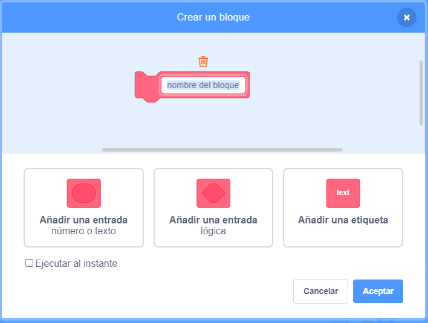

## Poderes

Por el momento solo tienes un tipo de coleccionable: una estrella con la que ganas un punto cuando la agarras. En esta tarjeta, vas a crear un nuevo tipo de coleccionable, y lo harás de una manera que facilitará la adición de otros tipos de coleccionables. ¡Entonces podrás inventar tus propios potenciadores y bonificaciones y realmente hacer tuyo el juego!

Ya he incluido algunas piezas para hacer esto con la variable `tipo-coleccionable`{:class="block3variables"} y el bloque `elige-disfraz`{:class="block3myblocks"} **Mis bloques**. Sin embargo, vas a necesitar mejorarlos.

Echemos un vistazo a cómo funciona el coleccionable en este momento.

En los scripts para el sprite **Coleccionable**, encuentra el `al comenzar como clon`{:class="block3events"}. Los bloques que debes mirar son los que te dan puntos por recoger una estrella:

```blocks3
    if <touching [Player Character v]?> then
        change [points v] by (collectable-value ::variables)
        delete this clone
```

y éste que selecciona un disfraz para el clon:

```blocks3
    pick-costume (collectable-type ::variables) :: custom
```

## \--- collapse \---

## title: ¿Cómo funciona la elección de un disfraz?

El bloque `elige-disfraz`{:class="block3myblocks"} funciona un poco como el bloque `perder`{:class="block3myblocks"}, pero tiene algo extra: toma una variable de **entrada** llamada `tipo`{:class="block3myblocks"}.

```blocks3
    define pick-costume (type)
    if <(type ::variables) = [1]> then
        switch costume to [star1 v]
    end
```

Cuando el bloque `elegir-disfraz`{:class="block3myblocks"} se ejecuta, lo que hace es esto:

1. Mira a la variable de entrada `tipo`{: class = "block3myblocks"}
2. Si el valor de `tipo`{:class="block3myblocks"} es igual a `1`, cambia al traje `estrella1`

Echa un vistazo a la parte del script que utiliza el bloque:

```blocks3
    when I start as a clone
    pick-costume (collectable-type ::variables) :: custom
    show
    repeat until <(y position) < [-170]>
        change y by (collectable-speed ::variables)
        if <touching [Player Character v]?> then
            change [points v] by (collectable-value ::variables)
            delete this clone
```

Puedes ver que la variable `tipo-coleccionable`{:class="block3variables"} **pasa ** al bloque `elegir-disfraz`{:class="block3myblocks"}. Dentro del código de `elegir-disfraz`{:class="block3myblocks"}, `collectable-type`{:class="block3variables"} se utiliza como la variable de entrada (`tipo`{:class="block3myblocks"}).

Esto significa que el valor de `de tipo-coleccionable`{: class = "block3variables"} decide qué disfraz obtiene el objeto clon.

\--- /collapse \---

### Añade un disfraz para el nuevo poder

Por supuesto, en este momento, el objeto **coleccionable** sólo tiene un disfraz, ya que sólo hay un tipo de coleccionable. Estás a punto de cambiar eso.

\--- task \---

Agrega un nuevo disfraz al sprite **Coleccionable** para tu nuevo poder. Me gusta el relámpago, pero tú puedes eligir lo que quieras.

\--- /task \---

\--- task \---

A continuación, indica el `disfraz`{:class="block3myblocks"} **Mis bloques** para establecer el nuevo disfraz cuando recibe el nuevo valor `tipo`{:class="block3myblocks"}, de esta manera \(usando cualquier nombre de disfraz que hayas elegido\):

```blocks3
    define pick-costume (type)
    if <(type ::variable) = [1]> then
        switch costume to [star1 v]
    end
+    if <(type ::variable) = [2]> then
+        switch costume to [lightning v]
+    end
```

\--- /task \---

### Crear el código de encendido.

¡Ahora tienes que decidir qué hará el nuevo coleccionable! Empezaremos con algo simple: dar al jugador una nueva vida. En el siguiente paso, lo harás hacer algo más interesante.

\--- task \---

Ve a la sección **Mis bloques** y haz clic en **Crear un bloque**. Nombra el nuevo bloque `reaccion-a-jugador`{:class="block3myblocks"} y agrega una **entrada de número** llamada `tip[o`{:class="block3myblocks"}.



Haz clic en **OK**.

\--- /task \---

\--- task \---

Haz que el bloque `reaccion-al-jugador`{:class="block3myblocks"} **Mis bloques** aumente los puntos o incremente la vida del jugador, dependiendo del valor de `tipo `{:class="block3myblocks"}.

```blocks3
+    define react-to-player (type)
+    if <(type ::variable) = [1]> then
+        change [points v] by (collectable-value ::variables)
+    end
+    if <(type ::variable) = [2]> then
+        change [lives v] by [1]
+    end
```

\--- /task \---

\--- task \---

Actualiza el código de `al comenzar como clon`{:class="block3events"} para reemplazar el bloque que añade un punto por una **llamada** a `reacion-a-jugador`{:class="block3myblocks"}, **pasándole ** `tipo-coleccionable`{:class="block3variables"}.

```blocks3
+    if <touching [Player Character v] ?> then
+        react-to-player (collectable-type ::variables) :: custom
+        delete this clone
+    end
```

\--- /task \---

Al usar este nuevo bloque `reaccion-al-jugador`{:class="block3myblocks"} **Mis bloques**, las estrellas todavía añaden un punto, pero el nuevo poder que has creado añade una vida.

### Usando `de tipo coleccionable`{:class="block3variables"} para hacer que los diferentes coleccionables aparezcan al azar

En este momento, quizás te estés preguntando cómo dirás a cada coleccionable que hace el juego, qué tipo debería ser.

Lo haces estableciendo el valor de `tipo-coleccionable`{:class="block3variables"}. Esta variable es sólo un número. Como has visto, se utiliza para decirle a los bloques `elige-disfraz`{: class = "block3myblocks"} y `reaccion-a-jugador`{: class = "block3myblocks"} qué disfraz, reglas, etc seguir. para usar para el coleccionable.

## \--- collapse \---

## title: Trabajando con variables en un clon

Para cada clon del objeto **Coleccionable**, puedes establecer un valor diferente para `tipo-coleccionable`{:class="block3variables"}.

Piensa en él como crear una nueva copia del objeto **Coleccionable** con la ayuda del valor que se almacena en `tipo-coleccionable`{:class="block3variables"} en el momento en que se crea el clon **Coleccionable**.

Puede que te preguntes si cambiar el valor de `tipo-coleccionable`{:class="block3variables"} convertirá todos los coleccionables en el mismo tipo. Esto no sucede, porque una de las cosas que hace que los clones sean especiales es que no pueden cambiar los valores de cualquier variable con la que comiencen. Los objetos clones tienen valores**constantes**. Eso significa que cuando cambias el valor de `tipo-coleccionable`{:class="block3variables"}, esto no afecta a los clones de objetos **Coleccionable** que ya están en el juego.

\--- /collapse \---

Vas a establecer el `tipo-coleccionable`{:class="block3variables"} a `1` o `2` por cada nuevo clon que hagas. Para mantener el interés del juego, escoge entre los números al azar para hacer un coleccionable aleatorio cada vez.

\--- task \---

Encuentra el bucle `repetir hasta`{:class="block3control"} dentro del código de bandera verde para el objeto **Coleccionable** y añade el código `if..else`{:class="block3control"} mostrado a continuación.

```blocks3
    repeat until <not <(create-collectables ::variables) = [true]>>
+        if <[50] = (pick random (1) to (50))> then
+            set [collectable-type v] to [2]
+        else
+            set [collectable-type v] to [1]
+        end
        wait (collectable-frequency ::variables) secs
        go to x: (pick random (-240) to (240)) y: (179)
        create clone of [myself v]
```

\--- /task \---

Este código da una probabilidad de 1 entre 50 de establecer el `tipo-coleccionable`{:class="block3variables"} a `2`. Después de todo, no quieres dar al jugador la oportunidad de ganar una vida extra con demasiada frecuencia, de lo contrario el juego sería demasiado fácil.

Ahora tienes un nuevo tipo de coleccionable que a veces aparece en lugar de la estrella, y eso te da una vida extra en lugar de un punto cuando la recoges.