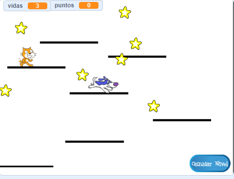

## Plataformas móviles

La razón por la que te pedí que utilizaras mi versión de nivel 2 es la brecha que seguramente has notado en el centro del diseño. ¡Vas a crear una plataforma que se mueva a través de esta brecha y que el jugador puede saltar en ella y utilizarla para moverse al otro lado!



Primero, necesitarás el objeto para la plataforma.

\--- task \---

Agrega un nuevo objeto, llámalo **Plataforma móvil**y usa las herramientas de personalización de disfraces en la pestaña Disfraces para que se vea como las otras plataformas \ (usa el modo vectorial \).

\--- /task \---

Ahora, vamos a añadir código al objeto.

Comienza con lo básico: para crear un conjunto interminable de plataformas que se muevan hacia arriba en la pantalla, deberás clonar la plataforma a intervalos regulares. He elegido `4` segundos como mi intervalo. También debes asegurarte de que haya un interruptor de encendido o apagado para dibujar las plataformas, de manera que no aparezcan en el nivel 1. Estoy usando una nueva variable llamada `crear-plataforma`{: class = "block3variables"}.

\--- task \---

Añade código para crear clones de tu objeto plataforma.

Así es como la mina se ve hasta ahora:

```blocks3
+    when green flag clicked
+    hide
+    forever
        wait (4) secs
        if <(create-platforms ::variables) = [true]> then
            create clone of [myself v]
        end
    end
```

\--- /task \---

\--- task \---

Luego añade el código del clon:

```blocks3
+    when I start as a clone
+    show
+    forever
        if <(y position) < [180]> then
            change y by (1)
            wait (0.02) secs
        else
            delete this clone
        end
    end
```

\--- /task \---

Este código hace que el clon de **Plataforma-movil** se mueva hacia la parte superior de la pantalla, lo suficientemente lento como para que el jugador se suba o se baje, y luego desaparezca.

\--- task \---

Ahora haz que las plataformas desaparezcan / reaparezcan en función de las transmisiones que cambian de nivel (por lo que solo están en el nivel con espacio para ellas) y el mensaje `fin del juego`{: class = "block3events"}.

```blocks3
+    when I receive [level-1 v]
+    set [create-platforms v] to [false]
+    hide

+    when I receive [level-2 v]
+    set [create-platforms v] to [true]

+    when I receive [game over v]
+    hide
+    set [create-platforms v] to [false]
```

\--- /task \---

Ahora, si intentas jugar al juego, ¡el **personaje de jugador** se cae a través de la plataforma! ¿Sabes por qué?

Es porque el código de física no reconoce la plataforma. En realidad la solución es rápida:

\--- task \---

En los scripts del objeto **Personaje del jugador **, reemplaza cada `tocando "Plataformas"`{:class="block3sensing"} con un operador `O`{:class="block3operators"} que busque **o** `tocando "Plataformas" ”`{:class=" block3sensing "} **O** `tocando “ Plataforma móvil ”`{:class=" block3sensing "}.

Revisa el código del objeto **personaje del jugador ** y en todas partes que veas este bloque:

```blocks3
    <touching [Platforms v] ?>
```

reemplázalo con este:

```blocks3
    <<touching [Platforms v] ?> or <touching [Moving-Platform v] ?>>
```

\--- /task \---