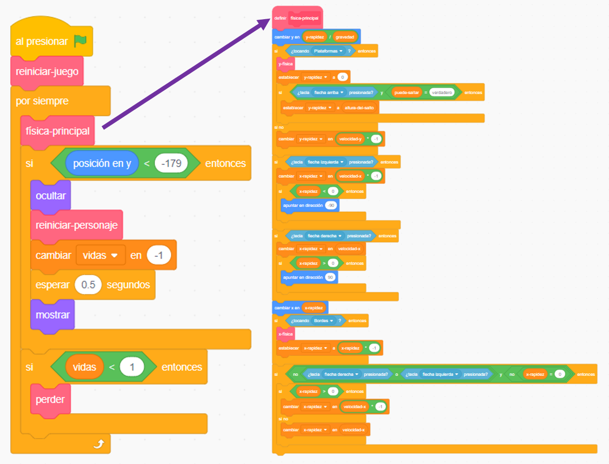

## Preparando todo

Como estás aprendiendo a programar en Scratch y no a construir un motor de física (el código que hace que las cosas en un juego de computadora se comporten como objetos del mundo real, por ejemplo, que no se caigan a través de los pisos), comenzarás con un proyecto que he creado que ya tiene integrado lo básico para moverse, saltar y detectar plataformas.

Debes echarle un vistazo rápido al proyecto, incluyendo los detalles en esta tarjeta, ya que harás algunos cambios más adelante, ¡pero no es necesario que entiendas todo lo que está haciendo!

### Obtener el proyecto

--- task ---

Lo primero que debes hacer es obtener una copia del código Scratch desde [aquí](https://scratch.mit.edu/projects/880040509){:target="_blank"}.

Para usar el proyecto sin conexión a Internet, descárgalo haciendo clic en **Ver dentro**, luego ve al menú **Archivo** y haz clic en **Guardar en tu computador**. Luego puedes abrir el archivo descargado en Scratch en tu computadora.

También puedes usarlo directamente en Scratch en tu navegador haciendo clic en **Ver dentro** y luego en **Remix**.

--- /task ---

### Echa un vistazo al código

El motor de física del juego tiene una variedad de piezas, algunas de las cuales ya funcionan y otras todavía no. Puedes probar esto ejecutando el juego e intentando jugarlo.

Verás que puedes perder vidas, pero no pasa nada cuando te quedas sin ellas. Además, el juego solo tiene un nivel, un tipo de cosa a recolectar, y no hay enemigos. ¡Vas a arreglar todo eso y luego harás un poco más!

--- task ---

Por ahora, échale un vistazo a cómo se crea el código.

--- /task ---

Usa muchos bloques de **Mis bloques**, que son excelentes para dividir tu código en partes para que puedas administrarlo mejor. Un bloque de **Mis bloques** es un bloque que se compone de muchos otros bloques, y puedes darle algunas instrucciones. ¡Verás cómo funciona en un próximo paso!

### Los bloques de 'Mis bloques' son realmente útiles

En el código anterior, el bucle principal `por siempre`{:class="block3control"} del juego llama al bloque `física-principal`{:class="block3myblocks"} de **Mis bloques** para hacer un montón de cosas! Mantener separados los bloques así hace que sea fácil leer el bucle principal y entender lo que sucede en el juego, sin preocuparse por **cómo** sucede.

--- task ---

Ahora mira los bloques `reiniciar-juego`{:class="block3myblocks"} y `reiniciar-personaje`{:class="block3myblocks"} de **Mis bloques**.

--- /task ---

Hacen cosas bastante normales, como configurar variables y asegurarse de que el personaje gire correctamente

- `reiniciar-juego`{:class="block3myblocks"} **llama a** `reiniciar-personaje`{:class="block3myblocks"}, mostrándote que puedes usar un bloque **Mis bloques** dentro de otro bloque **Mis bloques**
- El bloque `reiniciar-personaje`{:class="block3myblocks"} de **Mis bloques** se usa en dos lugares diferentes en el bucle principal. Esto significa que puedes cambiar dos lugares del bucle principal del juego cambiando solo el código dentro del bloque **Mis bloques**, lo que te ahorra mucho trabajo y te ayuda a evitar errores.