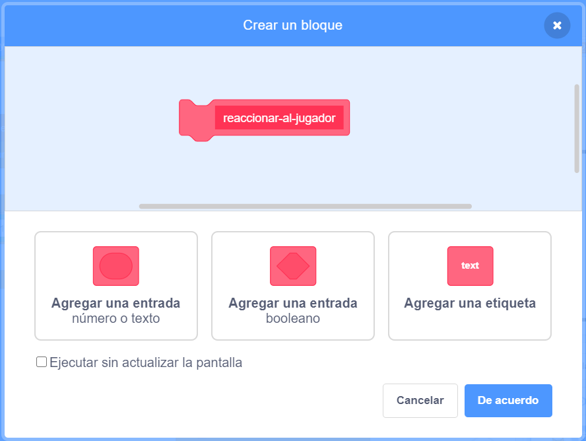

## Potenciadores

Por el momento solo tienes un tipo de coleccionable: una estrella que te gana un punto cuando la agarras. En esta tarjeta, crearás un nuevo tipo de coleccionable, y lo harás de una manera que facilitará la adición de otros tipos de coleccionables. ¡Entonces puedes inventar tus propios potenciadores y bonos y realmente hacer que el juego sea tuyo!

Ya he incluido algunas piezas para hacer esto con la variable `tipo-coleccionable`{:class="block3variables"} y el bloque `elegir-disfraz`{:class="block3myblocks"} de **Mis bloques**. Sin embargo, tendrás que mejorarlos.

Echemos un vistazo a cómo funciona el coleccionable en este momento.

En los scripts para el objeto **Coleccionable**, busca el código `al comenzar como clon`{:class="block3events"}. Los bloques que debes mirar son los que te dan puntos por recoger una estrella:

```blocks3
    if <touching [Personaje del jugador v]?> then
        change [puntos v] by (valor-coleccionable ::variables)
        delete this clone
```

y este que selecciona un disfraz para el clon:

```blocks3
    elegir-disfraz (tipo-coleccionable ::variables) :: custom
```

--- collapse ---
---
title: ¿Cómo funciona elegir un disfraz?
---

El bloque `elegir-disfraz`{:class="block3myblocks"} funciona un poco como el bloque `perder`{:class="block3myblocks"}, pero tiene algo extra: toma una variable de **entrada** llamada `tipo`{:class="block3myblocks"}.

```blocks3
    define elegir-disfraz (tipo)
    if <(tipo ::variables) = [1]> then
        switch costume to [estrella1 v]
    end
```

Siempre que el bloque `elegir-disfraz`{:class="block3myblocks"} se ejecuta, lo que hace es:

1. Busca la variable de entrada `tipo`{:class="block3myblocks"}
2. Si el valor de `tipo`{:class="block3myblocks"} es igual a `1`, cambia al disfraz `estrella1`

Echa un vistazo a la parte del script que utiliza el bloque:

```blocks3
    when I start as a clone
    elegir-disfraz (tipo-coleccionable ::variables) :: custom
    show
    repeat until <(y position) < [-170]>
        change y by (velocidad-coleccionable ::variables)
        if <touching [Personaje del jugador v]?> then
            change [puntos v] by (valor-coleccionable ::variables)
            delete this clone
```

Puedes ver que la variable `tipo-coleccionable`{:class="block3variables"} se **traslada** al bloque `elegir-disfraz`{:class="block3myblocks"}. Dentro del código para `elegir-disfraz`{:class="block3myblocks"}, el `tipo-coleccionable`{:class="block3variables"} se usa como la variable de entrada (`tipo`{:class="block3myblocks"}).

Esto significa que el valor de `tipo-coleccionable`{:class="block3variables"} decide qué disfraz obtiene el objeto clonado.

--- /collapse ---

### Agrega un disfraz para el nuevo potenciador

Por supuesto, ahora mismo el objeto **Coleccionable** solo tiene un disfraz, ya que solo hay un tipo de coleccionable. Estás a punto de cambiar eso.

--- task ---

Agrega un nuevo disfraz al objeto **Coleccionable** para tu nuevo potenciador. A mí me gusta el rayo, pero elige lo que tú quieras.

--- /task ---

--- task ---

A continuación, dile al bloque `elegir-disfraz`{:class="block3myblocks"} de **Mis bloques** que establezca el nuevo disfraz cuando obtenga el nuevo valor para `tipo`{:class="block3myblocks"}, de esta manera \(usando cualquier nombre de disfraz que hayas elegido\):

```blocks3
    define elegir-disfraz (tipo)
    if <(tipo ::variable) = [1]> then
        switch costume to [estrella1 v]
    end
+    if <(tipo ::variable) = [2]> then
+        switch costume to [rayo v]
+    end
```

--- /task ---

### Crear el código de potenciador

¡Ahora tienes que decidir qué hará el nuevo coleccionable! Comenzaremos con algo simple: darle al jugador una nueva vida. En el siguiente paso, harás que haga algo más genial.

--- task ---

Ve a la sección **Mis bloques** y haz clic en **Crear un bloque**. Nombra el nuevo bloque `reaccionar-al-jugador`{:class="block3myblocks"} y agrega una **entrada numérica** llamada `tipo`{:class="block3myblocks"}.



Clic **OK**.

--- /task ---

--- task ---

Haz que el bloque `reaccionar-al-jugador`{:class="block3myblocks"} de **Mis bloques** aumente ya sea los puntos o la vida del jugador, dependiendo del valor del `tipo`{:class="block3myblocks"}.

```blocks3
+    define reaccionar-al-jugador (tipo)
+    if <(tipo ::variable) = [1]> then
+        change [puntos v] by (valor-coleccionable ::variables)
+    end
+    if <(tipo ::variable) = [2]> then
+        change [vidas v] by [1]
+    end
```

--- /task --- 

--- task ---

Actualiza el código de `al comenzar como clon`{:class="block3events"} para reemplazar el bloque que agrega un punto con una **llamada** a `reaccionar-al-jugador`{:class="block3myblocks"}, **pasándole** `tipo-coleccionable`{:class="block3variables"}.

```blocks3
+    if <touching [Personaje del jugador v] ?> then
+        reaccionar-al-jugador (tipo-coleccionable ::variables) :: custom
+        delete this clone
+    end
```

--- /task ---

Al usar este nuevo bloque `reaccionar-al-jugador`{:class="block3myblocks"} de **Mis bloques**, las estrellas aún agregan un punto, pero el nuevo potenciador que has creado agrega una vida.

### Usar `tipo-coleccionable`{:class="block3variables"} para que aparezcan diferentes objetos coleccionables al azar

En este momento, es posible que te preguntes cómo le dirás a cada coleccionable que el juego genere, de qué tipo debería ser.

Puedes hacer esto estableciendo el valor de `tipo-coleccionable`{:class="block3variables"}. Esta variable es solo un número. Como has visto, se usa para decirle a los bloques `elegir-disfraz`{:class="block3myblocks"} y `reaccionar-al-jugador`{:class="block3myblocks"} qué disfraz, reglas, etc. usar para el coleccionable.

--- collapse ---
---
title: Trabajando con variables en un clon
---

Para cada clon del objeto **Coleccionable**, puedes establecer un valor diferente para `tipo-coleccionable`{:class="block3variables"}.

Piensa en ello como crear una nueva copia del objeto **Coleccionable** con la ayuda del valor almacenado en `tipo-coleccionable`{:class="block3variables"} en el momento en que se crea el clon de **Coleccionable**.

Tal vez te preguntes si cambiar el valor de `tipo-coleccionable`{:class="block3variables"} convertirá todos los coleccionables en el escenario al mismo tipo. Eso no sucede, porque una de las cosas que hace que los clones sean especiales es que no pueden cambiar los valores de ninguna variable con la que comiencen. Los clones de objetos tienen **valores** constantes. Eso significa que cuando cambias el valor de `tipo-coleccionable`{:class="block3variables"}, esto no afecta a los clones del objeto **Coleccionable** que ya están en el juego.

--- /collapse ---

Vas a configurar el `tipo-coleccionable`{:class="block3variables"} a `1` o `2` por cada nuevo clon que hagas. Para mantener el juego interesante, elige entre los números al azar para hacer un coleccionable aleatorio cada vez.

--- task ---

Encuentra el bucle `repetir hasta que`{:class="block3control"} dentro del código de la bandera verde para el objeto **Coleccionable**, y agregue el código `si...entonces`{:class="block3control"} que se muestra a continuación.

```blocks3
    repeat until <not <(crear-coleccionables ::variables) = [true]>>
+        if <[50] = (pick random (1) to (50))> then
+            set [tipo-coleccionable v] to [2]
+        else
+            set [tipo-coleccionable v] to [1]
+        end
        wait (frecuencia-coleccionable ::variables) secs
        go to x: (pick random (-240) to (240)) y: (179)
        create clone of [mí mismo v]
```

--- /task ---

Este código ofrece una probabilidad de 1 en 50 de establecer el `tipo-coleccionable`{:class="block3variables"} a `2`. Después de todo, no quieres darle al jugador la oportunidad de recoger una vida extra con demasiada frecuencia, de lo contrario el juego sería demasiado fácil.

Ahora tienes un nuevo tipo de coleccionable que a veces aparece en lugar de la estrella, y que te da una vida extra en lugar de un punto cuando lo recoges.