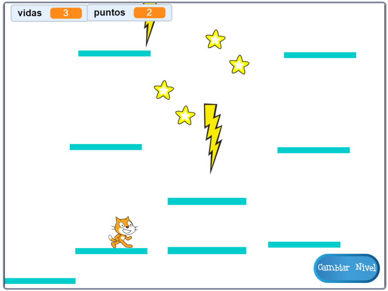

## Plataformas móviles

La razón por la que le pedí que usaras mi versión del nivel 2 es el espacio vacío que puedes haber notado en el medio del diseño. ¡Vas a crear una plataforma que se mueva a través de esta brecha y que el jugador pueda saltar y recorrer!



Primero, necesitarás el objeto para la plataforma.

\--- task \---

Agrega un nuevo objeto, asígnale el nombre de **Plataforma-móvil**, y usa las herramientas de personalización de disfraz en la pestaña Disfraces para que se vea como las otras plataformas \(usa el modo vectorial\).

\--- /task \---

Ahora, agreguemos algo de código al objeto.

Comienza con lo básico: para hacer un conjunto interminable de plataformas que se muevan hacia arriba de la pantalla, necesitarás clonar la plataforma a intervalos regulares. Yo elegí `4` segundos como mi intervalo. También debes asegurarte de que haya un interruptor de encendido/apagado para generar las plataformas, de manera que no aparezcan en el nivel 1. Estoy usando una nueva variable llamada `crear-plataformas`{:class="block3variables"}.

\--- task \---

Añade código para crear clones de tu objeto plataforma.

Así es como el mío se ve hasta ahora:

```blocks3
+    when green flag clicked
+    hide
+    forever
        wait (4) secs
        if <(create-platforms ::variables) = [true]> then
            create clone of [myself v]
        end
    end
```

\--- /task \---

\--- task \---

Luego agrega el código del clon:

```blocks3
+    when I start as a clone
+    show
+    forever
        if <(y position) < [180]> then
            change y by (1)
            wait (0.02) secs
        else
            delete this clone
        end
    end
```

\--- /task \---

Este código hace que el clon de **Plataforma-móvil** se mueva hacia la parte superior de la pantalla, lo suficientemente lento como para que el jugador suba y baje, y luego desaparece.

\--- task \---

Ahora haz que las plataformas desaparezcan/reaparezcan en función de los mensajes que cambian los niveles (para que solo estén en el nivel con espacio para ellas), y del mensaje de `fin del juego`{:class="block3events"}.

```blocks3
+    when I receive [level-1 v]
+    set [create-platforms v] to [false]
+    hide

+    when I receive [level-2 v]
+    set [create-platforms v] to [true]

+    when I receive [game over v]
+    hide
+    set [create-platforms v] to [false]
```

\--- /task \---

Ahora, si realmente intentas jugar el juego, ¡el **Personaje del jugador** se cae a través de la plataforma! ¿Alguna idea de por qué?

Es porque el código de física no reconoce la plataforma. En realidad es una solución rápida:

\--- task \---

En los scripts del objeto **Personaje del jugador**, reemplace cada bloque de `tocando “Plataformas”`{:class="block3sensing"} con un operador `O`{:class="block3operators"} que compruebe **ya sea** `tocando “Plataformas”`{:class="block3sensing"} **O** `tocando “Plataforma-móvil”`{:class="block3sensing"}.

Revisa del código del objeto **Personaje del jugador** y dondequiera que veas este bloque:

```blocks3
    <touching [Platforms v] ?>
```

reemplázalo con este:

```blocks3
    <<touching [Platforms v] ?> or <touching [Moving-Platform v] ?>>
```

\--- /task \---