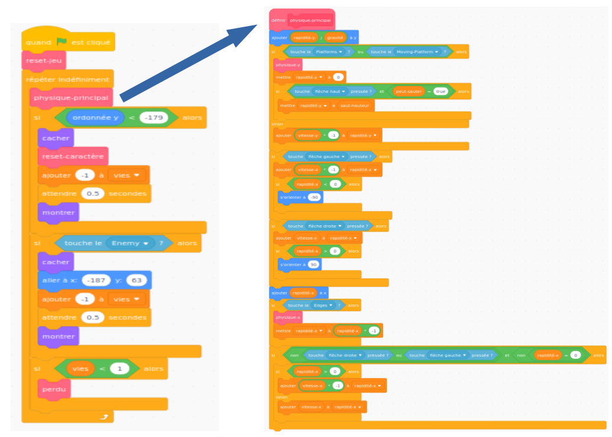

## Mise en place

Comme ici tu apprends à coder dans Scratch et non à construire un moteur physique (le code qui fait que les éléments d'un jeu informatique se comportent comme des objets du monde réel, par exemple ils ne tombent pas à travers les planchers), tu commenceras par un projet que j'ai créé et qui intègre déjà les bases pour se déplacer, sauter et détecter les plateformes.

Jette un rapide coup d'œil au projet, y compris aux détails de cette carte, car tu y apporteras des modifications ultérieurement. Tu n'as pas besoin de comprendre tout ce qu'il fait !

### Récupère le projet

\--- task \---

La première chose que tu dois faire est d'obtenir une copie du code Scratch de [ici](https://scratch.mit.edu/projects/454114430){:target="_blank"}.

Pour utiliser le projet hors-ligne, télécharge-le en cliquant sur **Voir à l'intérieur**, puis va dans le menu **Fichier** et clique sur **Sauvegarder sur votre ordinateur**. Ensuite, tu peux ouvrir le fichier téléchargé dans Scratch sur ton ordinateur.

Tu peux également l'utiliser directement dans Scratch dans ton navigateur en cliquant simplement sur **Voir à l'intérieur** puis sur **Remix**.

\--- /task \---

### Jette un coup d’œil au code

Le moteur physique du jeu contient diverses pièces, dont certaines fonctionnent déjà et d'autres non. Tu peux le tester en exécutant le jeu et en essayant d'y jouer.

Tu verras que tu peux perdre des vies, mais rien ne se passe quand tu n'en as plus. En outre, le jeu n'a qu'un seul niveau, un seul type de chose à collecter et aucun ennemi. Tu vas régler tout ça, et puis en faire un peu plus !

\--- task \---

Regarde comment le code est assemblé.

\--- /task \---

Il utilise beaucoup de blocs **Mes blocs**, qui sont parfaits pour diviser ton code en morceaux afin de mieux le gérer. Un bloc **Mes blocs** est un bloc que tu crées parmi beaucoup d'autres, et tu peux lui donner des instructions. Tu verras comment cela fonctionne dans une prochaine étape !

### Les blocs « Mes blocs » sont vraiment très utiles

Dans le code ci-dessus, la boucle `répéter indéfiniment`{:class="block3control"} principale du jeu appelle le bloc **Mes blocs** `physique-principal`{:class="block3myblocks"} pour faire plein de choses ! Garder les blocs séparés comme cela facilite la lecture de la boucle principale et la compréhension de ce qui se passe dans le jeu, sans se soucier de **comment** cela arrive.

\--- task \---

Regarde maintenant les blocs **Mes blocs** `reset-jeu`{:class="block3myblocks"} et `reset-personnage`{:class="block3myblocks"}.

\--- /task \---

Ils font des choses assez simples, telles que définir des variables et s'assurer que le personnage tourne correctement

- `reset-jeu`{:class="block3myblocks"} **appelle** `reset-personnage`{:class="block3myblocks"}, te montrant que tu peux utiliser un bloc **Mes blocs** dans un autre bloc **Mes blocs**
- Le bloc **Mes blocs** `reset-personnage`{:class="block3myblocks"} est utilisé à deux endroits différents de la boucle principale. Cela signifie que tu peux modifier deux emplacements de ta boucle de jeu principale en modifiant uniquement le code situé à l'intérieur du bloc **Mes blocs**, ce qui t'évite beaucoup de travail et t'évite des erreurs.