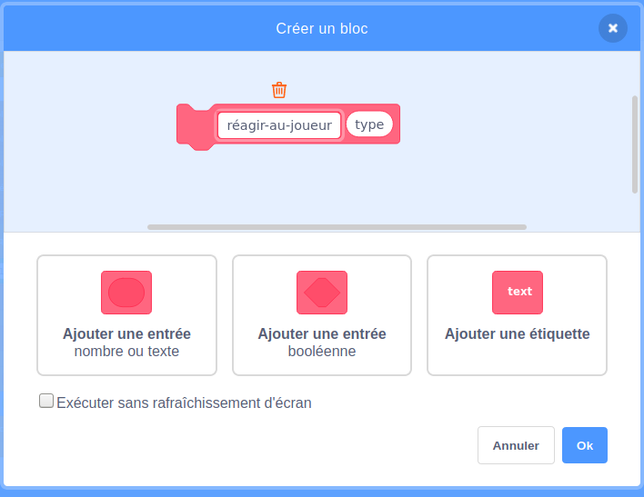

## Power-ups

Pour le moment, tu n'as qu’un type de pièce de collection: une étoile qui te gagne un point lorsque tu l’attrapes. Sur cette carte, tu vas créer un nouveau type de pièce de collection, et tu le feras d'une manière qui facilitera l'ajout d'autres types de pièces de collection. Alors tu peux inventer tes propres power-ups et bonus et vraiment faire le jeu toi-même !

J'ai déjà inclus quelques éléments pour le faire avec la variable `collectable-type`{:class="block3variables"} et les `prendre-costume`{:class="block3myblocks"} **Mes blocs**. Tu vas cependant avoir besoin de les améliorer.

Jetons un coup d’œil à la façon dont fonctionne la collection maintenant.

Dans les scripts du sprite **Collectable**, trouve le code `quand je commence comme un clone`{:class="block3events"}. Les blocs que tu dois regarder sont ceux qui te donnent des points pour ramasser une étoile :

```blocks3
    if <touching [Player Character v]?> then
        change [points v] by (collectable-value ::variables)
        delete this clone
```

et celui-ci qui sélectionne un costume pour le clone :

```blocks3
    prendre-costume (collectable-type ::variables) :: custom
```

## \--- collapse \---

## title: Comment fonctionne la sélection d'un costume ?

Le bloc `prendre-costume`{:class="block3myblocks"} fonctionne un peu comme le bloc `perdu`{:class="block3myblocks"}, mais il a quelque chose en plus : il prend une variable **entrée** appelée `type`{:class="block3myblocks"}.

```blocks3
    define pick-costume (type)
    if <(type ::variables) = [1]> then
        switch costume to [star1 v]
    end
```

Lorsque le bloc `prendre-costume`{:class="block3myblocks"} s'exécute, sa fonction est la suivante :

1. Il regarde la variable d'entrée `type`{:class="block3myblocks"}
2. Si la valeur `type`{:class="block3myblocks"} est égale à `1`, il passe au costume `étoiles1 `

Jette un coup d'œil à la partie du script qui utilise le bloc :

```blocks3
    when I start as a clone
    pick-costume (collectable-type ::variables) :: custom
    show
    repeat until <(y position) < [-170]>
        change y by (collectable-speed ::variables)
        if <touching [Player Character v]?> then
            change [points v] by (collectable-value ::variables)
            delete this clone
```

Tu peux voir que la variable `collectable-type`{:class="block3variables"} est **passée** au bloc `prendre-costume`{:class="block3myblocks"}. Dans le code de `prendre-costume`{:class="block3myblocks"}, `collectable-type`{:class="block3variables"} est alors utilisé comme variable d'entrée (`type`{:class="block3myblocks"}).

Cela signifie que la valeur `collectable-type`{:class="block3variables"} détermine le costume obtenu par le clone du sprite.

\--- /collapse \---

### Ajouter un costume pour le nouveau power-up

Bien sûr, pour le moment, le sprite **Collectable** n'a qu'un costume, puisqu'il n'y a qu'un seul type d'objets de collection. Tu es sur le point de changer cela.

\--- task \---

Ajoute un nouveau costume au sprite **Collectable** pour ton nouveau power-up. J'aime l'éclair, mais choisis ce que tu veux.

\--- /task \---

\--- task \---

Ensuite, dis au bloc `prendre-costume`{:class="block3myblocks"} **Mes blocs** de définir le nouveau costume chaque fois qu'il obtient la nouvelle valeur pour `type`{:class="block3myblocks"}, comme ceci \(en utilisant le nom du costume que tu as choisis\) :

```blocks3
    define pick-costume (type)
    if <(type ::variable) = [1]> then
        switch costume to [star1 v]
    end
+    if <(type ::variable) = [2]> then
+        switch costume to [lightning v]
+    end
```

\--- /task \---

### Crée le code du power-up

Maintenant tu dois décider ce que fera le nouvel objet de collection ! Nous allons commencer avec quelque chose de simple : donner une nouvelle vie au joueur. Par la suite, tu lui feras faire quelque chose de plus cool.

\--- task \---

Va dans la section **Mes blocs** et clique sur **Créer un bloc**. Nomme le nouveau bloc `réagir-au-joueur`{:class="block3myblocks"} et ajoute un **nombre entrée** nommé `type`{:class="block3myblocks"}.



Clique sur **OK**.

\--- /task \---

\--- task \---

Fais que le bloc `réagir-au-joueur`{:class="block3myblocks"} **Mes blocs** soit augmente les points soit augmente la vie du joueur, selon la valeur de `type`{:class="block3myblocks"}.

```blocks3
+    define react-to-player (type)
+    if <(type ::variable) = [1]> then
+        change [points v] by (collectable-value ::variables)
+    end
+    if <(type ::variable) = [2]> then
+        change [lives v] by [1]
+    end
```

\--- /task \---

\--- task \---

Mets à jour le code `quand je commence comme un clone`{:class="block3events"} pour remplacer le bloc qui ajoute un point avec un **appel** à `réagir-au-joueur`{:class="block3myblocks"}, **passant** `collectable-type`{:class="block3variables"} à lui.

```blocks3
+    if <touching [Player Character v] ?> then
+        react-to-player (collectable-type ::variables) :: custom
+        delete this clone
+    end
```

\--- /task \---

En utilisant ce nouveau bloc `réagir-au-joueur`{:class="block3myblocks"} **Mes blocs**, les étoiles ajoutent encore un point, mais le nouveau power-up que tu as créé ajoute une vie.

### Utilisation de `collectable-type`{:class="block3variables"} pour faire apparaître différents objets de collection au hasard

En ce moment, Tu te demandes peut-être comment tu vas dire à chaque objet de collection que le jeu fait quel type il doit être.

Tu le fais en définissant la valeur de `collectable-type`{:class="block3variables"}. Cette variable est juste un nombre. Comme tu l’as vu, il est utilisé pour dire aux blocs `prendre-costume`{:class="block3myblocks"} et `réagir-au-joueur`{:class="block3myblocks"} quel costume, règles, etc. utiliser pour l'objet de collection.

## \--- collapse \---

## title: Travailler avec des variables dans un clone

Pour chaque clone du sprite **Collectable**, tu peux définir une valeur différente pour `collectable-type`{:class="block3variables"}.

Penses-y quand tu crées une nouvelle copie du sprite **Collectable** à l'aide de la valeur stockée dans `collectable-type`{:class="block3variables"} au moment de la création du clone **Collectable**.

Tu te demandes peut être si changer la valeur de `collectable-type`{:class="block3variables"} transformera tous les objets de collection sur la scène en même type. Cela ne se produit pas, parce que l'une des choses qui rendent les clones spéciaux est qu'ils ne peuvent pas modifier les valeurs des variables avec lesquelles ils commencent. Les clones de sprite ont effectivement des valeurs **constantes**. Cela signifie que lorsque tu changes la valeur de `collectable-type`{:class="block3variables"}, cela n'affecte pas les clones de sprite **Collectable** qui sont déjà en jeu.

\--- /collapse \---

Tu vas définir le `collectable-type`{:class="block3variables"} soit à `1` soit à `2` pour chaque nouveau clone que tu fais. Pour garder le jeu intéressant, choisis entre les nombres au hasard pour faire un objet de collection aléatoire à chaque fois.

\--- task \---

Trouve la boucle `répéter jusqu'à`{:class="block3control"} dans le code du drapeau vert pour le sprite **Collectable** et ajoute le code `si...sinon`{:class="block3control"} affiché ci-dessous.

```blocks3
    repeat until <not <(create-collectables ::variables) = [true]>>
+        if <[50] = (pick random (1) to (50))> then
+            set [collectable-type v] to [2]
+        else
+            set [collectable-type v] to [1]
+        end
        wait (collectable-frequency ::variables) secs
        go to x: (pick random (-240) to (240)) y: (179)
        create clone of [myself v]
```

\--- /task \---

Ce code donne 1 chance sur 50 de définir le `collectable-type`{:class="block3variables"} à `2`. Après tout, tu ne veux pas donner au joueur la chance de gagner une vie supplémentaire trop souvent, sinon le jeu serait trop facile.

Maintenant tu as un nouveau type de collection qui apparaît parfois au lieu de l'étoile, et cela te donne une vie supplémentaire au lieu d'un point quand tu le collectes.