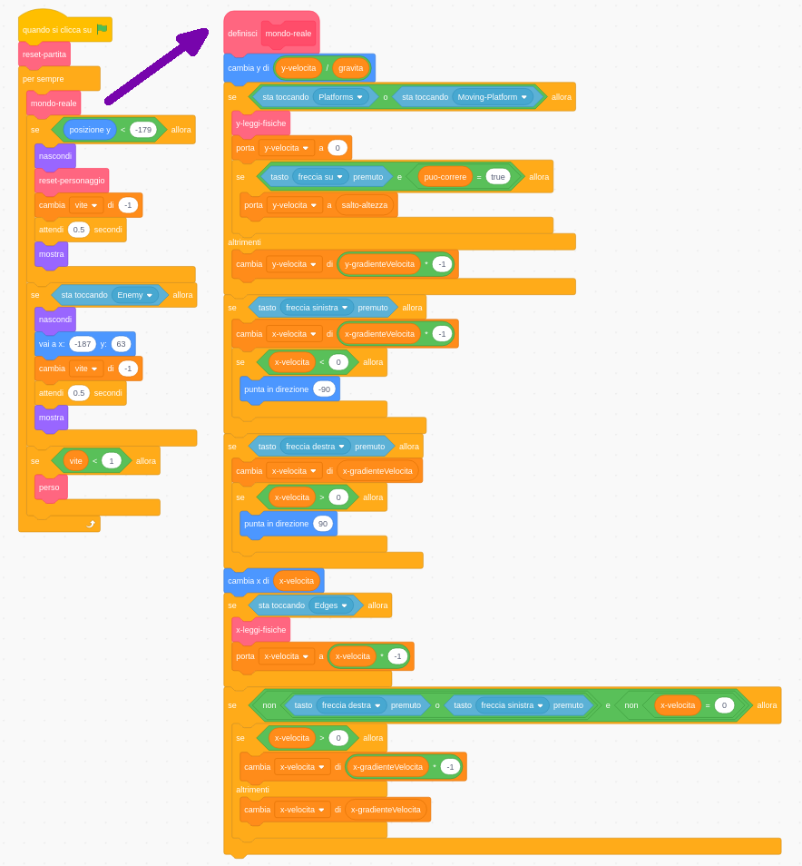

## Impostare il tutto

Siccome stai imparando a scrivere codice in Scratch e non a costruire un motore fisico (codice che fa in modo che le cose in un gioco per computer si comportino come oggetti del mondo reale, ad esempio non cadano attraverso i pavimenti), inizierai con un progetto che ho creato che ha già le basi per spostare, saltare e rilevare le piattaforme integrate.

Dovresti dare una rapida occhiata al progetto, inclusi i dettagli su questa scheda, perché in seguito dovrai apportare alcune modifiche, ma non devi capire tutto ciò che sta facendo!

### Prendi il progetto

\--- task \---

La prima cosa che devi fare è ottenere una copia del codice di Scratch da [dojo.soy/advanced-scratch](http://dojo.soy/advanced-scratch){:target="_ blank"}.

Per utilizzare il progetto offline, scaricalo facendo clic su **Guarda Dentro**, quindi vai al menu **File** e fai clic su **Scarica sul tuo computer**. Dopodiché potrai aprire il file scaricato in Scratch sul tuo computer.

Puoi anche usarlo direttamente in Scratch nel tuo browser semplicemente cliccando su **Vedi Inside** e poi **Remix**.

\--- /task \---

### Dai un'occhiata al codice

Il motore fisico del gioco ha una quantità di mattoncini, alcuni dei quali funzionano già e alcuni non ancora. Puoi testarlo eseguendo il gioco e provando a giocarci.

Vedrai che puoi perdere delle vite, ma non succede nulla quando le esaurisci. Inoltre, il gioco ha solo un livello, un solo tipo di oggetto da raccogliere e nessun nemico. Stai per sistemare le cose, e farai anche di più!

\--- task \---

Dai un'occhiata a come è stato creato il codice.

\--- /task \---

In esso si utilizzano un sacco di **I Miei blocchi**, che sono fantastici per dividere il codice in più parti in modo da poterlo gestire meglio. Un blocco de **I Miei Blocchi** è un blocco che crei combinando molti altri blocchi e al quale puoi passare anche delle istruzioni. Vedrai come funziona nel prossimo passo!

### I blocchi "I miei blocchi" sono davvero utili

Nel codice qui sopra, il ciclo principale del gioco `per sempre`{:class="block3control"} chiama `mondo-reale`{:class="block3myblocks"} da **I Miei Blocchi** per fare un sacco di cose! Mantenere i blocchi separati come questo rende più facile leggere il ciclo principale e capire ciò che accade nel gioco, senza preoccuparsi di **come** accade.

\--- task \---

Ora guarda il `reset game`{:class="block3myblocks"} e `reset personaggio`{: class = "block3myblocks"} ne **I Miei Blocchi**.

\--- /task \---

Fanno cose piuttosto normali, come impostare variabili e assicurarsi che il personaggio ruoti correttamente

- `reset-partita`{:class="block3myblocks"} **chiama** `reset-personaggio`{:class="block3myblocks"}, mostrandoti che puoi usare un blocco de **I Miei Blocchi** all'interno di un altro blocco de **I Miei Blocchi**
- Il `reset-personaggio`{:class="block3myblocks"} de **I Miei Blocchi** viene utilizzato in due diversi punti del ciclo principale. Ciò significa che puoi modificare due posizioni nel tuo ciclo di gioco principale cambiando solo il codice all'interno del blocco ne **I Miei blocchi**, il che ti consente di risparmiare molto lavoro e ti aiuta a evitare errori.