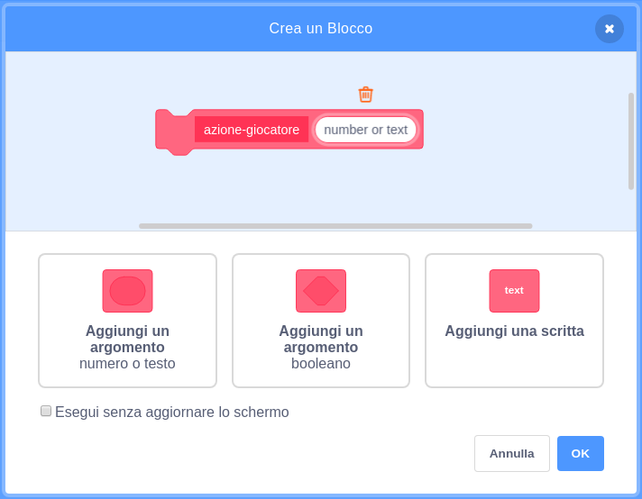

## Potenziamenti

Al momento hai solo un tipo di oggetto da raccogliere: una stella che ti fa guadagnare un punto quando la prendi. In questa scheda, creerai un nuovo tipo di oggetto da raccogliere, e lo farai in un modo che aggiungere ulteriori tipi di oggetti da raccogliere sarà più facile. E poi potrai inventare nuovi potenziamenti e bonus e rendere davvero questo gioco il tuo!

Ho già incluso alcuni pezzi per fare ciò grazie alla variabile `catturabili-tipo`{:class="block3variables"} ed il blocco `scegli-costume`{:class="block3myblocks"} ne **I Miei Blocchi**. Avrai bisogno di migliorarli però.

Diamo un'occhiata a come funzionano ora gli oggetti da raccogliere.

Negli script per lo sprite **Catturabili**, cerca il codice `quando vengo clonato`{:class="block3events"}. I blocchi in cui guardare sono quelli che ti danno i punti per la raccolta di una stella:

```blocks3
    se <touching [Player Character v]?> allora 
  cambia [punteggio v] di (catturabili-valore :: variables)
  elimina questo clone
end
```

e questo che seleziona un costume per il clone:

```blocks3
    scegli-costume (catturabili-tipo :: variables) :: custom
```

## \--- collapse \---

## title: Come funziona la scelta di un costume?

Il blocco `scegli-costume`{:class="block3myblocks"} funziona un po' come il blocco `perso`{:class="block3myblocks"}, ma ha qualcosa in più: richiede una variabile di **input** chiamata `tipo`{:class="block3myblocks"}.

```blocks3
    definisci scegli-costume (tipo :: custom-arg)
se <(tipo :: variables) = [1]> allora 
  passa al costume [star1 v]
end
```

Quando viene eseguito il blocco `scegli-costume`{:class="block3myblocks"}, ciò che fa è questo:

1. Cerca la variabile di input `tipo`{:class="block3myblocks"}
2. Se il valore di `tipo`{:class="block3myblocks"} è uguale a `1`, passa al costume `star1`

Dai un'occhiata alla parte dello script che usa il blocco:

```blocks3
    quando vengo clonato
scegli-costume (catturabili-tipo :: variables) :: custom
mostra
ripeti fino a quando <(posizione y) < [-170]> 
  cambia y di (catturabili-velocita :: variables)
  se <touching [Player Character v]?> allora 
    cambia [punteggio v] di (catturabili-valore :: variables)
    elimina questo clone
  end
end
```

Si può vedere che la variabile `catturabili-tipo`{class="block3variables"} viene **passata** al blocco `scegli-costume`{:class="block3myblocks"}. All'interno del codice `scegli-costume`{:class="block3myblocks"}, `catturabili-tipo`{:class="block3variables"} viene quindi utilizzata come variabile di input (`tipo`{:class="block3myblocks"}).

Ciò significa che il valore di `catturabili-tipo`{:class="block3variables"} decide quale costume riceve il clone dello sprite.

\--- /collapse \---

### Aggiungi un costume per il nuovo potenziamento

Certo, adesso lo sprite **Catturabili** ha solo un costume, dal momento che c'è solo un tipo di oggetto da raccogliere. Stai per cambiarlo.

\--- task \---

Aggiungi un nuovo costume allo sprite **Catturabili** per il tuo nuovo potenziamento. A me piace il fulmine, ma scegli quello che piace a te.

\--- /task \---

\--- task \---

Poi, dì al blocco `scegli-costume`{:class="block3myblocks"} ne **I Miei Blocchi** di impostare il nuovo costume ogni volta che riceve il nuovo valore di `tipo`{:class="block3myblocks"}, come questo \(usa qualsiasi nome di costume hai scelto\):

```blocks3
    definisci scegli-costume (type :: custom-arg)
se <(tipo) = [1]> allora 
  passa al costume [star1 v]
end
+ se <(tipo) = [2]> allora 
+  passa al costume [lightning v]
+ end
```

\--- /task \---

### Crea il codice di potenziamento

Ora devi decidere che cosa farà il nuovo oggetto da raccogliere! Inizieremo con qualcosa di semplice: dare al giocatore una vita in più. Nel prossimo passaggio, farai qualcosa di più interessante.

\--- task \---

Vai nella sezione **I Miei Blocchi** e fai clic su **Crea Un Blocco**. Rinomina il nuovo blocco `reazione-al-giocatore`{:class="block3myblocks"} e aggiungi un **input numerico** chiamato `tipo`{:class="block3myblocks"}.



Premi **OK**.

\--- /task \---

\--- task \---

Fai sì che il blocco `reazione-al-giocatore`{: class = "block3myblocks"} ne **I Miei Blocchi** o aumenti i punti o aumenti le vite del giocatore, a seconda del valore di `tipo`{:class="block3myblocks"}.

```blocks3
+ definisci reazione-al-giocatore (tipo :: custom-arg)
+ se <(tipo :: custom-arg) = [1]> allora 
+  cambia [punteggio v] di (catturabili-valore :: variables)
+ end
+ se <(tipo :: custom-arg) = [2]> allora 
+  cambia [vite v] di [1]
+ end
```

\--- /task \---

\--- task \---

Aggiorna il codice `quando vengo clonato`{:class="block3events"} per sostituire il blocco che aggiunge un punto con una **chiamata** a `reazione-al-giocatore`{:class="block3myblocks"}, **passandogli** `catturabili-tipo`{:class="block3variables"}.

```blocks3
+ se <touching [Player Character v] ?> allora 
+  reazione-al-giocatore (catturabili-tipo :: variables) :: custom
+  elimina questo clone
+ end
```

\--- /task \---

Usando questo nuovo blocco `reazione-al-giocatore`{:class="block3myblocks"} ne **I Miei Blocchi**, le stelle aggiungono ancora un punto, ma il nuovo potenziamento che hai creato aggiunge una vita.

### Usare `catturabili-tipo`{:class="block3variables"} per far apparire oggetti da raccogliere a caso

In questo momento, ti starai chiedendo come dirai a ogni oggetto da raccogliere di che tipo dovrebbe essere.

Puoi farlo impostando il valore di `catturabili-tipo`{:class="block3variables"}. Questa variabile è solo un numero. Come hai visto, è usata per dire ai blocchi `scegli-costume`{:class="block3myblocks"} e `reazione-al-giocatore`{:class="block3myblocks"} quale costume, regole, ecc. da usare per l'oggetto da raccogliere.

## \--- collapse \---

## title: Lavorare con le variabili in un clone

Per ogni clone dello sprite **Catturabili**, puoi impostare un valore diverso per `catturabili-tipo`{:class="block3variables"}.

Pensa ad esso come fosse una nuova copia dello sprite **Catturabili** con l'aiuto del valore che è memorizzato in `catturabili-tipo`{:class="block3variables"} nel momento in cui viene creato il clone **Catturabili**.

Ci si potrebbe chiedere se la modifica del valore di `catturabili-tipo`{:class="block3variables"} trasformerà tutti i catturabili sullo schermo nello stesso tipo. Ciò non accade, perché una delle cose che rende speciali i cloni è che non possono cambiare i valori di nessuna variabile con cui iniziano. I cloni di sprite hanno effettivamente **valori costanti**. Ciò significa che quando cambi il valore di `catturabili-tipo`{:class="block3variables"}, questo non influenza i cloni **Catturabili** già presenti nel gioco.

\--- /collapse \---

Stai per impostare il `catturabili-tipo`{:class="block3variables"} su `1` o `2` per ogni nuovo clone che crei. Per mantenere il gioco interessante, scegli i numeri a caso per creare un oggetto da raccogliere casuale ogni volta.

\--- task \---

Trova la ripetizione `ripeti fino a quando`{:class="block3control"} all'interno del codice della bandiera verde per lo sprite **Catturabili** e aggiungi il codice `se... allora`{:class=" block3control "} mostrato di seguito.

```blocks3
    repeat until <not <(create-collectables ::variables) = [true]>>
+ se <[50] = (numero a caso tra (1) e (50))> allora 
+  porta [catturabili-tipo v] a [2]
+ altrimenti 
+  porta [catturabili-tipo v] a [1]
+ end
attendi (catturabili-frequenza :: variables) secondi
vai a x: (numero a caso tra (-240) e (240)) y: (179)
crea clone di [me stesso v]
```

\--- /task \---

Questo codice offre una possibilità di 1 su 50 di impostare il `catturabili-tipo`{:class="block3variables"} a `2`. Dopotutto, non vuoi dare al giocatore la possibilità di raccogliere una vita extra troppo spesso, altrimenti il gioco sarebbe troppo facile.

Ora hai un nuovo tipo di oggetto da raccogliere che a volte appare al posto della stella, e che ti dà una vita extra invece di un punto quando lo raccogli.