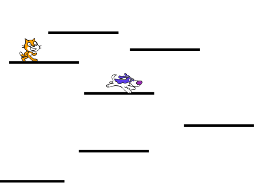

## Aggiungiamo un po' di difficoltà

Il tuo gioco funziona e ora puoi raccogliere punti, ottenere poteri speciali dai potenziamenti e anche perdere. Stiamo arrivando da qualche parte! Forse sarebbe divertente aggiungere un po' di concorrenza - che dici di includere un personaggio che si muove un po', ma che non dovresti toccare? Sarà simile ai nemici nei tradizionali giochi come Super Mario da cui ci siamo ispirati.

\--- task \---

First, pick a sprite to add as your enemy. Because our player character is a cat, I chose a dog. There are lots of other sprites you could add though. I also renamed the sprite **Enemy**, just to make things clearer for me.

Resize the sprite to the right size, and place it somewhere appropriate to start. Here’s what mine looks like:



\--- /task \---

\--- task \---

Write the easiest code first: set up its block for reacting to the `game over`{:class="events"} message to make the enemy disappear when the player loses the game.

```blocks3
+ quando ricevo [game over v]
+ nascondi
```

\--- /task \---

\--- task \---

Now you need to write the code for what the enemy does. Use my code here, but consider adding extra bits! (What if they can teleport around to different platforms? What if there’s a power-up that makes them move faster, or slower?)

```blocks3
+ quando si clicca sulla bandiera verde
+ mostra
+ porta [nemico-moto-passi v] a [5]
+ usa stile rotazione [sinistra-destra v]
+ vai a x: (-25) y: (-9)
+ per sempre 
fai (nemico-moto-passi) passi
  if <not <touching [Platforms v] ?>> then
  porta [nemico-moto-passi v] a ((nemico-moto-passi) * (-1))
end
end
```

**Note**: if you just drag the `go to`{:class="block3motion"} block into the sprite panel and don’t change the `x` and `y` values, they’ll be the values for the current location of the **Enemy** sprite!

The code in the `if...then`{:class="block3control"} block will make the sprite turn around when they get to the end of the platform!

\--- /task \---

The next thing you’ll need is for the player to lose a life when their **Player Character** sprite touches the **Enemy** sprite. Also, you need to make sure the sprites **stop** touching really quickly, since otherwise the code that checks for touching will keep running and the player will keep losing lives.

\--- task \---

Here's how I did it, but you can try to improve on this code! I modified the **Player Character** sprite’s main block. Add the new code before the `if`{:class="block3control"} block that checks if you're out of lives.

```blocks3
    quando si clicca sulla bandiera verde
reset-partita :: custom
per sempre 
  mondo-reale :: custom
  se <(posizione y) <[-179]> allora 
    nascondi
    reset-personaggio :: custom
    cambia [vite v] di (-1)
    attendi (0.05) secondi
    mostra
  end
  + se <touching [Enemy v] ?> allora 
  +   nascondi
  +   vai a x: (-187) y: (42)
  +   cambia [vite v] di (-1)
  +   attendi (0.5) secondi
  +   mostra
  + end
  se <(vite) <[1]> allora 
    perso :: custom
  end
end
```

\--- /task \---

The new code hides the **Player Character** sprite, moves it back to its starting position, reduces the `lives`{:class="block3variables"} variable by `1`, and after half a second makes the sprite re-appear.