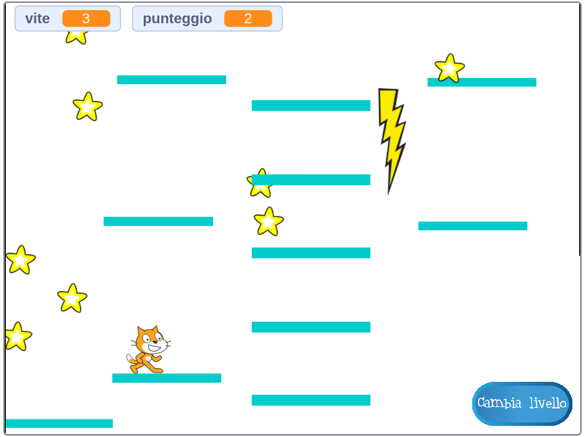

## Piattaforme mobili

La ragione per cui ti ho chiesto di usare la mia versione di livello 2 è la differenza che potresti aver notato nel centro del layout. Creerai una piattaforma che si muove in questo spazio e che il giocatore può saltare e cavalcare!



Innanzitutto, avrai bisogno dello sprite per la piattaforma.

\--- task \---

Aggiungi un nuovo sprite, chiamalo **Piattaforme-mobili** e usa gli strumenti di personalizzazione del costume nella scheda Costumi per renderlo simile alle altre piattaforme \ (usa la modalità vettoriale \).

\--- /task \---

Ora, aggiungiamo un po' di codice allo sprite.

Inizia con le basi: per creare un insieme infinito di piattaforme che si muovono sullo schermo, dovrai clonare la piattaforma a intervalli regolari. Ho scelto `4` secondi come intervallo. Devi anche assicurarti che ci sia un interruttore on/off per creare le piattaforme, in modo che non vengano visualizzate nel livello 1. Sto usando una nuova variabile chiamata `crea-piattaforma`{:class="block3variables"}.

\--- task \---

Aggiungi il codice per creare cloni dello sprite della tua piattaforma.

Ecco come appare il mio a questo punto:

```blocks3
+ quando si clicca sulla bandiera verde
+ nascondi
+ per sempre 
  attendi (4) secondi
  se <(crea-piattaforma :: variables) = [true]> allora 
    crea clone di [me stesso v]
end
end
```

\--- /task \---

\--- task \---

Quindi aggiungi il codice del clone:

```blocks3
+ quando vengo clonato
+ mostra
+ per sempre 
  se <(posizione y) <[180]> allora 
    cambia y di (1)
    attendi (0.02) secondi
  altrimenti 
    elimina questo clone
  end
end
```

\--- /task \---

Questo codice fa muovere il clone **Piattaforme-mobili** fino alla parte superiore dello schermo, abbastanza lentamente da consentire al giocatore di saltare avanti e indietro e quindi scomparire.

\--- task \---

Ora le piattaforme scompaiono/riappaiono in base ai messaggi che cambiano i livelli (quindi esistono solo nel livello che ha spazio per ospitarle), e al messaggio `game over`{:class="block3events"}.

```blocks3
+ quando ricevo [livello-1 v]
+ porta [crea-piattaforma v] a [false]
+ nascondi

+ quando ricevo [livello-2 v]
+ porta [crea-piattaforma v] a [true]

+ quando ricevo [game over v]
+ nascondi
+ porta [crea-piattaforma v] a [false]
```

\--- /task \---

Ora, se si tenta di giocare, il **Personaggio-giocatore** cade attraverso la piattaforma! Qualche idea del perché?

È perché il codice della fisica del mondo-reale non conosce la piattaforma. In realtà c'è una soluzione rapida:

\--- task \---

Negli script dello sprite **Personaggio-giocatore**, sostituire ogni blocco `sta toccando “Piattaforme”`{:class="block3sensing"} con un operatore `O`{:class="block3operators"} che controlla **o** se `sto toccando “Piattaforme”`{:class="block3sensing"} **O** `sto toccando “Piattaforme-mobili”`{:class="block3sensing"}.

Analizza il codice dello sprite **Personaggio-giocatore** e ovunque vedi questo blocco:

```blocks3
    <touching [Platforms v] ?>
```

sostituiscilo con questo:

```blocks3
    <<touching [Platforms v] ?> o <touching [Moving-Platform v] ?>>
```

\--- /task \---