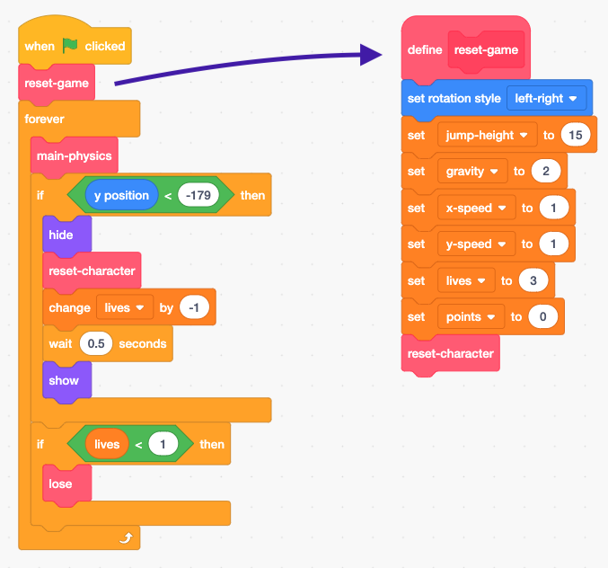

## ಸಾಮಗ್ರಿಗಳನ್ನು ಹೊಂದಿಸುವುದು

ನೀವು Scratch‌ನಲ್ಲಿ ಹೇಗೆ code ಮಾಡಬೇಕೆಂದು ಕಲಿಯುತ್ತಿರುವಿರಿ ಮತ್ತು ಫಿಸಿಕ್ಸ್ ಎಂಜಿನ್ ಅನ್ನು ಹೇಗೆ ನಿರ್ಮಿಸುವುದು ಎಂಬುದರ ಬಗ್ಗೆ ಅಲ್ಲ (ಕಂಪ್ಯೂಟರ್ ಆಟದಲ್ಲಿನ ವಿಷಯಗಳನ್ನು ನೈಜ-ಪ್ರಪಂಚದ ವಸ್ತುಗಳಂತೆ ವರ್ತಿಸುವಂತೆ ಮಾಡುವ ಕೋಡ್, ಉದಾ. ಅವು ಮಹಡಿಗಳ ಮೂಲಕ ಬೀಳದಂತೆ ನೋಡಿಕೊಳ್ಳುವುದು). ನಾನು ಈಗಾಗಲೇ ರಚಿಸಿದ ಚಲಿಸುವ, ಜಿಗಿಯುವ ಮತ್ತು ದಿಬ್ಬ/ವೇದಿಕೆ ಪತ್ತೆಹಚ್ಚುವ ಮೂಲಭೂತ ಅಂಶಗಳ ಜೊತೆ ನೀವು ಪ್ರಾರಂಭಿಸುತ್ತೀರಿ.

ಈ ಕಾರ್ಡ್‌ನಲ್ಲಿನ ವಿವರಗಳನ್ನು ಒಳಗೊಂಡಂತೆ ನೀವು ಪ್ರಾಜೆಕ್ಟ್ ಅನ್ನು ತ್ವರಿತವಾಗಿ ನೋಡಬೇಕು, ಏಕೆಂದರೆ ನೀವು ನಂತರ ಅದರಲ್ಲಿ ಕೆಲವು ಬದಲಾವಣೆಗಳನ್ನು ಮಾಡುತ್ತೀರಿ, ಆದರೆ ಅದು ಮಾಡುತ್ತಿರುವ ಎಲ್ಲವನ್ನೂ ನೀವು ಅರ್ಥಮಾಡಿಕೊಳ್ಳುವ ಅಗತ್ಯವಿಲ್ಲ!

### ಪ್ರಾಜೆಕ್ಟ್ ಅನ್ನು ಪಡೆಯಿರಿ

\--- task \---

[dojo.soy/advanced-scratch](http://dojo.soy/advanced-scratch){:target="_blank"} ನಿಂದ Scratch code‌ನ ನಕಲನ್ನು ಪಡೆಯುವುದು ನೀವು ಮೊದಲು ಮಾಡಬೇಕಾಗಿರುವುದು.

ಪ್ರಾಜೆಕ್ಟ್ ಆಫ್‌ಲೈನ್‌ನಲ್ಲಿ ಬಳಸಲು, **See Inside** ಕ್ಲಿಕ್ ಮಾಡುವ ಮೂಲಕ ಅದನ್ನು ಡೌನ್‌ಲೋಡ್ ಮಾಡಿ, ನಂತರ **File** menu ಮತ್ತು**Download to your computer** ಕ್ಲಿಕ್ ಮಾಡಿ. ನಂತರ ನೀವು ಡೌನ್‌ಲೋಡ್ ಮಾಡಿದ file ಅನ್ನು ನಿಮ್ಮ ಕಂಪ್ಯೂಟರ್‌ನಲ್ಲಿ Scratch ‌ನಲ್ಲಿ ತೆರೆಯಬಹುದು.

**See Inside** ಮತ್ತು ನಂತರ **Remix** ಕ್ಲಿಕ್ ಮಾಡುವ ಮೂಲಕ ನೀವು ಅದನ್ನು ನೇರವಾಗಿ ನಿಮ್ಮ ಬ್ರೌಸರ್‌ನ Scratch‌ ನಲ್ಲಿ ಬಳಸಬಹುದು.

\--- /task \---

### ಒಮ್ಮೆ code ನೋಡಿ

ಈ ಆಟದ ಫಿಸಿಕ್ಸ್ ಎಂಜಿನ್ ಅದರಲ್ಲಿ ವಿವಿಧ ಭಾಗಗಳು ಇವೆ, ಅವುಗಳಲ್ಲಿ ಕೆಲವು ಈಗಾಗಲೇ ಕಾರ್ಯನಿರ್ವಹಿಸುತ್ತವೆ ಮತ್ತು ಅವುಗಳಲ್ಲಿ ಕೆಲವು ಇನ್ನೂ ಇಲ್ಲ. ಆಟವನ್ನು ಚಲಾಯಿಸುವ ಮೂಲಕ ಮತ್ತು ಅದನ್ನು ಆಡಲು ಪ್ರಯತ್ನಿಸುವ ಮೂಲಕ ನೀವು ಇದನ್ನು ಪರೀಕ್ಷಿಸಬಹುದು.

ನೀವು ಲೈಫ್ ಕಳೆದುಕೊಳ್ಳಬಹುದು ಎಂದು ನೀವು ನೋಡುತ್ತೀರಿ, ಆದರೆ ಇದು ಖಾಲಿಯಾದಾಗ ಏನೂ ಆಗುವುದಿಲ್ಲ. ಅಲ್ಲದೆ, ಆಟವು ಕೇವಲ ಒಂದು ಹಂತವನ್ನು ಹೊಂದಿದೆ, ಸಂಗ್ರಹಿಸಲು ಒಂದು ರೀತಿಯ ವಿಷಯವಿದೆ ಮತ್ತು ಶತ್ರುಗಳಿಲ್ಲ. ನೀವು ಎಲ್ಲವನ್ನೂ ಸರಿಪಡಿಸಲು ಹೊರಟಿದ್ದೀರಿ, ಮತ್ತು ನಂತರ ಸ್ವಲ್ಪ ಹೆಚ್ಚು ಮಾಡಿ!

\--- task \---

Code ಹೇಗೆ ಒಟ್ಟುಗೂಡಿಸಲಾಗಿದೆ ಎಂಬುದನ್ನು ನೋಡೋಣ.

\--- /task \---

ಇದು ಸಾಕಷ್ಟು **My blocks** ಬ್ಲಾಕ್ ಅನ್ನು ಉಪಯೋಗಿಸುತ್ತದೆ, ನಿಮ್ಮ code ಅನ್ನು ತುಂಡುಗಳಾಗಿ ವಿಭಜಿಸಲು ಇದು ಉತ್ತಮವಾಗಿದೆ ಆದ್ದರಿಂದ ನೀವು ಅದನ್ನು ಉತ್ತಮವಾಗಿ ನಿರ್ವಹಿಸಬಹುದು. **My blocks** ಬ್ಲಾಕ್ ಎನ್ನುವುದು ಹಲವಾರು ಇತರ ಬ್ಲಾಕ್‌ಗಳಿಂದ ರಚಿಸಲ್ಪಟ್ಟ ಒಂದು ಬ್ಲಾಕ್ ಆಗಿದೆ, ಮತ್ತು ನೀವು ಅದಕ್ಕೆ ಕೆಲವು ಸೂಚನೆಗಳನ್ನು ನೀಡಬಹುದು. ಮುಂಬರುವ ಹಂತದಲ್ಲಿ ಅದು ಹೇಗೆ ಕಾರ್ಯನಿರ್ವಹಿಸುತ್ತದೆ ಎಂಬುದನ್ನು ನೀವು ನೋಡುತ್ತೀರಿ!

### 'ನನ್ನ blocks'ಬ್ಲಾಕ್ ನಿಜವಾಗಿಯೂ ಉಪಯುಕ್ತವಾಗಿವೆ

ಮೇಲಿನ ಕೋಡ್‌ನಲ್ಲಿ, ಮುಖ್ಯ ಆಟದ `forever`{:class="block3control"} ಲೂಪ್ </strong> ಎಲ್ಲಾ ಕೆಲಸವನ್ನು ಮಾಡಲು, `main-physics`{:class="block3myblocks"} **My blocks</1> ಅನ್ನು ಕರೆಯುತ್ತದೆ! **ಹೇಗೆ** ಇದು ಸಂಭವಿಸುತ್ತದೆ ಎಂಬುದರ ಬಗ್ಗೆ ಚಿಂತಿಸದೆ, ಬ್ಲಾಕ್ಗಳನ್ನು ಈ ರೀತಿ ಬೇರ್ಪಡಿಸುವುದರಿಂದ ಮುಖ್ಯ ಲೂಪ್ ಅನ್ನು ಓದುವುದು ಮತ್ತು ಆಟದಲ್ಲಿ ಏನಾಗುತ್ತದೆ ಎಂಬುದನ್ನು ಅರ್ಥಮಾಡಿಕೊಳ್ಳುವುದು ಸುಲಭವಾಗುತ್ತದೆ.
 

\--- task \---

ಈಗ `reset game`{:class="block3myblocks"} ಮತ್ತು `reset character`{:class="block3myblocks"} **My blocks** ಬ್ಲಾಕ್ ಗಳನ್ನು ನೋಡಿ.

\--- /task \---

ವೇರಿಯೇಬಲ್ಸ್ ಗಳನ್ನು ಹೊಂದಿಸುವುದು ಮತ್ತು ಪಾತ್ರವು ಸರಿಯಾಗಿ ತಿರುಗುತ್ತಿದೆಯೆ ಎಂದು ಖಚಿತಪಡಿಸಿಕೊಳ್ಳುವಂತಹ ಸಾಮಾನ್ಯ ಕೆಲಸಗಳನ್ನು ಅವರು ಮಾಡುತ್ತಾರೆ

- `reset-game`{:class="block3myblocks"}, `reset-character`{:class="block3myblocks"} ಅನ್ನು **ಕರೆ** ಮಾಡುವ ಮೂಲಕ, **My blocks** ಬ್ಲಾಕ್ ಒಳಗೆ ಮತ್ತೊಂದು **My blocks** ಬ್ಲಾಕ್ ಬಳಸಬಹುದು ಎಂದು ತೋರಿಸುತ್ತದೆ
- `reset-character`{:class="block3myblocks"} **My blocks** ಬ್ಲಾಕ್ ಮುಖ್ಯ ಲೂಪ್ನಲ್ಲಿ ಎರಡು ವಿಭಿನ್ನ ಸ್ಥಳಗಳಲ್ಲಿ ಬಳಸಲಾಗುತ್ತದೆ. ಇದರರ್ಥ **My blocks** ಬ್ಲಾಕ್ ಕೋಡ್ ಅನ್ನು ಮಾತ್ರ ಬದಲಾಯಿಸುವ ಮೂಲಕ ನಿಮ್ಮ ಮುಖ್ಯ ಆಟದ ಲೂಪ್ ‌ನಲ್ಲಿ ನೀವು ಎರಡು ಸ್ಥಳಗಳನ್ನು ಬದಲಾಯಿಸಬಹುದು, ಇದು ನಿಮಗೆ ಬಹಳಷ್ಟು ಕೆಲಸವನ್ನು ಉಳಿಸುತ್ತದೆ ಮತ್ತು ತಪ್ಪುಗಳನ್ನು ತಪ್ಪಿಸಲು ಸಹಾಯ ಮಾಡುತ್ತದೆ.