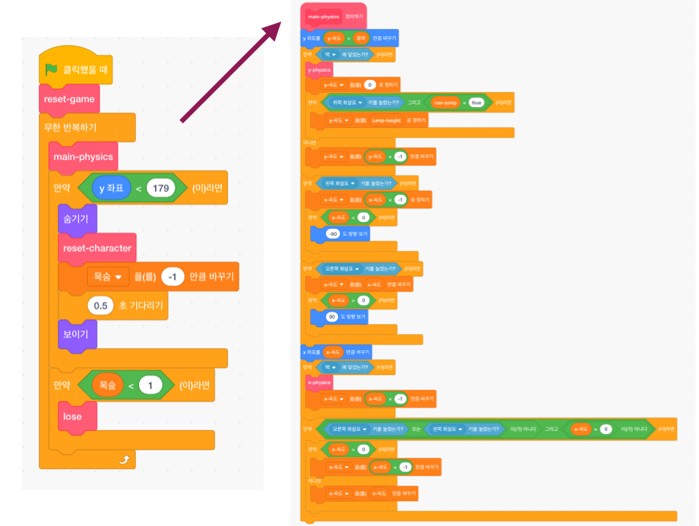

## 설정하기

물리적인 엔진(컴퓨터 게임의 물건을 실제 물건처럼 행동하게 만드는 코드, 예를 들어 바닥으로 떨어지지 않는 코드)을 만드는 방법이 아니라 스크래치로 코딩하는 방법을 배우는 것이기 때문에, 이미 플랫폼 이동, 점프 및 감지에 대한 기본 사항이 있는 이 프로젝트로 시작할 것입니다.

나중에 이 프로젝트를 약간 변경하기 때문에 세부 정보를 포함하여 프로젝트를 빠르게 살펴 봐야 합니다. 그렇다고 모든 작업을 이해할 필요는 없습니다.

### 프로젝트 가져 오기

\--- task \---

The first thing you’ll need to do is to get a copy of the Scratch code from [here](https://scratch.mit.edu/projects/454114430){:target="_blank"}.

To use the project offline, download it by clicking **See Inside**, then go to the **File** menu and click **Download to your computer**. Then you can open the downloaded file in Scratch on your computer.

You can also use it directly in Scratch in your browser by just clicking **See Inside** and then **Remix**.

\--- /task \---

### 코드 살펴보기

The physics engine of the game has a variety of pieces in it, some of which work already and some of which don’t yet. You can test this out by running the game and trying to play it.

You'll see that you can lose lives, but nothing happens when you run out. Also, the game only has one level, one type of thing to collect, and no enemies. You’re going to fix all of that, and a then do a bit more!

\--- task \---

Take a look at how the code is put together.

\--- /task \---

It uses lots of **My blocks** blocks, which are great for splitting your code up into pieces so you can manage it better. A **My blocks** block is a block you make up out of a lot of other blocks, and you can give some instructions to it. You'll see how it works in an upcoming step!

### '나만의 블록' 블록은 정말 유용합니다.

In the code above, the main game `forever`{:class="block3control"} loop calls the `main-physics`{:class="block3myblocks"} **My blocks** block to do a whole lot of stuff! Keeping the blocks separated like this makes it easy to read the main loop and understand what happens in the game, without worrying about **how** it happens.

\--- task \---

Now look at the `reset game`{:class="block3myblocks"} and `reset character`{:class="block3myblocks"} **My blocks** blocks.

\--- /task \---

They do pretty normal things, such as setting up variables and making sure the character rotates properly

- `reset-game`{: class = "block3myblocks"} 은 `reset-character`{: class = "block3myblocks"}, **블록을 호출하고**, 이는 ** 나만의 블록 ** 안에 또 다른 **나만의 블록** 을 사용할 수 있음을 보여줍니다.
- `reset-character`{: class = "block3myblocks"} **나만의 블록** 은 메인 루프의 두 곳에서 사용됩니다. 즉, **나만의 블록** 내부의 코드 만 변경하여 게임 메인 루프의 두 곳을 변경할 수 있으므로 많은 작업을 절약하고 실수를 피할 수 있습니다.