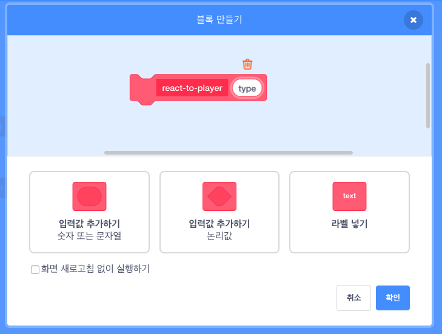

## 파워 업

현재 수집 할 수 있는 유형은 한 가지뿐입니다. 수집 할 때 1점을 얻는 별. 이 프로젝트에서는 새로운 유형의 수집품을 만들고, 다른 유형의 수집품도 쉽게 추가 할 수 있는 방식으로 수행 할 것입니다. 그런 다음 자신의 파워 업과 보너스를 만들어 실제로 자신의 게임을 직접 만들 수 있습니다!

우리는 이 작업을 이미 `collectable-type`{:class="block3variables"} 변수와 `pick-costume`{:class="block3myblocks"} **나만의 블록** 으로 일부 수행했습니다. 당신은 그것들을 개선할 필요가 있을 것입니다.

지금 수집품이 어떻게 작동하는지 살펴 보겠습니다.

**Collectable** 스프라이트에 대한 스크립트에서 `복제되었을 때`{class = "block3events"} 코드를 찾으세요. 살펴 봐야 할 블록은 별 수집을 위한 포인트를 주는 블록입니다.

```blocks3
    만약 <touching [Player Character v]?> 이라면
        [points v] 를 (collectable-value ::variables) 만큼 바꾸기
        이 복제본 삭제하기
```

그리고 이 코드는 복제본에 대한 모양을 선택합니다:

```blocks3
    pick-costume (collectable-type :: variables) :: custom
```

## \--- collapse \---

## 제목: 모양을 정하는 방법은 무엇입니까?

`pick-costume`{:class = "block3myblocks"} 블록은 `lose` {:class = "block3myblocks"}과 같은 방식으로 동작을 하지만, 추가된 기능이 있습니다: `type`{:class="block3myblocks"} 이라고 하는**입력** 변수를 사용합니다.

```blocks3
    pick-costume (type) 정의하기
    만약 <(type ::variables) = [1]> 이라면
        모양을 [star1 v] 으로 바꾸기
    끝
```

`pick-costume`{:class="block3myblocks"} 블록이 실행될 때 수행되는 작업은 다음과 같습니다.

1. `type`{:class = "block3myblocks"}이 입력 변수입니다.
2. `type`{:class="block3myblocks"} 이 `1`과 같다면, `star1` 모양으로 바꿉니다.

블록을 사용하는 스크립트 부분을 살펴보십시오.

```blocks3
    복제되었을 때
    pick-costume (collectable-type ::variables) :: custom
    보이기
    <(y position) < [-170]> 까지 반복하기
        y 좌표를 (collectable-speed ::variables) 만큼 바꾸기
        만약 <touching [Player Character v]?> 이라면
            [points v] 을 (collectable-value ::variables) 만큼 바꾸기
            이 복제본 삭제하기
```

`collectable-type`{：class = "block3variables"}변수가 `pick-costume`{：class = "block3myblocks"}블록으로 **전달**되는 것을 알 수 있습니다. `pick-costume`{: class = "block3myblocks"} 코드에서 `collectable-type`{: class = "block3variables"}가 입력 변수로 사용됩니다 (`type`{: class = "block3myblocks"}) ).

즉, `collectable-type`{: class = "block3variables"} 값은 스프라이트 복제본의 모양을 결정합니다.

\--- /collapse \---

### 새로운 파워 업을 위한 모양 추가

물론, 지금은 ** Collectable** 스프라이트는 모양이 한 종류밖에 없습니다. 이제 이를 바꾸려고 합니다.

\--- task \---

Add a new costume to the **Collectable** sprite for your new power-up. I like the lightning bolt, but pick whatever you like.

\--- /task \---

\--- task \---

Next, tell the `pick-costume`{:class="block3myblocks"} **My blocks** block to set the new costume whenever it gets the new value for `type`{:class="block3myblocks"}, like this \(using whatever costume name you picked\):

```blocks3
    pick-costume (type) 정의하기
    만약 <(type ::variable) = [1]> 이라면
        모양을 [star1 v] 으로 바꾸기
    끝
+    만약 <(type ::variable) = [2]> 이라면
+        모양을 [lightning v] 으로 바꾸기
+    끝
```

\--- /task \---

### 파워 업 코드 생성

Now you need to decide what the new collectable will do! We’ll start with something simple: giving the player a new life. In the next step, you’ll make it do something cooler.

\--- task \---

Go into the **My blocks** section and click **Make a Block**. Name the new block `react-to-player`{:class="block3myblocks"} and add a **number input** named `type`{:class="block3myblocks"}.



Click **OK**.

\--- /task \---

\--- task \---

Make the `react-to-player`{:class="block3myblocks"} **My blocks** block either increase the points or increase the player’s lives, depending on the value of `type`{:class="block3myblocks"}.

```blocks3
+    react-to-player (type) 정의하기
+    만약 <(type ::variable) = [1]> 이라면
+       [points v] 을 (collectable-value ::variables) 만큼 바꾸기
+    끝
+    만약 <(type ::variable) = [2]> 이라면
+        [lives v] 을 [1] 만큼 바꾸기
+    끝
```

\--- /task \---

\--- task \---

Update the `when I start as a clone`{:class="block3events"} code to replace the block that adds a point with a **call** to `react-to-player`{:class="block3myblocks"}, **passing** `collectable-type`{:class="block3variables"} to it.

```blocks3
+    만약 <touching [Player Character v] ?> 이라면
+        react-to-player (collectable-type ::variables) :: custom
+        이 복제본 삭제하기
+    끝
```

\--- /task \---

By using this new `react-to-player`{:class="block3myblocks"} **My blocks** block, stars still add a point, but the new power-up you've created adds a life.

### 다른 수집품이 무작위로 나타나게 하기 위한 `collectable-type`{: class = "block3variables"} 사용하기

Right now, you might be wondering how you'll tell each collectable the game makes what type it should be.

You do this by setting the value of `collectable-type`{:class="block3variables"}. This variable is just a number. As you've seen, it's used to tell the `pick-costume`{:class="block3myblocks"} and `react-to-player`{:class="block3myblocks"} blocks what costume, rules, etc. to use for the collectable.

## \--- collapse \---

## title: 복제본에서 변수 작업

For each clone of the **Collectable** sprite, you can set a different value for `collectable-type`{:class="block3variables"}.

Think of it like creating a new copy of the **Collectable** sprite with the help of the value that is stored in `collectable-type`{:class="block3variables"} at the time the **Collectable** clone gets created.

You might be wondering whether changing the value of `collectable-type`{:class="block3variables"} will turn all the collectables on the Stage into the same type. That doesn't happen, because one of the things that makes clones special is that they cannot change the values of any variables they start with. Sprite clones effectively have **constant** values. That means that when you change the value of `collectable-type`{:class="block3variables"}, this doesn't affect the **Collectable** sprite clones that are already in the game.

\--- /collapse \---

You're going to set the `collectable-type`{:class="block3variables"} to either `1` or `2` for each new clone that you make. To keep the game interesting, pick between the numbers at random to make a random collectable every time.

\--- task \---

Find the `repeat until`{:class="block3control"} loop inside the green flag code for the **Collectable** sprite, and add the `if...else`{:class="block3control"} code shown below.

```blocks3
    <not <(create-collectables ::variables) = [true]>> 까지 반복
+        만약 <[50] = (pick random (1) to (50))> 이라면
+            [collectable-type v] 를 [2] 로 설정
+        아니면
+           [collectable-type v] 를 [1] 로 설정
+        끝
       (collectable-frequency ::variables) 까지 기다리기
        x: ((-240) 부터 (240) 사이의 난수) y: (179) 로 이동
        [myself v] 복제하기
```

\--- /task \---

This code gives a 1-in-50 chance of setting the `collectable-type`{:class="block3variables"} to `2`. After all, you don't want to give the player the chance to collect an extra life too often, otherwise the game would be too easy.

Now you have a new type of collectable that sometimes shows up instead of the star, and that gives you an extra life instead of a point when you collect it.