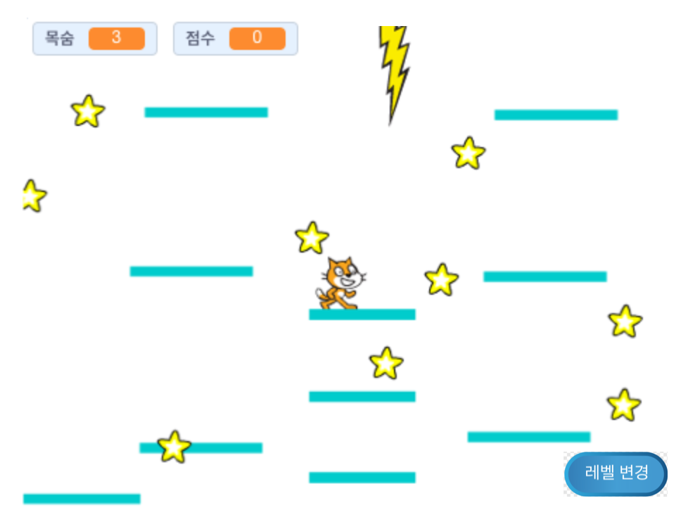

## 움직이는 플랫폼

나의 레벨 2 버전을 사용하도록 요청한 이유는 레이아웃 중간에 눈에 띄는 갭이 있기 때문입니다. 이 갭을 극복하고 플레이어가 점프하여 탈 수 있는 플랫폼을 만들 것입니다!



먼저 플랫폼 용 스프라이트가 필요합니다.

\--- task \---

Add a new sprite, name it **Moving-Platform**, and using the costume customisation tools in the Costumes tab to make it look like the other platforms \(use vector mode\).

\--- /task \---

Now, let's add some code to the sprite.

Begin with the basics: to make a never-ending set of platforms moving up the screen, you’ll need to clone the platform at regular intervals. I picked `4` seconds as my interval. You also need to make sure that there’s an on/off switch for making the platforms, so that they don’t show up in level 1. I’m using a new variable called `create-platforms`{:class="block3variables"}.

\--- task \---

Add code to create clones of your platform sprite.

Here's how mine looks so far:

```blocks3
+    녹색 깃발이 클릭되었을 때
+    숨기기
+    무한 반복
        (4) 초 기다리기
        만약 <(create-platforms ::variables) = [true]> 이라면
            [myself v] 복제하기
        끝
    끝
```

\--- /task \---

\--- task \---

Then add the clone's code:

```blocks3
+    복제되었을 때
+    보이기
+    무한 반복
        만약 <(y position) < [180]> 이라면
            y를 (1)만큼 바꾸기
            (0.02) 초 기다리기
        아니면
            이 복제본 삭제하기
        끝
    끝
```

\--- /task \---

This code makes the **Moving-Platform** clone move up to the top of the screen, slowly enough for the player to jump on and off, and then disappear.

\--- task \---

Now make the platforms disappear/reappear based on the broadcasts that change levels (so they're only on the level with space for them), and the `game over`{:class="block3events"} message.

```blocks3
+    [level-1 v] 신호를 받았을 때
+    [create-platforms v] 를 [false] 로 정하기
+    숨기기

+    [level-2 v] 신호를 받았을 때
+    [create-platforms v] 를 [true] 로 정하기

+    [game over v] 신호를 받았을 때
+    숨기기
+    [create-platforms v] 를 [false] 로 정하기
```

\--- /task \---

Now, if you try to actually play the game, the **Player Character** falls through the platform! Any idea why?

It’s because the physics code doesn’t know about the platform. It’s actually a quick fix:

\--- task \---

In the **Player Character** sprite scripts, replace every `touching “Platforms”`{:class="block3sensing"} block with an `OR`{:class="block3operators"} operator that checks for **either** `touching “Platforms”`{:class="block3sensing"} **OR** `touching “Moving-Platform”`{:class="block3sensing"}.

Go through the code for the **Player Character** sprite and everywhere you see this block:

```blocks3
    <touching [Platforms v] ?>
```

replace it with this one:

```blocks3
    <<touching [Platforms v] ?> or <touching [Moving-Platform v] ?>>
```

\--- /task \---