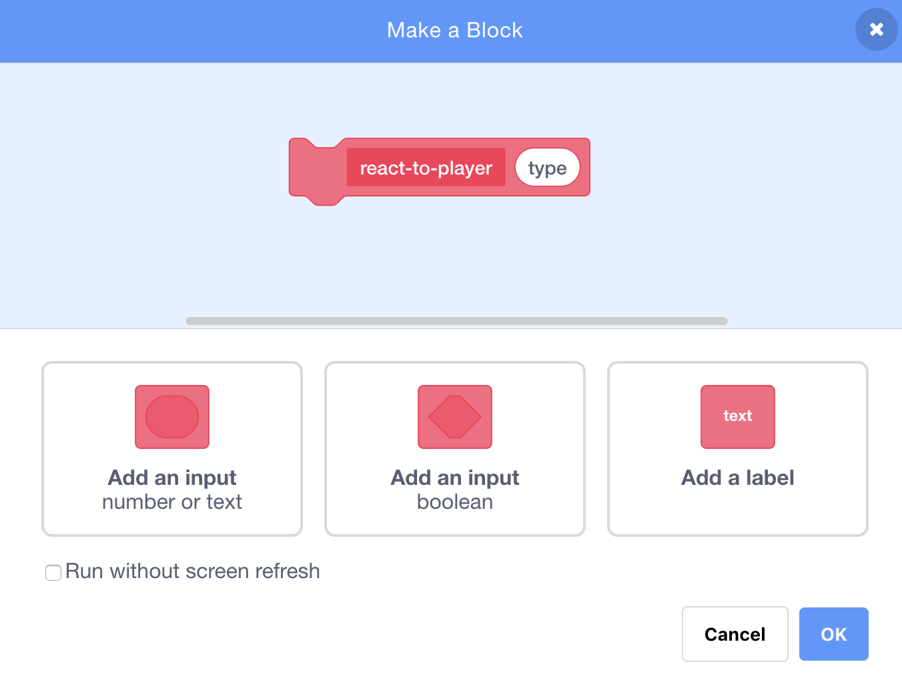

## पॉवर-अप्स

याक्षणी आपल्याकडे केवळ एक प्रकारचा कलेक्टेबल आहे: एक तारा जेव्हा आपण त्यावर कब्जा करता तेव्हा आपल्याला एक गुण मिळतो. या कार्डवर, आपण कलेक्टेबलचा एक नवीन प्रकार तयार करणार आहात आणि आपण हे अशा प्रकारे कराल जे इतर कलेक्टेबल जोडणे सुलभ करेल. मग आपण आपल्या स्वत: च्या पॉवर-अप आणि बोनसचा शोध लावू शकता आणि गेम खरोखरच आपला बनवू शकता!

`collectable-type`{:class="block3variables"} वॅरिएबल आणि `pick-costume`{:class="block3myblocks"} **My blocks** ब्लॉक सोबत हे करण्यासाठी मी आधीपासून काही तुकडे समाविष्ट केले आहेत. आपल्याला तरीही त्यांच्यात सुधारणा करण्याची आवश्यकता आहे.

आता कलेक्टेबल कशे प्रकारनी कार्य कर्तात यावर एक नजर टाकूया.

**Collectable** स्प्राईटच्या स्क्रिप्ट मध्ये `when I start as a clone`{:class="block3events"} कोड शोधा. आपण पहात असलेले ब्लॉक्स हेच आहेत जे आपल्याला तारे गोळा करण्यासाठी गुण देतात:

```blocks3
    if <touching [Player Character v]?> then
        change [points v] by (collectable-value ::variables)
        delete this clone
```

आणि क्लोनसाठी costume (पोशाख) निवडणारे हे एक:

```blocks3
    pick-costume (collectable-type ::variables) :: custom
```

--- collapse ---
---
title: costume (पोशाख) निवडणे कसे कार्य करते?
---

`pick-costume`{:class="block3myblocks"} ब्लॉक थोडेसे `lose`{:class="block3myblocks"} ब्लॉक सारखे कार्य करते, परंतु त्यात आणखी काही अतिरिक्त आहे: ते `type`{:class="block3myblocks"} नावाचे एक **इनपुट** व्हेरिएबल घेते.

```blocks3
    define pick-costume (type)
    if <(type ::variables) = [1]> then
        switch costume to [star1 v]
    end
```

जेव्हा `pick-costume`{:class="block3myblocks"} ब्लॉक चालते, तेव्हा ते हे करते:

1. हे `type`{:class="block3myblocks"} इनपुट व्हेरिएबल कडे बगते
2. जर `type`{:class="block3myblocks"} च मूल्य `1` असले तर ते `star1` costume (पोशाख) वर स्विच करते

स्क्रिप्टचा एक भाग पहा ज्यामध्ये हा ब्लॉक वापरला जातो:

```blocks3
    when I start as a clone
    pick-costume (collectable-type ::variables) :: custom
    show
    repeat until <(y position) < [-170]>
        change y by (collectable-speed ::variables)
        if <touching [Player Character v]?> then
            change [points v] by (collectable-value ::variables)
            delete this clone
```

आपण हे पाहू शकता की `collectable-type`{:class="block3variables"} व्हेरिएबल `pick-costume`{:class="block3myblocks"} ब्लॉक ला **पास** केला जातोय. नंतर `pick-costume`{:class="block3myblocks"} कोडच्या आत `collectable-type`{:class="block3variables"} इनपुट व्हेरिएबल (`type` {:class="block3myblocks"}) म्हणून वापरले जाते.

याचा अर्थ असा की `collectable-type`{:class="block3variables"} चे मूल्य स्प्राईट क्लोनला कोणता पोशाख मिळते ते ठरवते.

--- /collapse ---

### नवीन पॉवर-अपसाठी costume (पोशाख) जोडा

नक्कीच, आत्ता **Collectable** स्प्राईट मध्ये फक्त एक costume (पोशाख) आहे, कारण तेथे केवळ एक प्रकारचा संग्रह आहे. आपण ते बदलणार आहात.

--- task ---

आपल्या नवीन शक्ती साठी **Collectable** स्प्राईट मधे नवीन costume (पोशाख) जोडा. मला विजेचा बोल्ट आवडतो, परंतु आपल्या आवडी अनुसार निवडा.

--- /task ---

--- task ---

पुढे `pick-costume`{:class="block3myblocks"} **My blocks** ब्लॉकला नवीन costume (पोशाख) सेट करण्यासाठी सांगा जेव्हा त्याला `type`{:class="block3myblocks"} साठी नवीन मूल्य प्राप्त होते, यासारखे (आपण निवडलेल्या कोणत्याही पोशाखाचे नाव वापरुन):

```blocks3
    define pick-costume (type)
    if <(type ::variable) = [1]> then
        switch costume to [star1 v]
    end
+    if <(type ::variable) = [2]> then
+        switch costume to [lightning v]
+    end
```

--- /task ---

### पॉवर-अप कोड तयार करा

नवीन कलेक्टेबल काय करेल हे आता आपल्याला ठरविण्याची आवश्यकता आहे! आपण एखाद्या सोप्या गोष्टीसह प्रारंभ करू: प्लेअरला नवीन जीवनदान देणे. पुढील चरणात, आपण हे काहीतरी भारी बनवाल.

--- task ---

**My Blocks** सेक्शन मध्ये **Make a Block** वर क्लिक करा. नवीन ब्लॉकला नाव द्या `react-to-player`{:class="block3myblocks"} आणि `type`{:class="block3myblocks"} नावाचा **number input** जोडा.



**OK** वर क्लिक करा.

--- /task ---

--- task ---

`type`{:class="block3myblocks"} चा मूल्यानुसार `react-to-player`{:class="block3myblocks"} **My blocks** ब्लॉक गुण वाढवेल किंवा प्लेअरचे आयुष्य वाढवेल असे बनवा.

```blocks3
+    define react-to-player (type)
+    if <(type ::variable) = [1]> then
+        change [points v] by (collectable-value ::variables)
+    end
+    if <(type ::variable) = [2]> then
+        change [lives v] by [1]
+    end
```

--- /task ---

--- task ---

`when I start as a clone`{:class="block3events"} कोड ला अद्यतनित करुन जो ब्लॉक एक गुण जोडतो त्याला `react-to-player`{:class="block3myblocks"} ला **कॉल** करण्यानी पुनर्स्थित करा आणि त्यात `collectable-type`{:class="block3variables"} **pass करा**.

```blocks3
+    if <touching [Player Character v] ?> then
+        react-to-player (collectable-type ::variables) :: custom
+        delete this clone
+    end
```

--- /task ---

ह्या नवीन `react-to-player`{:class="block3myblocks"} **My blocks** ब्लॉक चा उपयोग करुन तारे अजूनही एक गुण जोडतात, परंतु आपण तयार केलेल्या नवीन पॉवर-अपने एक जीवन जोडले जाते.

### `collectable-type`{:class="block3variables"} चा उपयोग भिन्न कलेक्टेबल्स यादृच्छिक दाखवण्यासाठी

आत्ता, आपण विचार करीत असाल की आपण प्रत्येक संग्रहित करणारी गोष्ट (कलेक्टेबल) जो गेम बनवतो ते कश्या प्रकाराचे असावे हे कसे सांगायचे.

आपण हे `collectable-type`{:class="block3variables"} चे मूल्य सेट करुन करता. हे व्हेरिएबल फक्त एक संख्या आहे. आपण पाहिले त्याप्रमाणे `pick-costume`{:class="block3myblocks"} आणि `react-to-player`{:class="block3myblocks"} ब्लॉक्सला काय पोशाख, नियम इतयादी सांगण्यासाठी याचा वापर केला जातो. संग्रहित करण्याच्या गोष्टींसाठी उपयोग.

--- collapse ---
---
title: क्लोनमध्ये व्हेरिएबल सह कार्य करणे
---

प्रत्येक **Collectable** स्प्राइटच्या क्लोन (प्रत) साठी आपण `collectable-type`{:class="block3variables"} चे एक भिन्न मूल्य सेट करू शकता.

असं समजा कि हे, जेव्हा **Collectable** क्लोन तयार होतो तेव्हा `collectable-type`{:class="block3variables"} मध्ये संचयित केलेल्या मूल्याच्या मदतीने **Collectable** स्प्राइट ची एक नवीन प्रत तयार केल्यासारखे आहे.

आपण विचार करत असाल की `collectable-type`{:class="block3variables"} चे मूल्य बदलणे, स्टेजवरील सर्व कलेक्टेबल्सना एकाच प्रकारचे बनवेल का. असे होत नाही, कारण क्लोन्सला विशेष बनविणारी एक गोष्ट म्हणजे त्यांनी ज्या वॅरिएबल्सनी सुरुवात केली आहे त्यांचे मूल्य ते बदलू शकत नाही. स्प्राइटच्या क्लोनमध्ये प्रभावीपणे ** स्थिर** मूल्य अस्तात. याचा अर्थ असा की जेव्हा आपण `collectable-type`{:class="block3variables"} चे मूल्य बदलता, याचा गेममध्ये आधीपासूनच असलेल्या **Collectable** स्प्राइट क्लोनवर परिणाम होत नाही.

--- /collapse ---

आपण बनवलेल्या प्रत्येक नवीन क्लोनसाठी `collectable-type`{:class="block3variables"} ला एकतर `1` किंवा `2` नी सेट करणार आहात. गेम मनोरंजक ठेवण्यासाठी प्रत्येक वेळी यादृच्छिक कलेक्टेबल बनवायला संख्यांमध्ये यादृच्छिक रीतीने निवड करा.

--- task ---

**Collectable** स्प्राइट साठीच्या ग्रीन फ्लॅग कोडमध्ये `repeat until`{:class="block3control"} लूप शोधा, आणि खाली दर्शविलेल्या कोड मधे `if...else`{:class="block3control"} जोडा.

```blocks3
    repeat until <not <(create-collectables ::variables) = [true]>>
+        if <[50] = (pick random (1) to (50))> then
+            set [collectable-type v] to [2]
+        else
+            set [collectable-type v] to [1]
+        end
        wait (collectable-frequency ::variables) secs
        go to x: (pick random (-240) to (240)) y: (179)
        create clone of [myself v]
```

--- /task ---

हा कोड `collectable-type`{:class="block3variables"} ला `2` वर सेट करण्याची 50 मधून 1 संधी देतो. शेवटी आपण खेळाडूला जास्त जीवन गोळा करण्याची संधी देऊ इच्छित नाही, अन्यथा खेळ खूप सोपा होईल.

आता आपल्याकडे संग्रह करण्यायोग्य एक नवीन प्रकार आहे जो ताऱ्यांऐवजी कधीकधी दर्शविला जातो आणि आपण संकलन करता तेव्हा एक गुण ऐवजी आपल्याला अतिरिक्त आयुष्य देते.