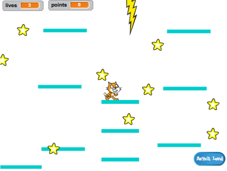

## प्लॅटफॉर्म हलविणे

मी आपणास माझी लेव्हल 2 ची आवृत्ती वापरण्यास ह्याच्यासाठी सांगितले कारण की लेआउटच्य मध्यभागी अस्लेले अंतर आपल्या लक्षात आले असेल. आपण असे प्लॅटफॉर्म तयार करत आहात जे या अंतरां मधून सरकेल आणि त्यावर खेळाडू उडी मारून सवार होऊ शकेल!



प्रथम, आपल्याला प्लेटफॉर्म साठी स्प्राइट ची आवश्यकता असेल.

--- task ---

एक नवीन स्प्राइट जोडा, त्यास **Moving-Platform** असे नाव द्या आणि Costumes टॅब मध्ये पोशाख सानुकूलित साधने वापरुन ते दिसायला इतर प्लॅटफॉर्मवर सारखे बनवा \(व्हेक्टर मोड वापरा\).

--- /task ---

चला, आता स्प्राइट मध्ये काही कोड टाकू या.

मुलभूत गोष्टींसह प्रारंभ करा: स्क्रीनवर कधी न संपणारा प्लॅटफॉर्म चा गट तयार करण्यासाठी आपल्याला नियमित अंतरावर प्लॅटफॉर्मची प्रत (clone) बनवणे आवश्यक आहे. मी माझा मध्यांतर म्हणून `4` सेकंद निवडला. आपल्याला हे देखील सुनिश्चित करण्याची आवश्यकता आहे की प्लॅटफॉर्म बनवण्यासाठी चालू/बंद करण्यासाठी स्विच आहे, जेणे करून ते लेव्हल 1 मध्ये दर्शविले जाणार नाही. मी `create-platforms`{:class="block3variable"} या नावाचे एक नवीन व्हेरीएबल वापरत आहे.

--- task ---

आपल्या प्लॅटफॉर्म स्प्राइटचे प्रती तयार करण्या साठी कोड जोडा.

माझा कोड सध्या असा दिसत आहे:

```blocks3
+    when green flag clicked
+    hide
+    forever
        wait (4) secs
        if <(create-platforms ::variables) = [true]> then
            create clone of [myself v]
        end
    end
```

--- /task ---

--- task ---

त्या नंतर क्लोनचा कोड जोडा:

```blocks3
+    when I start as a clone
+    show
+    forever
        if <(y position) < [180]> then
            change y by (1)
            wait (0.02) secs
        else
            delete this clone
        end
    end
```

--- /task ---

या कोड मुळे ** Moving-Platform** क्लोन स्क्रीनच्या शीर्षस्थानी हलविला जातो, हळू हळू खेडाळू वरती खाली जातो आणि नंतर अदृश्य होते.

--- task ---

आता लेव्हल बदलणार्‍या प्रसारणांच्या आणि `game over`{:class="block3events"} झाल्याचा संदेशाच्या आधारावर प्लॅटफॉर्म अदृश्य/दृश्य करा (जेणेकरून ते फक्त त्यांच्या साठी जागा असलेल्या लेव्हलवर असतील).

```blocks3
+    when I receive [level-1 v]
+    set [create-platforms v] to [false]
+    hide

+    when I receive [level-2 v]
+    set [create-platforms v] to [true]

+    when I receive [game over v]
+    hide
+    set [create-platforms v] to [false]
```

--- /task ---

आता, आपण खरोखर गेम खेळण्याचा प्रयत्न केल्यास, ** Player Character** प्लॅटफॉर्मवर मधून पडेल! काही कलपना आहे का असे होते?

त्याचे कारण म्हणजे फिज़िक्स कोडला प्लॅटफॉर्म बद्दल जाणीव नाही. हे खरं तर एक त्वरित दुरुस्त काम आहे:

--- task ---

**Player Character** स्प्राइट स्क्रिप्ट मध्ये प्रत्येक `touching "Platforms"`{:class="block3sensing"} ब्लॉकला एका `OR`{:class="block3operators"} ऑपरेटर नी बदला जे **एकतर** `touching "Platforms"`{:class="block3sensing"} **किंवा** `touching "Moving-Platform"`{:class="block3sensing"} चा तपास करेल.

**Player Character** स्प्राइटच्या कोड वरून नज़र फिरवा आणि जेथे जेथे आपल्याला हा ब्लॉक दिसेल:

```blocks3
    <touching [Platforms v] ?>
```

त्यास यासह बदला:

```blocks3
    <<touching [Platforms v] ?> or <touching [Moving-Platform v] ?>>
```

--- /task ---