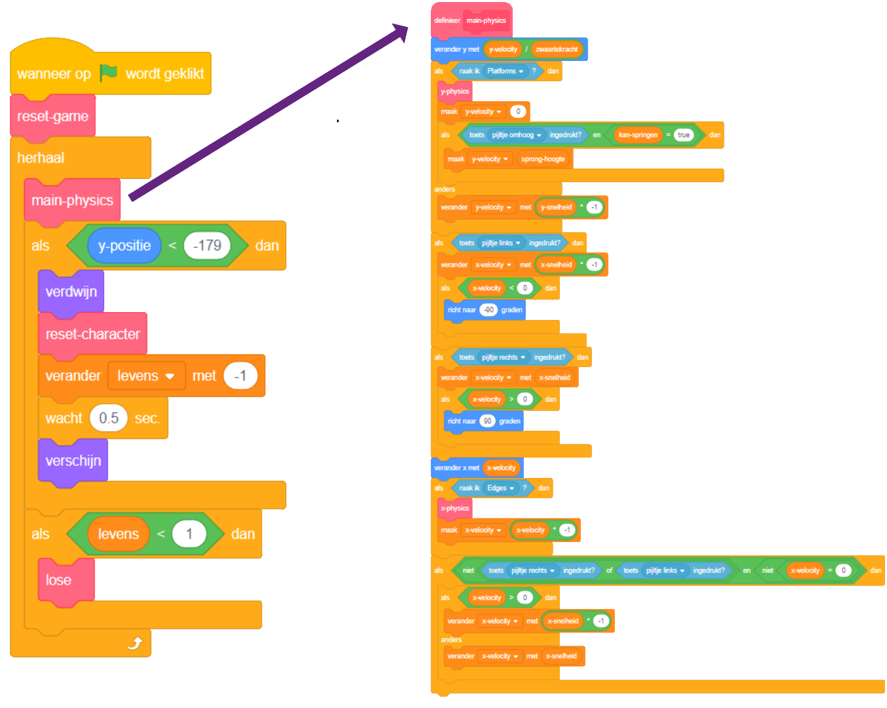

## De voorbereidingen

Omdat je in Scratch leert programmeren en niet hoe je een natuurkundige machine moet bouwen (code die dingen in een computergame doet voorkomen als objecten uit de echte wereld, bijvoorbeeld dat ze niet door vloeren vallen), begin je met een project dat ik heb gemaakt en dat al de basis heeft voor bewegingen, springen en het zien van platforms.

Werp een blik op het project, inclusief de details op deze kaart, want je zult er later een aantal wijzigingen in aanbrengen, maar je hoeft niet alles te begrijpen wat het doet!

### Ga naar het project

--- task --- Het eerste wat je moet doen is een kopie van de Scratch code maken van [dojo.soy/advanced-scratch](http://dojo.soy/advanced-scratch){:target="_ blank"}.

Als je het project offline wilt gebruiken, downloadt je het door te klikken op **Bekijk van binnen**, klik vervolgens op **Bestand** en op **Opslaan op je computer**. Vervolgens kun je het gedownloade bestand in Scratch op je computer openen.

Je kunt het ook rechtstreeks in Scratch in je browser gebruiken door op **Bekijk van binnen** en dan op **Bewerk** te klikken. --- /task ---

### Bekijk de code

De natuurkundige machine van het spel bevat een aantal verschillende onderdelen, waarvan sommige al werken en sommige nog niet. Je kunt dit uitproberen door het spel uit te voeren en het proberen te spelen.

Je zult zien dat je levens kunt verliezen, maar er gebeurt niets wanneer je geen levens meer hebt. Bovendien heeft de game maar één level, één soort ding om te verzamelen en geen vijanden. Je gaat dit allemaal oplossen, en een beetje meer doen!

--- task --- Bekijk hoe de code is samengesteld. --- /task ---

Het gebruikt veel blokken van **Mijn blokken**, die ideaal zijn om je code in stukken te splitsen, zodat je ze beter kunt beheren. Een **Mijn blokken** blok is een blok dat je uit een heleboel andere blokken opmaakt, en je kunt er instructies aan geven. Je zult zien hoe het werkt in een volgende stap!

### 'Mijn blokken' blokken zijn erg handig

In de bovenstaande code, roept de hoofdgame `herhaal`{:class="block3control"} lus de `natuurkunde`{:class="block3myblocks"} **Mijn blokken** blokken op om heel veel dingen te doen! Door de blokken op deze manier gescheiden te houden, is het makkelijk om de belangrijkste lus te lezen en te begrijpen wat er gebeurt in het spel, zonder dat je je zorgen maakt over **hoe** het gebeurt.

--- task --- Kijk nu naar de `reset-spel`{:class="block3myblocks"} en `reset-speler`{:class="block3myblocks"} **Mijn blokken** blokken. --- /task ---

Ze doen behoorlijk normale dingen, zoals het instellen van variabelen en ervoor zorgen dat het personage op de juiste manier ronddraait

- `reset-spel`{:class="block3myblocks"} **roept** `reset-speler`{:class="block3myblocks"} **op**, en laat zien dat je een **Mijn blokken** blok kunt gebruiken binnen een andere <1>Mijn blokken</1> blok
- Het `reset-speler`{:class="block3myblocks"} **Mijn blokken** blok wordt op twee verschillende plaatsen in de hoofdlus gebruikt. Dit betekent dat je twee plaatsen in je hoofdgame-loop kunt wijzigen door alleen de code in het blok **Mijn blokken** te wijzigen. Dit bespaart je veel werk en helpt je fouten te voorkomen.