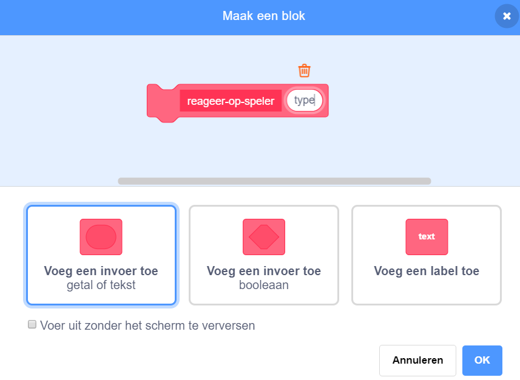

## Power-ups

Op dit moment heb je slechts één type prijs: een ster die je één punt oplevert als je hem grijpt. Op deze kaart ga je een nieuw type prijs maken en zul je het doen op een manier die het toevoegen van andere soorten prijzen makkelijk maakt. Dan kun je je eigen power-ups en bonussen verzinnen en echt je eigen spel maken!

Ik heb hier al enkele stukjes voor toegevoegd met de `prijs-type`{:class="block3variables"} variabele en het `kies-uiterlijk`{:class="block3myblocks"} **Mijn blokken** blok. Je zult ze echter moeten verbeteren.

Laten we eens kijken hoe de prijs nu werkt.

Zoek in de scripts voor de **Prijs** sprite de `wanneer ik als kloon start`{:class="block3events"} code. De blokken waar je naar moet kijken zijn degenen die je punten geven voor het verzamelen van een ster:

```blocks3
    als <raak ik [Speler v]?> dan
        verander [punten v] met (prijs-waarde ::variables)
        verwijder deze kloon
```

en deze die een uiterlijk voor de kloon selecteert:

```blocks3
    kies-uiterlijk (prijs-type ::variables) :: aangepast
```

## \--- collapse \---

## title: Hoe werkt het kiezen van een uiterlijk?

Het blok `kies-uiterlijk`{:class="block3myblocks"} werkt een beetje zoals het blok `verlies`{:class="block3myblocks"}, maar er is iets extra's: er is een variabele met **invoer**, genaamd `type`{:class="block3myblocks"}.

```blocks3
    definieer kies-uiterlijk (type)
    als <(type ::variabelen) = [1]> dan
        verander uiterlijk naar  [star1 v]
    end
```

Wanneer het blok `kies-uiterlijk`{:class="block3myblocks"} wordt uitgevoerd, doet het hier het volgende:

1. Het kijkt naar de invoervariabele `type`{:class="block3myblocks"}
2. Als de waarde van `type`{:class="block3myblocks"} gelijk is aan `1`, schakelt het over naar het `star1` kostuum

Bekijk het deel van het script dat het blok gebruikt:

```blocks3
    wanneer ik als kloon start
    kies-uiterlijk (prijs-type :: variables) :: custom
    verschijn
    herhaal tot <(y positie) < [-170]>
        verander y met (prijs-snelheid ::variables)
        als <touching [Player Character v]?> dan
            verandering [punten v] met (prijs-waarde ::variables)
            verwijder deze kloon
```

Je kunt zien dat de `prijs-type`{:class="block3variables"} variabele **doorgezet wordt** naar het blok `kies-uiterlijk`{:class="block3myblocks"}. Binnen de code voor `kies-uiterlijk`{:class="block3myblocks"}, wordt `prijs-type`{:class="block3variables"} vervolgens gebruikt als de invoervariabele (`type`{:class="block3myblocks"}).

Dit betekent dat de waarde van `prijs-type`{:class="block3variables"} bepaalt welk uiterlijk de sprite-kloon krijgt.

\--- /collapse \---

### Voeg een uiterlijk toe voor de nieuwe power-up

Natuurlijk heeft de sprite van **Prijs** maar één uiterlijk, omdat er maar één type prijs is. Je staat op het punt om dat te veranderen.

\--- task \---

Add a new costume to the **Collectable** sprite for your new power-up. I like the lightning bolt, but pick whatever you like.

\--- /task \---

\--- task \---

Next, tell the `pick-costume`{:class="block3myblocks"} **My blocks** block to set the new costume whenever it gets the new value for `type`{:class="block3myblocks"}, like this \(using whatever costume name you picked\):

```blocks3
    definieer kies-uiterlijk (type)
    als <(type ::variable) = [1]> dan
        verander uiterlijk naar [star1 v]
    end
+ als <(type ::variable) = [2]> dan
+       verander uiterlijk naar [Lightning v]
+ end
```

\--- /task \---

### Maak de code voor de power-up

Now you need to decide what the new collectable will do! We’ll start with something simple: giving the player a new life. In the next step, you’ll make it do something cooler.

\--- task \---

Go into the **My blocks** section and click **Make a Block**. Name the new block `react-to-player`{:class="block3myblocks"} and add a **number input** named `type`{:class="block3myblocks"}.



Click **OK**.

\--- /task \---

\--- task \---

Make the `react-to-player`{:class="block3myblocks"} **My blocks** block either increase the points or increase the player’s lives, depending on the value of `type`{:class="block3myblocks"}.

```blocks3
+ definieer reageer-op-speler (type)
+ als <(type ::variable) = [1]> dan
+ verander [punten v] met (prijs-waarde ::variables)
+ end
+ als <(type ::variable) = [2]> dan
+ verander [levens v] met [1]
+ end
```

\--- /task \---

\--- task \---

Update the `when I start as a clone`{:class="block3events"} code to replace the block that adds a point with a **call** to `react-to-player`{:class="block3myblocks"}, **passing** `collectable-type`{:class="block3variables"} to it.

```blocks3
+ als <raak ik [Speler v] ?> dan
+ reageer-op-speler (prijs-type ::variables) :: custom
+ verwijder deze kloon
+ end
```

\--- /task \---

By using this new `react-to-player`{:class="block3myblocks"} **My blocks** block, stars still add a point, but the new power-up you've created adds a life.

### Gebruik `prijs-type`{:class="block3variables"} om verschillende prijzen willekeurig weer te geven

Right now, you might be wondering how you'll tell each collectable the game makes what type it should be.

You do this by setting the value of `collectable-type`{:class="block3variables"}. This variable is just a number. As you've seen, it's used to tell the `pick-costume`{:class="block3myblocks"} and `react-to-player`{:class="block3myblocks"} blocks what costume, rules, etc. to use for the collectable.

## \--- collapse \---

## title: Werken met variabelen in een kloon

For each clone of the **Collectable** sprite, you can set a different value for `collectable-type`{:class="block3variables"}.

Think of it like creating a new copy of the **Collectable** sprite with the help of the value that is stored in `collectable-type`{:class="block3variables"} at the time the **Collectable** clone gets created.

You might be wondering whether changing the value of `collectable-type`{:class="block3variables"} will turn all the collectables on the Stage into the same type. That doesn't happen, because one of the things that makes clones special is that they cannot change the values of any variables they start with. Sprite clones effectively have **constant** values. That means that when you change the value of `collectable-type`{:class="block3variables"}, this doesn't affect the **Collectable** sprite clones that are already in the game.

\--- /collapse \---

You're going to set the `collectable-type`{:class="block3variables"} to either `1` or `2` for each new clone that you make. To keep the game interesting, pick between the numbers at random to make a random collectable every time.

\--- task \---

Find the `repeat until`{:class="block3control"} loop inside the green flag code for the **Collectable** sprite, and add the `if...else`{:class="block3control"} code shown below.

```blocks3
    herhaal tot <not <(create-collectables ::variables) = [true]>>
+ als <[50] = (willekeurig getal tussen (1) en (50))> dan
+ maak [prijs-type v] [2]
+ anders
+ maak [prijs-type v] [1]
+ end
        wacht (prijs-frequentie ::variables) sec
        ga naar x: (willekeurig getal tussen (-240) en (240)) y: (179)
        maak een kloon van [mijzelf v]
```

\--- /task \---

This code gives a 1-in-50 chance of setting the `collectable-type`{:class="block3variables"} to `2`. After all, you don't want to give the player the chance to collect an extra life too often, otherwise the game would be too easy.

Now you have a new type of collectable that sometimes shows up instead of the star, and that gives you an extra life instead of a point when you collect it.