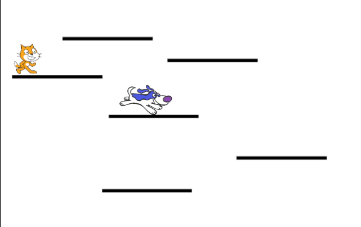

## Wedstrijdelement toevoegen

Je game werkt en nu kun je punten verzamelen, speciale power-ups verdienen en verliezen. Het wordt wat! Misschien is het leuk om een wedstrijdelement toe te voegen - zoals bijvoorbeeld een personage dat een beetje beweegt, maar dat je niet hoort aan te raken? Dit zal vergelijkbaar zijn met vijanden in de traditionele platformgames zoals Super Mario, waar we ons hier door laten inspireren.

--- task --- 
Kies eerst een sprite om toe te voegen als je vijand. Omdat onze speler een kat is, koos ik een hond. Er zijn echter nog veel andere sprites die je zou kunnen gebruiken. Ik hernoemde de sprite **Vijand**, gewoon om dingen voor mij duidelijker te maken.

Verklein de sprite naar de juiste maat en plaats hem ergens om te starten. Dit is hoe de mijne eruit ziet:

 
--- /task ---

--- task --- 
Schrijf de makkelijkste code eerst: stel het blok in om te reageren op het bericht `game over`{:class="events"} om de vijand te laten verdwijnen als de speler het spel verliest.

```blocks3
+ wanneer ik signaal [game over v] ontvang
+ verdwijn
```

--- /task ---

--- task --- 
Nu moet je de code schrijven voor wat de vijand doet. Gebruik mijn code, maar je kunt extra dingen toevoegen! (Wat als ze zich kunnen verplaatsen naar verschillende platforms? Wat als er een power-up is waardoor ze sneller of langzamer bewegen?)

```blocks3
+ wanneer op groene vlag wordt geklikt
+ verschijn
+ maak [vijand-zet-stappen v] [5]
+ maak draaistijl [links-rechts v]
+ ga naar x: (-25) y: (-9)
+ herhaal
        neem (vijand-zet-stappen) stappen
        als <not <touching [Platforms v] ?>> dan
            maak [vijand-zet-stappen v] ((vijand-zet-stappen) * (-1))
        end
     end
```

**Opmerking**: als je het blok `ga naar`{:class="block3motion"} sleept naar het sprite-paneel en de waarden `x` en `y` niet wijzigt, zijn dit de waarden voor de huidige locatie van de **Vijand** sprite!

De code in het blok `als...dan`{:class="block3control"} zorgt ervoor dat de sprite zich omdraait wanneer ze het einde van het platform bereiken! 
--- /task ---

Het volgende wat je nodig hebt is dat de speler een leven verliest wanneer hun **Speler** sprite de **Vijand** sprite raakt. Ook moet je ervoor zorgen dat de sprites snel **stoppen** met elkaar aanraken, omdat anders de code die controleert of er wordt aangeraakt, blijft draaien en de speler levens zal blijven verliezen.

--- task --- 
Zo heb ik het gedaan, maar je kunt proberen deze code te verbeteren! Ik heb het hoofdblok van **Speler** sprite aangepast. Voeg de nieuwe code toe vóór het `als`{:class="block3control"} blok dat controleert of je geen levens meer hebt.

```blocks3
    wanneer op groene vlag wordt geklikt
    reset-spel :: custom
    herhaal
        natuurkunde :: custom
        als <(y positie) < [-179]> dan
            verdwijn
            reset-speler :: custom
            verander [levens v] met (-1 )
            wacht (0.05) sec
            verschijn
        end
+ als <touching [Enemy v] ?> dan
            verdwijn
            ga naar x: (-187) y: (42)
            verander [levens v] met (-1)
            wacht (0.5) sec
            verschijn
+ end
        als <(levens) < [1]> dan
            verlies :: custom
        end
    end
```

--- /task ---

De nieuwe code verbergt de sprite van de **Speler**, zet deze terug naar de beginpositie, verkleint de `levens`{:class="block3variables"} variabele met `1`, en na een halve seconde verschijnt de sprite weer.