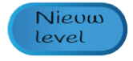

## Level 2

Met deze stap voeg je een nieuw level toe aan het spel dat de speler kan bereiken door eenvoudig op een knop te drukken. Later kun je jouw code wijzigen zodat een bepaald aantal punten of iets anders nodig zijn om daar te komen.

### Op naar het volgende level

\--- task \---

Maak eerst een nieuwe knop-sprite door er een toe te voegen uit de bibliotheek of door er zelf een te tekenen. Ik deed een beetje van beide en maakte dit:



\--- /task \---

\--- task \---

Nu is de code voor deze knop slim: hij is zo ontworpen dat elke keer dat je erop klikt, hij naar het volgende level gaat, ongeacht hoeveel levels er zijn.

Voeg deze scripts toe aan je **Knop** sprite. Je moet een aantal variabelen maken.

```blocks3
+ wanneer op groene vlag wordt geklikt
+ maak [max-level v] [2]
+ maak [min-level v] [1]
+ maak [huidig niveau v] [1]
```

```blocks3
+ wanneer op deze deze sprite wordt geklikt
+ verander [huidig-level v] met (1)
+ als <(huidig-level) > (max-level ::variables)> dan
        maak [huidig-level v] (min-level ::variables)
    end
+ zend signaal [prijzen-schoonmaak v]
+ zend signaal (voeg [level-] en (huidig-level) samen)
```

\--- /task \---

Kun je zien hoe het programma de variabelen gebruikt die je hebt gemaakt?

+ `max-level`{:class="block3variables"} slaat het hoogste level op
+ `min-level`{:class="block3variables"} slaat het laagste level op
+ `huidig-level`{:class="block3variables"} slaat het level op waar de speler nu is

Deze moeten allemaal worden ingesteld door de programmeur \(jij!\), dus als je een derde level toevoegt, vergeet dan niet om de waarde van `max-level`{:class="block3variables"} te wijzigen! `min-level`{:class="block3variables"} zal natuurlijk nooit veranderen.

De signalen worden gebruikt om aan de andere sprites te vertellen welk level moet worden weergegeven en om de prijzen op te ruimen wanneer een nieuw level begint.

### Laat de sprites reageren

#### De **Prijs** sprite

Nu moet je de andere sprites laten reageren op deze signalen! Begin met de makkelijkste: alle prijzen opruimen.

\--- task \---

Voeg de volgende code toe aan de **Prijs** sprite scripts om al zijn klonen te vertellen om te `verdwijnen`{:class="block3looks"} wanneer ze het schoonmaaksignaal ontvangen:

```blocks3
+ wanneer ik signaal [prijzen-schoonmaak v] ontvang
+ verdwijn
```

\--- /task \---

Omdat een van de eerste dingen die elke nieuwe kloon doet is zichzelf laten zien, hoef je je geen zorgen te maken over het zichtbaar maken van prijzen!

#### De **Platform** sprite

Now to switch the **Platforms** sprite. Je kunt later je eigen nieuwe level ontwerpen als je wilt, maar laten we nu degene gebruiken dat ik al heb toegevoegd. In de volgende stap zie je waarom!

\--- task \---

Voeg deze code toe aan de **Platform** sprite:

```blocks3
+ wanneer ik signaal [level-1 v] ontvang
+ verander uiterlijk naar [Level 1 v]
+ verschijn
```

```blocks3
+ wanneer ik signaal [level-2 v] ontvang
+ verander uiterlijk naar [Level 2 v]
+ verschijn
```

\--- /task \---

Het ontvangt de `samengevoegde`{:class="block3operators"} signalen van `level-`{:class="block3variables"} en `huidig-level`{:class="block3variables"} die de sprite **Knop** verzendt, en antwoordt door het uiterlijk van **Platform** te veranderen.

#### De **Vijand** sprite

\--- task \---

Zorg er in de **Vijand** sprite script voor dat de sprite verdwijnt wanneer de speler level 2 binnengaat, zoals dit:

```blocks3
+ wanneer ik signaal [level-1 v] ontvang
+ verschijn
```

```blocks3
+ wanneer ik signaal [level-2 v] ontvang
+ verdwijn
```

\--- /task \---

Als je wilt, kun je ervoor zorgen dat de vijand in plaats daarvan naar een ander platform gaat. In dat geval zou je een blok `ga naar`{:class="block3motion"} kunnen gebruiken in plaats van de blokken `verschijn`{:class="block3looks"} en `verdwijn`{:class="block3looks"}.

### Laat de **Speler** op de juiste plaats verschijnen

Wanneer een nieuw level begint, moet de **Speler** sprite naar de juiste plaats gaan voor dat level. Om dit te laten gebeuren, moet je wijzigen waar de sprite zijn coördinaten krijgt vanaf het moment dat het voor het eerst in het werkgebied verschijnt. Op dit moment zijn er vaste waarden voor `x` en `y` in de code.

\--- task \---

Begin met het maken van variabelen voor de startcoördinaten: `start-x`{:class="block3variables"} en `start-y`{:class="block3variables"}. Zet ze vervolgens in het blok `ga naar`{:class="block3motion"} blok in het `reset-speler`{:class="block3myblocks"} **Mijn blokken** blok in plaats van de vaste `x` en `y` waarden:

```blocks3
    definieer reset-speler
    maak [kan-springen v] [true]
    maak [x-vaart v] [0]
    maak [y-vaart v] [-0]
+ ga naar x: (start-x) y: (start- y)
```

\--- /task \---

\--- task \---

Stel vervolgens voor elk signaal die het begin van een level aankondigt, de juiste `start-x`{:class="block3variables"} en `start-y`{:class="block3variables"} coördinaten in als antwoord en voeg een **signaal** voor `reset-speler`{:class="block3myblocks"} toe:

```blocks3
+ wanneer ik signaal [level-1 v] ontvang
+ maak [start-x v] [-183]
+ maak [start-y v] [42]
+ reset-speler :: custom
```

```blocks3
+ wanneer ik signaal [level-2 v] ontvang
+ maak [start-x v] [-218]
+ maak [start-y v] [-143]
+ reset-speler :: custom
```

\--- /task \---

### Beginnen op Level 1

Je moet er ook voor zorgen dat telkens wanneer iemand het spel start, het eerste level dat ze spelen level 1 is.

\--- task \---

Ga naar het script `reset-spel`{:class="block3myblocks"} en verwijder het signaal van `reset-speler`{:class="block3myblocks"}. Zend in plaats daarvan het signaal `min-level`{:class="block3variables"} uit. De code die je al met deze kaart hebt toegevoegd zal dan dan de juiste startcoördinaten instellen voor de **Speler** sprite en roept ook `reset-speler`{:class="block3myblocks"} aan.

```blocks3
    definieer reset-spel
    maak draaistijl [links-rechts v]
    maak [sprong-hoogte v] [15]
    maak [zwaartekracht v] [2]
    maak [x-snelheid v] [1]
    maak [y-snelheid v] [1]
    maak [levens v] [3]
    maak [punten v] [0]
+ zend signaal (voeg [level-] en (min-level ::variables) samen)
```

\--- /task \---

## \--- collapse \---

## title: Het personage van de speler of de game resetten

Merk op dat het eerste blok in het belangrijkste groene vlagscript van de **Speler** sprite een signaal is naar het `reset-spel`{:class="block3myblocks"} **Mijn blokken** blok.

Dit blok stelt alle variabelen voor een nieuw spel in en roept vervolgens het `reset-speler`{:class="block3myblocks"} **Mijn blokken** blok op, waardoor het personage terug in de juiste beginpositie wordt geplaatst.

Als je de code `reset-speler`{:class=block3myblocks"} in een eigen blok apart van `reset-spel`{:class="block3myblocks"} hebt, kun je de speler opnieuw instellen op verschillende posities **zonder dat** het hele spel herstart hoeft te worden.

\--- /collapse \---