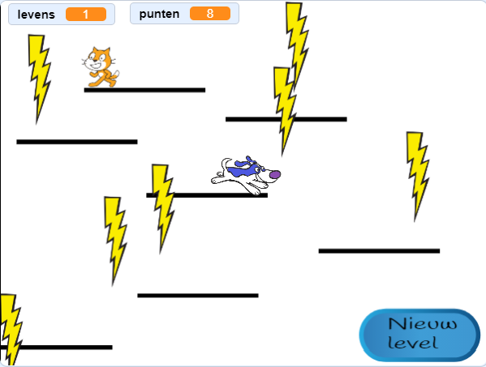

## Bewegende platforms

De reden waarom ik je heb gevraagd om mijn versie van level 2 te gebruiken, is de opening die je misschien midden in de opmaak hebt gezien. Je gaat een platform creëren dat zich door deze kloof beweegt en waar de speler op kan springen en rijden!



Ten eerste heb je de sprite voor het platform nodig.

\--- task \--- Voeg een nieuwe sprite toe, noem deze **Bewegend-Platform**, en gebruik de uiterlijkgereedschappen in Uiterlijken om het op de andere platforms te laten lijken \(gebruik de vectormodus\). \--- /task \---

Laten we nu wat code toevoegen aan de sprite.

Begin met de basis: om een nooit eindigende set platforms op het scherm te laten bewegen, moet je het platform regelmatig klonen. Ik koos `4` seconden als mijn interval. Je moet ook zorgen dat er een aan-/uit-schakelaar is om de platforms te maken, zodat ze niet op niveau 1 verschijnen. Ik gebruik een nieuwe variabele genaamd `maak-platforms`{:class="block3variables"}.

\--- task \--- Voeg code toe om klonen van je platformsprite te maken.

Dit is hoe de mijne er nu uitziet:

```blocks3
+ wanneer op groene vlag wordt geklikt
+ verdwijn
+ herhaal
        wacht (4) sec
        als <(maak-platforms ::variables) = [true]> dan
            maak een kloon van [mijzelf v]
        end
    end
```

\--- /task \---

\--- task \--- Voeg vervolgens de klooncode toe:

```blocks3
+ wanneer ik als kloon start
+ verschijn
+ herhaal
        als <(y positie) < [180]> dan
            verander y met (1)
            wacht (0.02) sec
        anders
            verwijder deze kloon
        end
    end
```

\--- /task \---

Deze code zorgt ervoor dat de kloon van **Bewegend-Platform** naar de bovenkant van het scherm wordt verplaatst, langzaam genoeg zodat de speler erop en eraf kan springen, en vervolgens verdwijnt.

\--- task \--- Laat nu de platforms verdwijnen/verschijnen op basis van de signalen die levels veranderen (dus ze zijn alleen op het level waar ruimte voor hen is), en het `game over`{:class="block3events"} bericht.

```blocks3
+ wanneer ik signaal [level-1 v] ontvang
+ maak [maak-platforms v] [false]
+ verdwijn

+ wanneer ik signaal [level-2 v] ontvang
+ maak [maak-platforms v] [true]

+ wanneer ik signaal [game over v] ontvang
+ verdwijn
+ maak [maak-platforms v] [false]
```

\--- /task \---

Als je nu probeert om het spel daadwerkelijk te spelen, valt de **Speler** door het platform! Enig idee waarom?

Het is omdat de natuurkunde code nog van niets weet over het platform. Er is een snelle oplossing:

\--- task \--- Vervang in de **Speler** sprite scripts elk `aanrakende "Platform"`{:class="block3sensing"} blok met een `OF`{:class="block3operators"} functie die controleert **of** `"Platform" aangeraakt`{:class="block3sensing"} worden **OF** `"Bewegend-Platform" aangeraakt`{:class="block3sensing"} worden.

Doorloop de code voor de **Speler** sprite en overal waar je dit blok ziet:

```blocks3
    <raak ik [Platform v] ?>
```

vervang het door deze:

```blocks3
    <<raak ik [Platform v] ?> of <raak ik [Bewegend-Platform v] ?>>
```

\--- /task \---