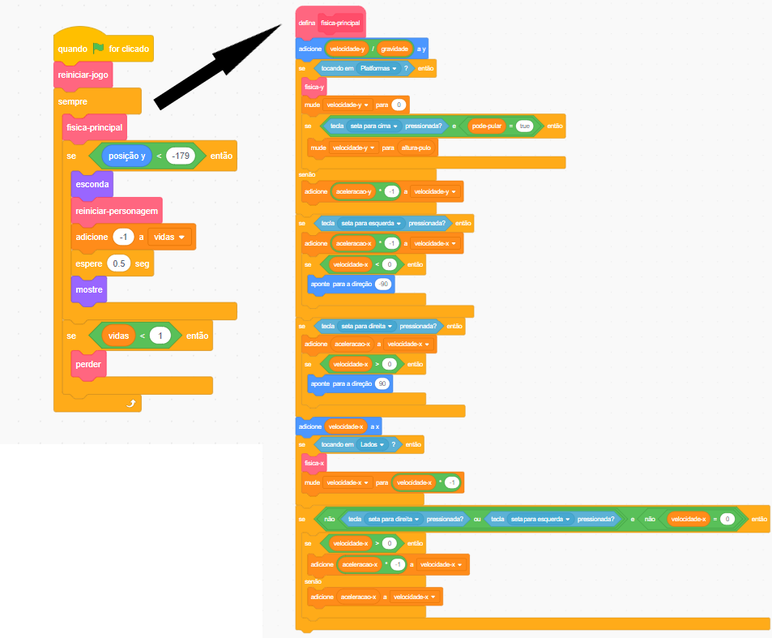

## Configurando as coisas

Porque você está aprendendo a programar no Scratch e não como construir um mecanismo de física (código que faz coisas em um jogo de computador se comportar como objetos do mundo real, por exemplo, eles não atravessam o chão), você vai começar com um projeto que eu criei que já tem nele os fundamentos para mover, saltar e detectar plataformas.

Você deve dar uma olhada rápida no projeto, inclusive nos detalhes deste cartão, porque você fará algumas alterações nele mais tarde, mas você não precisa entender tudo o que ele faz!

### Obtendo o projeto

\--- task \---

A primeira coisa que você precisa fazer é obter uma cópia do código do Scratch em [dojo.soy/advanced-scratch](http://dojo.soy/advanced-scratch){:target="_blank"} .

Para usar o projeto offline, faça o download clicando em **Ver interior**, vá para o menu **Arquivo** e clique em **Baixar para o seu computador**. Então você pode abrir o arquivo baixado no Scratch no seu computador.

Você também pode usá-lo diretamente no Scratch no seu navegador, clicando em **Ver interior** e depois **Remix**.

\--- /task \---

### Dê uma olhada no código

O mecanismo de física do jogo tem uma variedade de peças, algumas que já funcionam e outras que ainda não. Você pode testar isso rodando o jogo e tentando jogá-lo.

Você verá que pode perder vidas, mas nada acontece quando elas acabam. Além disso, o jogo tem apenas um nível, um tipo de coisa para coletar e nenhum inimigo. Você vai consertar tudo isso e um pouco mais!

\--- task \---

Veja como o código é feito.

\--- /task \---

Ele usa muitos blocos **Meus Blocos**, ótimos para dividir seu código em pedaços, para que você possa gerenciá-lo melhor. Um bloco **Meus Blocos** é um bloco que você faz de muitos outros blocos, e pode dar algumas instruções para ele. Você verá como funciona em um próximo passo!

### Os blocos 'Meus Blocos' são muito úteis

No código acima, o loop do jogo principal `sempre`{:class="block3control"} chama o bloco `fisica-principal`{:class="block3myblocks"} em **Meus Blocos** para fazer um monte de coisas! Manter os blocos separados assim facilita a leitura do loop principal e o entendimento do que acontece no jogo, sem se preocupar com o **como** acontece.

\--- task \---

Agora olha para os blocos `reiniciar-jogo`{:class="block3myblocks"} e `reiniciar-personagem`{:class="block3myblocks"} em **Meus Blocos**.

\--- /task \---

Eles fazem coisas bem triviais, como configurar variáveis e garantir que o personagem gire corretamente

- `reiniciar-jogo`{:class="block3myblocks"} **chama** `reiniciar-personagem`{:class="block3myblocks"}, mostrando que você pode usar um bloco **Meus Blocos** dentro de outro bloco **Meus Blocos**
- O bloco `reiniciar-personagem`{:class="block3myblocks"} em **Meus Blocos** é usado em dois lugares diferentes do loop principal. Isso significa que você pode mudar dois lugares no seu loop principal do jogo alterando apenas o código dentro do bloco **Meus Blocos**, o que economiza trabalho e te ajuda a evitar erros.