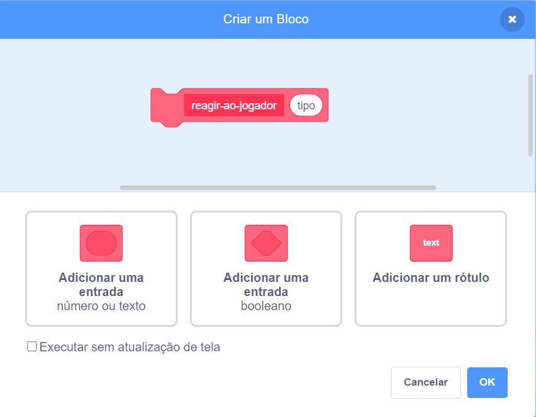

## Power-ups

Neste momento, você tem apenas um tipo de colecionável: uma estrela que dá um ponto quando você a pega. Neste cartão, você criará um novo tipo de colecionável e fará isso de uma maneira que facilitará a adição de outros tipos de colecionáveis. Depois você pode inventar seus próprios power-ups e bônus para deixar o jogo do seu jeito!

Eu já incluí algumas peças para fazer isso com a variável `colecionavel-tipo`{:class="block3Varibles"} e o bloco `selecionar-fantasia`{:class="block3myblocks"} em **Meus Blocos**. Mas você vai precisar melhorá-los.

Vamos agora dar uma olhada em como os colecionáveis funcionam.

Nos scripts do ator **Colecionavel**, ache o código `quando eu começar como um clone`{:class="block3events"}. Os blocos que você deve olhar são os que lhe dão pontos ao pegar uma estrela:

```blocks3
    if <touching [Personagem v]?> then
        change [pontos v] by (colecionavel-valor ::variables)
        delete this clone
```

e este que seleciona uma fantasia para o clone:

```blocks3
    selecionar-fantasia (colecionavel-tipo ::variables) :: custom
```

--- collapse ---
---
title: Como funciona a escolha de fantasia?
---

O bloco `selecionar-fantasia`{:class="block3myblocks"} funciona um pouco como o bloco `perder`{:class="block3myblocks"}, mas tem algo a mais: é necessária uma variável de **entrada** chamada `tipo`{:class="block3myblocks"}.

```blocks3
    define pick-costume (tipo)
    if <(tipo ::variables) = [1]> then
        switch costume to [star1 v]
    end
```

Quando o bloco `pick-costume`{:class="block3myblocks"} é executado o que ele faz é:

1. Olha para a variável de entrada `tipo`{:class="block3myblocks"}
2. Se o valor de `tipo`{:class="block3myblocks"} for igual a `1`, ele muda a fantasia para a `star1`

Dê uma olhada na parte do script que usa o bloco:

```blocks3
    when I start as a clone
    selecionar-fantasia (colecionavel-tipo ::variables) :: custom
    show
    repeat until <(y position) < [-170]>
        change y by (colecionavel-aceleracao ::variables)
        if <touching [Personagem v]?> then
            change [pontos v] by (colecionavel-valor ::variables)
            delete this clone
```

Você pode ver que a variável `colecionavel-tipo`{:class="block3variables"} é **passada** para o bloco `selecionar-fantasia`{:class="block3myblocks"}. Dentro do código do `selecionar-fantasia`{:class="block3myblocks"}, `colecionavel-tipo`{:class="block3variables"} é usada como variável de entrada (`tipo`{:class="block3myblocks"}).

Isso significa que o valor de `colecionavel-tipo`{:class="block3variables"} decide com qual fantasia o clone do ator vai usar.

--- /collapse ---

### Adicione uma fantasia para o novo power-up

Claro, agora o ator **Colecionavel** tem apenas uma fantasia, já que há apenas um tipo de colecionável. Você está prestes a mudar isso.

--- task ---

Adicione uma nova roupa ao ator **Colecionavel** para seu novo power-up. Eu gosto do raio, mas escolha o que você quiser.

--- /task ---

--- task ---

Em seguida, informe o bloco `selecionar-fantasia`{:class="block3myblocks"} em **Meus Blocos** para definir a nova fantasia sempre que receber um novo valor em `tipo`{:class="block3myblocks"}, desta forma (usando o nome da fantasia que você escolheu):

```blocks3
    define selecionar-fantasia (tipo)
    if <(tipo ::variable) = [1]> then
        switch costume to [star1 v]
    end
+    if <(tipo ::variable) = [2]> then
+        switch costume to [lightning v]
+    end
```

--- /task ---

### Criando o código do power-up

Agora você precisa decidir o que o novo colecionável fará! Vamos começar com algo simples: dar uma nova vida ao jogador. Na próxima etapa, você fará com que ele faça algo mais legal.

--- task ---

Entre na seção **Meus Blocos** e clique em **Criar um bloco**. Nomeie o novo bloco `reagir-ao-jogador`{:class="block3myblocks"} e adicione uma **entrada numérica** chamada `tipo`{:class="block3myblocks"}.



Clique **OK**.

--- /task ---

--- task ---

Faça o bloco `reagir-ao-jogador`{:class="block3myblocks"} em **Meus Blocos** aumentar pontos ou a vida do jogador, dependendo do valor em `tipo`{:class="block3myblocks"}.

```blocks3
+    define reagir-ao-jogador (tipo)
+    if <(tipo ::variable) = [1]> then
+        change [pontos v] by (colecionavel-valor ::variables)
+    end
+    if <(tipo ::variable) = [2]> then
+        change [vidas v] by [1]
+    end
```

--- /task ---

--- task ---

Atualize o código do `quando eu começar como um clone`{:class="block3events"} para substituir o bloco que adiciona um ponto com a **chamada** a `reagir-ao-jogador`{:class="block3myblocks"}, **passando** o `colecionavel-tipo`{:class="block3variables"} para ele.

```blocks3
+    if <touching [Personagem v] ?> then
+        reagir-ao-jogador (colecionavel-tipo ::variables) :: custom
+        delete this clone
+    end
```

--- /task ---

Ao usar este novo bloco `reagir-ao-jogador`{:class="block3myblocks"} em **Meus Blocos**, as estrelas ainda adicionam um ponto, mas o novo power-up que você criou adiciona uma vida.

### Usando `colecionavel-tipo`{:class="block3variables"} para fazer colecionáveis diferentes aparecerem aleatóriamente

Agora você deve estar se perguntando como dirá a cada item colecionável que o jogo tem de qual tipo ele deve ser.

Você faz isso definindo o valor de `colecionavel-tipo`{:class="block3variables"}. Essa variável é apenas um número. Como você viu, é usado para dizer para os blocos `selecionar-fantasia`{:class="block3myblocks"} e `reagir-ao-jogador`{:class="block3myblocks"} quais fantasias, regras, etc. para usar no colecionável.

--- collapse ---
---
title: Trabalhando com variáveis em um clone
---

Para cada clone do ator **Colecionavel**, você pode definir um valor diferente para `colecionavel-tipo`{:class="block3variables"}.

Pense nisso como criar uma nove cópia do ator **Colecionavel** com a ajuda do valor armazenado no `colecionavel-tipo`{:class="block3variables"} no momento em que o clone de **Colecionavel** é criado.

Você pode estar se perguntando se alterar o valor de `colecionavel-tipo`{:class="block3variables"} transformará todos os itens colecionáveis do mesmo tipo no palco. Isso não acontece, porque uma das coisas que torna os clones especiais é que eles não podem alterar os valores de nenhuma variável com a qual começam. Os clones de atores efetivamente têm valores **constantes**. Isso significa que quando você altera o valor de `colecionavel-tipo`{:class="block3variables"}, isso não afeta os clones dos atores **Colecionavel** que já estão no jogo.

--- /collapse ---

Você vai definir o `colecionavel-tipo`{:class="block3variables"} para `1` ou `2` para cada novo clone que você criar. Para manter o jogo interessante, escolha entre os números de forma aleatória para criar toda a vez um colecionável diferente.

--- task ---

Ache o loop `repita até que`{:class="block3control"} dentro do código green flag para o ator **Collectable**, e adicione o código `se...então`{:class="block3control"} mostrado abaixo.

```blocks3
    repeat until <not <(criar-colecionaveis ::variables) = [true]>>
+        if <[50] = (pick random (1) to (50))> then
+            set [colecionavel-tipo v] to [2]
+        else
+            set [colecionavel-tipo v] to [1]
+        end
        wait (colecionavel-frequencia ::variables) secs
        go to x: (pick random (-240) to (240)) y: (179)
        create clone of [myself v]
```

--- /task ---

Esse código dá uma chance de 1 em 50 de definir o tipo do `colecionavel-tipo`{:class="block3variables"} para `2`. Afinal, você não quer dar ao jogador a chance de ganhar uma vida extra toda hora, senão o jogo ficaria fácil demais.

Agora você tem um novo tipo de colecionável que às vezes aparece em vez da estrela, e ele dá uma vida extra em vez de um ponto quando você o coleciona.