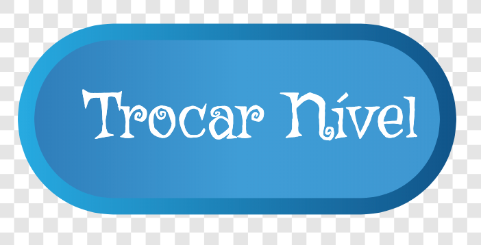

## Nível 2

Nessa próxima etapa, você vai adicionar um novo nível para o jogo que o jogador pode alcançar precisando só apertar um botão. Mais tarde, você pode alterar seu código para que eles precisem de um determinado número de pontos, ou de outra coisa, para chegar no próximo nível.

### Passando para o próximo nível

\--- task \---

Primeiro, crie um novo ator como um botão, seja adicionando um da biblioteca ou desenhando o seu. Fiz um pouco dos dois e cheguei nisto:



\--- /task \---

\--- task \---

Agora, o código para este botão é inteligente: ele foi projetado para que toda vez que você clicar nele, ele te levará ao próximo nível, não importando quantos níveis existam.

Adicione estes scripts ao seu ator **Botao**. Logo em seguida você precisará criar algumas variáveis.

```blocks3
+    when green flag clicked
+    set [nivel-maximo v] to [2]
+    set [nivel-minimo v] to [1]
+    set [nivel-atual v] to [1]
```

```blocks3
+    when this sprite clicked
+    change [nivel-atual v] by (1)
+    if <(nivel-atual) > (nivel-maximo ::variables)> then
        set [nivel-atual v] to (nivel-minimo ::variables)
    end
+    broadcast [limpar-colecionavel v]
+    broadcast (join [nivel-](nivel-atual))
```

\--- /task \---

Você consegue ver como o programa usará as variáveis que você criou?

+ `nivel-maximo`{:class="block3variables"} armazena o nível mais alto
+ `nivel-minimo`{:class="block3variables"} armazena o nível mais baixo
+ `nivel-atual`{:class="block3variables"} armazena o nível que o jogador está no momento

Tudo isso precisa ser definido pelo programador \(você! \), portanto, se você adicionar um terceiro nível, não se esqueça de alterar o valor de `nivel-maximo`{:class="block3variables"}! `nivel-minimo`{:class="block3variables"} nunca precisará mudar, é claro.

As transmissões são usadas para dizer aos outros atores qual nível exibir, e para limpar os itens colecionáveis quando um novo nível começar.

### Faça os atores reagirem

#### O ator **Colecionavel**

Agora você precisa que os outros atores respondam a essas transmissões! Comece com o mais fácil: limpando todos os itens colecionáveis.

\--- task \---

Adicione o seguinte código ao script do ator **Colecionavel** para dizer `esconda`{:class="block3vlooks"} a todos os seus clones quando eles recebem a mensagem de limpeza:

```blocks3
+    when I receive [limpar-colecionavel v]
+    hide
```

\--- /task \---

Como uma das primeiras coisas que um novo clone faz é se mostrar, você não precisa se preocupar em exibir os colecionáveis!

#### O ator **Platformas**

Agora, para mudar o ator **Platformas**. Se quiser, você pode criar seu próprio novo nível mais tarde, mas por enquanto vamos usar o que eu já incluí - você verá o porquê no próximo passo!

\--- task \---

Adicione este código ao ator **Platformas**:

```blocks3
+    when I receive [nivel-1 v]
+    switch fantasia to [Level 1 v]
+    show
```

```blocks3
+    when I receive [nivel-2 v]
+    switch costume to [Level 2 v]
+    show
```

\--- /task \---

Ele recebe as mensagens `agrupadas`{:class="block3operators"} do `level-`{:class="block3variables"} e `nivel-atual`{:class="block3variables"} que o ator **Botao** enviou e responde alterando a fantasia dos **Platformas**.

#### O ator **Inimigo**

\--- task \---

No scripts do ator **Inimigo**, verifique se o ator desaparece quando o jogador entra no nível 2, assim:

```blocks3
+    when I receive [nivel-1 v]
+    show
```

```blocks3
+    when I receive [nivel-2 v]
+    hide
```

\--- /task \---

Se preferir, você pode fazer o inimigo se mover para outra plataforma. Nesse caso, você usaria o bloco `vá para`{:class="block3motion"} ao invés de `mostre`{:class="block3looks"} e `esconda`{:class="block3looks"}.

### Faça o **Personagem** aparecer no lugar certo

Sempre que um novo nível começa, o ator **Personagem** precisa ir ao lugar certo para esse nível. Para que isso aconteça, você precisa alterar de onde o ator obtém suas coordenadas quando aparece pela primeira vez no palco. No momento, existem valores fixos `x` e `y` em seu código.

\--- task \---

Comece criando variáveis para as coordenadas iniciais: `inicio-x`{:class="block3variables"} e `inicio-y`{:class="block3variables"}. Em seguida, conecte-as ao bloco `vá para`{:class="block3motion"} no bloco `reiniciar-personagem`{:class="block3myblocks"} em **Meus Blocos** ao invés dos valores fixos para `x` e `y`:

```blocks3
    define reiniciar-personagem
    set [pode-pular v] to [true]
    set [velocidade-x v] to [0]
    set [velocidade-y v] to [-0]
+    go to x: (inicio-x) y: (inicio-y)
```

\--- /task \---

\--- task \---

Então, para cada transmissão que anuncia o início de um nível, defina as coordenadas `inicio-x`{:class="block3variables"} e `inicio-y`{:class="block3variables"}, e adicione uma **chamada** para `reiniciar-personagem`{:class="block3myblocks"}:

```blocks3
+    when I receive [nivel-1 v]
+    set [inicio-x v] to [-183]
+    set [inicio-y v] to [42]
+    reiniciar-personagem :: custom
```

```blocks3
+    when I receive [nivel-2 v]
+    set [inicio-x v] to [-218]
+    set [inicio-y v] to [-143]
+    reiniciar-personagem :: custom
```

\--- /task \---

### Começando no nível 1

Você também precisa garantir que toda vez que alguém iniciar o jogo, o primeiro nível que eles jogam seja o nível 1.

\--- task \---

Vá para o script `reiniciar-jogo`{:class="block3myblocks"} e remova a chamada para `reiniciar-personagem`{:class="block3myblocks"} dele. No seu lugar, transmita `nivel-minimo`{:class="block3variables"}. O código que você já adicionou com este cartão irá configurar as coordenadas de início corretas para o ator **Personagem** e chamar `reiniciar-personagem`{:class="block3myblocks"}.

```blocks3
    define reiniciar-jogo
    set rotation style [left-right v]
    set [altura-pulo v] to [15]
    set [gravidade v] to [2]
    set [aceleracao-x v] to [1]
    set [aceleracao-y v] to [1]
    set [vidas v] to [3]
    set [pontos v] to [0]
+    broadcast (join [nivel-](nivel-minimo ::variables))
```

\--- /task \---

## \--- collapse \---

## title: Reiniciando o personagem x reiniciando o jogo

Observe que o primeiro bloco do script principal do ator **Personagem** é chamar o bloco `reiniciar-jogo`{:class="block3myblocks"} em **Meus Blocos**.

Este bloco configura todas as variáveis para um novo jogo e então chama o bloco `reiniciar-personagem`{:class="block3myblocks"} em **Meus Blocos** que coloca o personagem de volta na sua posição inicial correta.

Ter o código do `reiniciar-personagem`{:class="block3myblocks"} em seu próprio bloco, separado de `reiniciar-jogo`{:class="block3myblocks"} permite que você redefina o personagem para posições diferentes **sem** ter que redefinir o jogo inteiro.

\--- /collapse \---