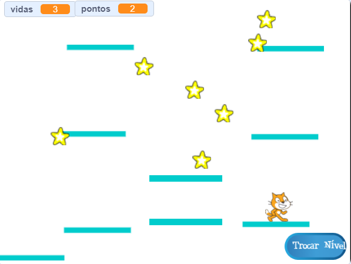

## Plataformas móveis

A razão pela qual eu te pedi para usar minha versão do nível 2 é a lacuna que você pode ter notado no meio do layout. Você vai criar uma plataforma que se move através dessa lacuna e que o jogador pode pular e montar!



Primeiro, você precisará de um ator para a plataforma.

--- task ---

Adicione um novo ator e o chame de **Plataforma-Movel**, e usando as ferramentas de personalização de fantasias na guia Fantasias para parecer com as outras plataformas (use o modo vetorial).

--- /task ---

Agora, vamos adicionar algum código no ator.

Comece com o básico: para criar um conjunto interminável de plataformas subindo na tela, você precisará clonar a plataforma em intervalos regulares. Eu escolhi `4` segundos para o meu intervalo. Você também precisa ter certeza de que há um botão liga/desliga para fazer as plataformas, para que elas não apareçam no nível 1. Estou usando uma nova variável chamada `criar-plataformas`{:class="block3variables"}.

--- task ---

Adicione código para criar clones do seu ator de plataforma.

Aqui está como o meu se parece está até agora:

```blocks3
+    when green flag clicked
+    hide
+    forever
        wait (4) secs
        if <(criar-plataformas ::variables) = [true]> then
            create clone of [myself v]
        end
    end
```

--- /task ---

--- task ---

Em seguida, adicione o código no clone:

```blocks3
+    when I start as a clone
+    show
+    forever
        if <(y position) < [180]> then
            change y by (1)
            wait (0.02) secs
        else
            delete this clone
        end
    end
```

--- /task ---

Este código faz com que o clone da **Plataforma-Movel** mova para cima do topo da tela, devagar o suficiente para o jogador pular nela e sair e depois desaparecer.

--- task ---

Agora faça as plataformas sumirem/aparecerem com base nas transmissões que mudam de nível (para que elas estejam apenas no nível com espaço para elas) e na mensagem de `fim de jogo`{:class="block3events"}.

```blocks3
+    when I receive [nivel-1 v]
+    set [criar-plataformas v] to [false]
+    hide

+    when I receive [nivel-2 v]
+    set [criar-plataformas v] to [true]

+    when I receive [fim de jogo v]
+    hide
+    set [criar-plataformas v] to [false]
```

--- /task ---

Agora, se você tentar jogar o jogo, o **Personagem** cai através da plataforma! Alguma idéia do porquê?

É porque o código de física não conhece a plataforma. Na verdade, é uma solução rápida:

--- task ---

Nos scripts do ator **Personagem**, substitua cada bloco `tocando em “Plataformas”`{:class="block3sensing"} por outro com um operador `OU`{:class="block3operators"} que verifica **se** está `tocando em “Plataformas”`{:class="block3sensing"} **OU** `tocando em “Plataforma-Movel”`{:class="block3sensing"}.

Repasse o código do ator **Personagem**, e em todos os lugares em que você vir este bloco:

```blocks3
    <touching [Plataformas v] ?>
```

substitua por este:

```blocks3
    <<touching [Plataformas v] ?> or <touching [Plataforma-Movel v] ?>>
```

--- /task ---